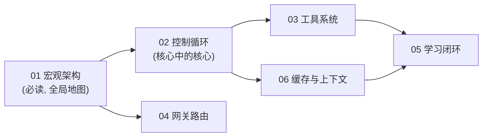

# Hermes Agent 源码架构分析系列 — 阅读指南

> 本系列文档面向希望通过阅读源码系统理解 Hermes Agent 顶层设计的工程师。
> 视角：系统架构师 —— 关注数据流向、状态机转换、模块解耦，而非逐行代码翻译。
> 所有论断均标注了源码依据（文件路径 + 行号，基于当前工作区快照）。

## 文档地图

| 序号 | 文档 | 回答的核心问题 |
|------|------|----------------|
| 01 | [宏观架构设计分析报告](./01-宏观架构设计分析报告.md) | 相比 LangChain 式静态图编排，Hermes 做了什么取舍？核心模块如何划分？ |
| 02 | [控制循环与状态机](./02-控制循环与状态机.md) | 一次用户消息如何变成一串 API 调用 + 工具执行？中断、转向、预算如何管控？ |
| 03 | [工具系统与 Footprint 阶梯](./03-工具系统与Footprint阶梯.md) | 工具如何注册、发现、门控、分发？为什么"核心工具"的准入门槛极高？ |
| 04 | [网关与多平台会话路由](./04-网关与多平台会话路由.md) | 20+ 个消息平台如何共用一个 Agent 核心？会话何时复用、何时重置？ |
| 05 | [记忆系统与学习闭环](./05-记忆系统与学习闭环.md) | "自我改进"如何落地？记忆、技能、Curator 三者如何构成闭环？ |
| 06 | [上下文工程与提示词缓存](./06-上下文工程与提示词缓存.md) | 为什么"缓存神圣不可侵犯"是全项目第一设计公理？压缩如何成为唯一例外？ |

## 建议阅读顺序

- **只有 30 分钟**：读 01 + 02 的架构图和状态图部分。
- **想动手改代码**：每篇文档末尾都有「🛠️ 动手实操」：脱离本项目即可独立运行的最小示例 + 改造练习 + 验证方式。
- **想给项目提 PR**：先读 `AGENTS.md`（仓库根目录）的 Contribution Rubric 与 Footprint Ladder，本系列 03/06 两篇是它的展开解读。

## 两条贯穿全部设计决策的公理

源自 `AGENTS.md:16-27`，理解了这两条，几乎可以推导出项目里所有"反直觉"的设计：

1. **每会话提示词缓存神圣不可侵犯（Prompt caching is sacred）**
   长会话每一轮都复用缓存前缀。任何在会话中途修改历史上下文、切换工具集、重建系统提示词的行为都会击穿缓存、成倍放大用户成本。全项目唯一的例外是上下文压缩（详见文档 06）。

2. **核心是窄腰（narrow waist），能力生长在边缘**
   每一个核心模型工具（model tool）的 schema 都会随**每一次** API 调用发送。因此新增核心工具的门槛极高；绝大多数新能力应以 CLI 子命令 + Skill、check_fn 门控工具、插件或 MCP 服务器的形式出现（详见文档 03 的 Footprint 阶梯）。

## 快速文件定位表

| 想看什么 | 去哪里 |
|----------|--------|
| Agent 主循环 | `agent/conversation_loop.py:523` (`run_conversation`)，入口转发自 `run_agent.py:5745` |
| Agent 类本体（~60 个构造参数） | `run_agent.py:393` (`class AIAgent`) |
| 工具注册表单例 | `tools/registry.py:721` (`registry = ToolRegistry()`) |
| 工具集定义 | `toolsets.py:31` (`_HERMES_CORE_TOOLS`) / `toolsets.py:95` (`TOOLSETS`) |
| 工具调用分发 | `model_tools.py:1019` (`handle_function_call`) |
| 网关主进程 | `gateway/run.py` (`GatewayRunner`, ~20k 行) |
| 会话路由与重置策略 | `gateway/session.py:961` (`SessionStore`) / `:1687` (`get_or_create_session`) |
| 平台适配器基类 | `gateway/platforms/base.py:2253` (`BasePlatformAdapter`) |
| 记忆提供者抽象 | `agent/memory_provider.py:43` (`MemoryProvider` ABC) |
| 记忆编排器 | `agent/memory_manager.py:353` (`MemoryManager`) |
| 定时任务调度 | `cron/scheduler.py` (`tick()`, 60 秒一拍) / `cron/jobs.py` |
| 上下文压缩 | `agent/conversation_compression.py:435` (`compress_context`) |
| 子代理委派 | `tools/delegate_tool.py` (`delegate_task`) |
| 终端后端（6 种） | `tools/environments/`（local / docker / ssh / modal / daytona / singularity） |
