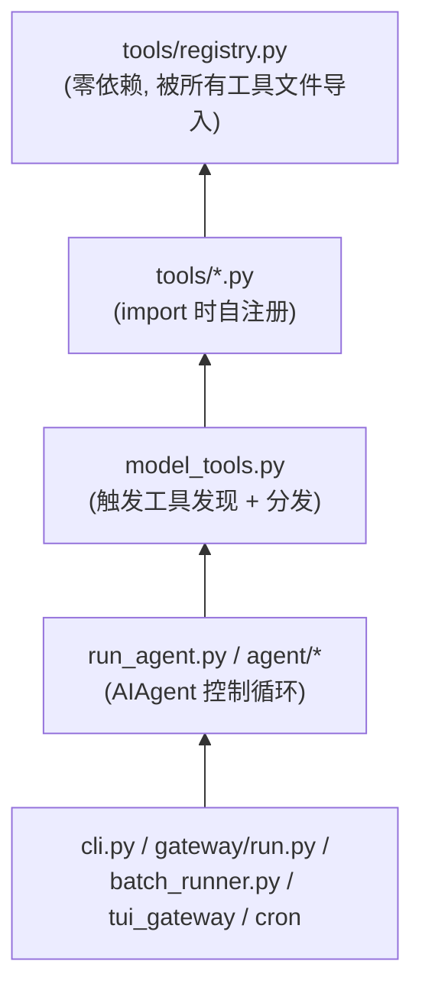
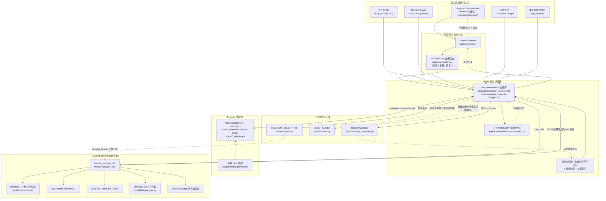

# 01 — Hermes 宏观架构设计分析报告

> 依据：仓库根目录结构、`AGENTS.md`（项目设计意图层）、`run_agent.py`、`toolsets.py`、`gateway/`、`agent/`、`cron/`、`plugins/` 的实际代码。

---

## 1. 核心痛点：Hermes 相对于静态图编排框架的取舍

### 1.1 LangChain 式框架的问题域

LangChain / LangGraph 一类框架的核心抽象是**开发者预先编排的静态图**：节点是 LLM 调用或工具，边是开发者写死的控制流。这适合"把一个确定的业务流程 LLM 化"，但对**个人常驻 Agent**（personal always-on agent）场景有三个结构性错配：

| 错配点 | 静态图框架 | Hermes 的选择 |
|--------|-----------|---------------|
| **控制流归属** | 开发者在图里写死分支 | 控制流完全交给模型：一个同步 while 循环（`agent/conversation_loop.py:638`），模型通过是否发出 tool_calls 来决定继续还是结束 |
| **成本模型** | 每次链路重建 prompt，缓存命中是偶然 | 缓存命中是**设计公理**：系统提示词在会话生命周期内字节级不变（`AGENTS.md:19-23`），消息严格追加 |
| **生命周期** | 一次 Request/Response，进程无状态 | 常驻进程 + 持久会话：SQLite 会话库（`hermes_state.py`，FTS5 全文检索）、跨平台会话续接、cron 定时唤醒、崩溃后 resume（`gateway/session.py:29-36` 的 auto-continue 机制） |

### 1.2 它真正要解决的痛点

从 README（`README.md:19`）和代码结构反推，Hermes 的目标画像是：**一个跑在廉价 VPS/无服务器环境上的、跨平台可达的、能从经验中自我改进的个人 Agent**。对应四个痛点：

1. **"Agent 每次都从零开始"** → 学习闭环：Agent 自主创建/改进技能（`skills/` + `agent/curator.py`）、自主策展记忆（`agent/memory_manager.py`）、搜索自己的历史会话（`session_search` 工具 + FTS5）。
2. **"Agent 绑死在开发者的笔记本上"** → 网关进程把同一个 Agent 核心暴露到 Telegram/Discord/Slack/微信等 20+ 平台（`gateway/platforms/`）；终端执行有 6 种后端（`tools/environments/`），其中 Modal/Daytona 支持"闲时休眠、按需唤醒"。
3. **"长会话贵到用不起"** → 提示词缓存优先的消息管线 + 上下文压缩兜底（`agent/conversation_compression.py`）。
4. **"框架核心随功能膨胀"** → 窄腰架构：核心工具列表被刻意压制（`toolsets.py:31` 的 `_HERMES_CORE_TOOLS`），新能力沿 Footprint 阶梯（`AGENTS.md:182-211`）落到插件/技能/MCP 边缘。

### 1.3 为此付出的代价（架构取舍）

- **放弃了图级可视化编排与静态可验证性** —— 控制流在模型脑子里，调试依赖轨迹日志（`save_trajectories`）与可观测性插件，而不是图快照。
- **同步循环而非 async 内核** —— `AIAgent.run_conversation` 是完全同步的（`AGENTS.md:352-354`），并发通过多进程/子代理（`delegate_task`）和网关层的 asyncio 实现。这是简单性换吞吐的取舍：单用户 Agent 不需要内核级并发。
- **上帝文件的存在被接受为演进中间态** —— `cli.py`（~16k 行）、`gateway/run.py`（~20k 行）、`run_agent.py`（~6k 行，且大量方法已是转发 stub，如 `run_conversation` → `agent/conversation_loop.py`）。`AGENTS.md:65-70` 明确把"从上帝文件中提取模块"列为受欢迎的贡献 —— 说明架构正处于"先长肉再塑形"的阶段。

---

## 2. 核心模块划分与依赖关系

五个核心子系统 + 两个横切层：

| 模块 | 位置 | 职责 |
|------|------|------|
| **① Agent 核心（控制循环）** | `run_agent.py`（`AIAgent`）+ `agent/conversation_loop.py` | 消息组装、LLM 调用、tool_calls 分发、中断/转向/预算、会话持久化 |
| **② 工具系统** | `tools/registry.py` + `tools/*.py` + `model_tools.py` + `toolsets.py` | 工具注册/发现/可用性门控/schema 生成/分发执行 |
| **③ 网关（多平台接入）** | `gateway/run.py` + `gateway/session.py` + `gateway/platforms/` | 平台适配、会话路由、消息去抖、流式分发、重启恢复 |
| **④ 记忆与学习** | `agent/memory_manager.py` + `agent/memory_provider.py` + `plugins/memory/` + `skills/` + `agent/curator.py` | 记忆读写编排、技能创建/使用/策展、跨会话召回 |
| **⑤ 调度器** | `cron/scheduler.py` + `cron/jobs.py` | 定时任务：60 秒 tick、文件锁防并发、结果投递回任意平台 |
| 横切：**Provider 适配层** | `agent/anthropic_adapter.py`、`agent/codex_responses_adapter.py`、`agent/gemini_native_adapter.py`、`plugins/model-providers/` | 把不同推理后端归一为 OpenAI 消息格式 |
| 横切:**插件系统** | `hermes_cli/plugins.py` + `plugins/` | 生命周期钩子（pre/post tool/llm call）、注册工具/CLI 命令，边缘扩展的落点 |

依赖方向（严格单向，`AGENTS.md:300-310` 的 File Dependency Chain）：



关键解耦点：

- **registry 是零依赖底座**：工具文件在 import 时调用 `registry.register()`（`tools/registry.py:356`），`model_tools.py` 只查询注册表，不维护平行数据结构 —— 循环导入被结构性消灭。
- **入口层（CLI/网关/TUI/cron/batch）都是 AIAgent 的薄壳**：同一个 Agent 核心，五种宿主。网关不 import CLI，desktop 不依赖 dashboard 前端（`AGENTS.md:494`）。
- **插件不许碰核心文件**（`AGENTS.md:779-784`，Teknium 2026-05 规则）：插件只能通过 ABC/钩子/ctx 表面扩展，需要新能力时加宽通用插件表面而非在核心里开洞。

---

## 3. 整体系统架构图

用户输入从任意平台进入、流经各模块、最终产生外部影响的全景：



读图要点（数据流四段论）：

1. **入口归一**：无论来自哪个平台，消息最终都变成 `AIAgent.run_conversation(user_message, conversation_history)` 的一次调用。网关多做一步会话路由（第 04 篇）。
2. **循环即架构**：核心就是一个"LLM 说→工具做→结果回填→再问 LLM"的同步循环，跳出条件只有三个 —— 模型不再要工具、迭代/预算耗尽、用户中断（第 02 篇）。
3. **外部影响全部经过 `handle_function_call` 这一个漏斗**：终端、浏览器、文件、消息投递、子代理，全部是注册表里的工具。这也是插件钩子（pre/post_tool_call）能全局生效的原因（第 03 篇）。
4. **学习是旁路而非主路**：记忆同步、技能创建、Curator 策展都挂在主循环的边缘（每轮末尾/会话末尾/后台线程），失败不阻塞对话（第 05 篇）。

---

## 4. 🛠️ 动手实操

### 4.1 最小可运行示例：50 行复现 Hermes 的"窄腰"

脱离本项目，复现其最核心的机制 —— **注册表驱动的工具循环**。只需 `pip install openai`（或任何 OpenAI 兼容端点）：

```python
# mini_hermes.py — 最小化 Hermes 核心循环
import json, os
from openai import OpenAI

# ---- ① 微型注册表 (对应 tools/registry.py) ----
REGISTRY = {}  # name -> {"schema": ..., "handler": ...}

def register(name, description, params, handler):
    REGISTRY[name] = {
        "schema": {"type": "function", "function": {
            "name": name, "description": description,
            "parameters": {"type": "object", "properties": params,
                           "required": list(params)}}},
        "handler": handler}

# ---- ② 工具在"import 时"自注册 (对应 tools/*.py) ----
register("get_time", "读取当前系统时间", {},
         lambda args: json.dumps({"time": __import__("datetime").datetime.now().isoformat()}))
register("calc", "计算一个 Python 算术表达式", {"expr": {"type": "string"}},
         lambda args: json.dumps({"result": eval(args["expr"], {"__builtins__": {}})}))

# ---- ③ 主循环 (对应 agent/conversation_loop.py:638) ----
def run_conversation(user_message, max_iterations=10):
    client = OpenAI()  # 需要 OPENAI_API_KEY；任何兼容端点均可
    messages = [{"role": "system", "content": "你是一个会用工具的助手。"},
                {"role": "user", "content": user_message}]
    schemas = [e["schema"] for e in REGISTRY.values()]
    for i in range(max_iterations):
        resp = client.chat.completions.create(
            model="gpt-4o-mini", messages=messages, tools=schemas)
        msg = resp.choices[0].message
        messages.append(msg.model_dump(exclude_none=True))
        if not msg.tool_calls:                 # 模型不再要工具 → 回合结束
            return msg.content
        for tc in msg.tool_calls:              # 分发 (对应 handle_function_call)
            entry = REGISTRY.get(tc.function.name)
            result = (entry["handler"](json.loads(tc.function.arguments))
                      if entry else json.dumps({"error": f"Unknown tool: {tc.function.name}"}))
            messages.append({"role": "tool", "tool_call_id": tc.id, "content": result})
    return "(达到迭代上限)"                     # 对应 max_iterations 护栏

if __name__ == "__main__":
    print(run_conversation("现在几点？另外帮我算 37*89。"))
```

注意三个与 Hermes 一一对应的细节：**工具注册与循环解耦**（handler 换掉不影响循环）、**未知工具返回 `{"error": ...}` 而不是抛异常**（对应 `tools/registry.py:583`）、**messages 只追加不修改**（缓存公理的最小体现）。

### 4.2 改造练习

**练习 1（体会 check_fn 门控）**：给 `register()` 加一个可选参数 `check_fn`，在构造 `schemas` 时跳过 `check_fn()` 返回 False 的工具。然后给 `calc` 挂上 `check_fn=lambda: os.getenv("ENABLE_CALC") == "1"`。
*预期*：不设环境变量时，问"帮我算 37*89"，模型会说自己没有计算工具（或口算）；`ENABLE_CALC=1` 后恢复。这正是 Hermes 中 Home Assistant 工具"没配 token 就不出现在 schema 里"的机制（`tools/registry.py:521-547`）。

**练习 2（体会窄腰成本）**：向注册表灌入 30 个假工具（描述各 200 字），对比一次对话的 `resp.usage.prompt_tokens`。
*预期*：prompt token 显著上涨且**每一轮都上涨** —— 亲手量化"每个核心工具都随每次 API 调用付费"，理解 `AGENTS.md` 为什么把新增核心工具列为最后手段。

### 4.3 验证方式

- 示例能跑通：输出同时包含当前时间和 3293。
- 练习 1：开/关环境变量各跑一次，用 `print(len(schemas))` 确认 schema 数量变化。
- 练习 2：记录两组 `prompt_tokens`，差值 ≈ 30 个工具 schema 的序列化开销 × 轮数。

---

*下一篇：[02 — 控制循环与状态机](./02-控制循环与状态机.md)，深入这个 while 循环里的中断、转向、预算与消息不变量。*
