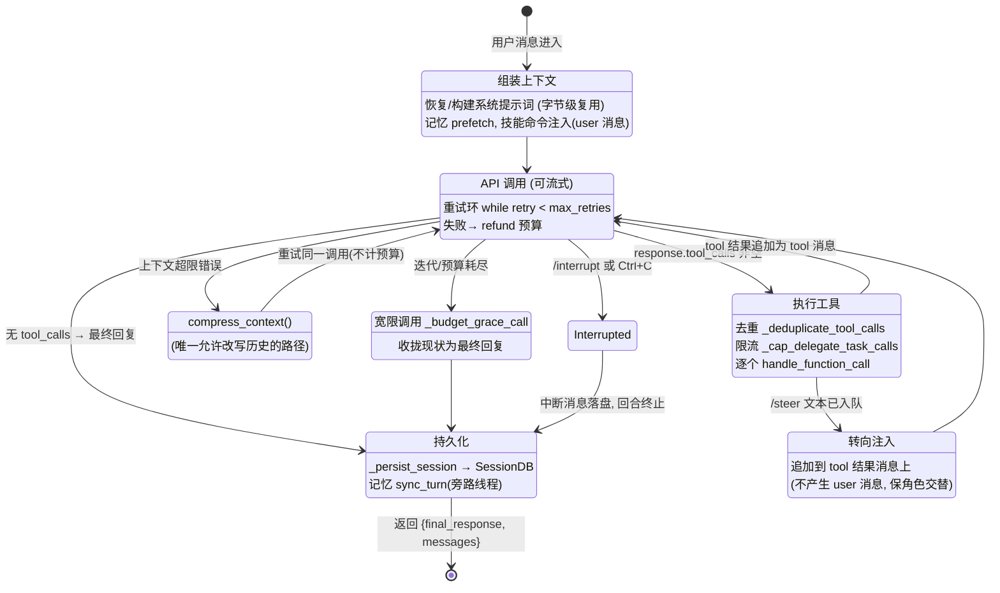
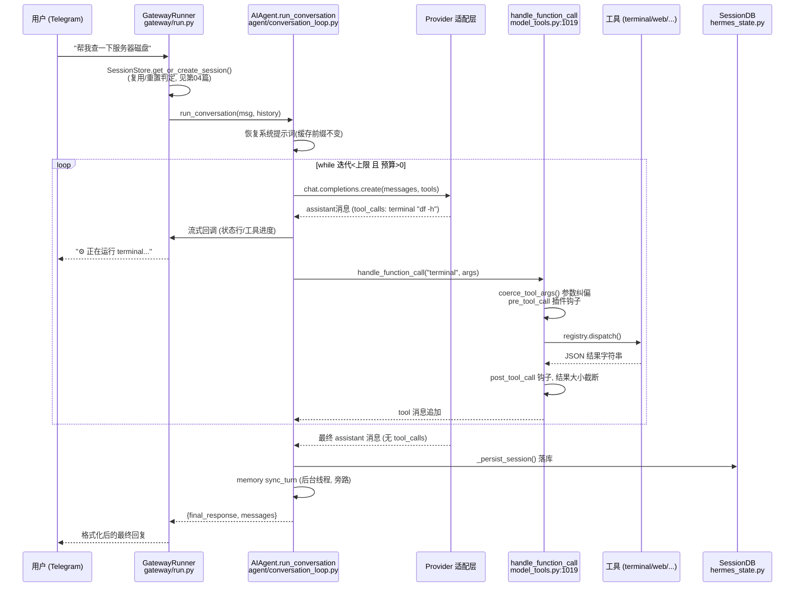

# 02 — 控制循环与状态机：一条消息的一生

> 依据：`agent/conversation_loop.py`（主循环本体，~5.3k 行）、`run_agent.py`（`AIAgent` 类与中断/转向/预算 API）、`agent/iteration_budget.py`、`agent/chat_completion_helpers.py`。

---

## 1. 为什么循环长这样：设计还原

`run_agent.py:5745` 的 `run_conversation()` 只是转发 stub，真身在 `agent/conversation_loop.py:523`。这是"从上帝文件提取模块"演进的实例：`AIAgent` 保留状态与公共 API，循环逻辑被抽成模块级函数（签名第一个参数就是 `agent`）。

循环头只有一行，但每个条件都是一个子系统（`agent/conversation_loop.py:638`）：

```python
while (api_call_count < agent.max_iterations
       and agent.iteration_budget.remaining > 0) or agent._budget_grace_call:
```

- `max_iterations`（默认 90，`run_agent.py:427`）—— **单回合**护栏，防止模型无限自我循环。
- `iteration_budget`（`agent/iteration_budget.py`）—— **跨回合/跨子代理共享**的预算池。子代理（`delegate_task`）消耗的是同一个池子，防止"父 90 次 × 子 90 次"的组合爆炸。
- `_budget_grace_call` —— 预算耗尽后的**一次宽限调用**：不给工具，只让模型把已有结果收拢成一段最终回复。宁可要一个"我做到一半，结果如下"的收尾，也不要一个突然沉默的 Agent。

值得注意的补偿机制：循环内部多处出现 `api_call_count -= 1` + `iteration_budget.refund()`（`conversation_loop.py:975-978`、`:1055-1057`）—— **失败的 API 调用（可重试错误、压缩重试）不计入预算**。预算度量的是"模型实际思考的次数"，不是"HTTP 请求次数"。

## 2. 回合状态机

一次 `run_conversation()` 调用（一个"回合"）的状态转换：



三类退出路径的语义差异（`run_agent.py:2912-3030` 的 turn-completion explainer 会向用户解释是哪种）：

| 退出原因 | 触发 | 对用户的表现 |
|----------|------|--------------|
| 自然完成 | 模型不再发 tool_calls | 正常回复 |
| `max_iterations_reached` | 回合内 API 调用数触顶 | 附带"已达迭代上限，可调 `max_iterations`"的说明 |
| 中断/转向 | `interrupt()` / `steer()` | 立即停止或改变方向 |

## 3. 中断（interrupt）与转向（steer）：两种打断的解耦

这是与"一问一答"框架差异最大的地方。用户在 Agent 工作**中途**有两种介入方式，语义完全不同：

- **`interrupt(message)`**（`run_agent.py:2619`）：硬停。循环在每次 API 调用前检查 `_interrupt_requested`，工具执行也有中断检查点（`tools/interrupt.py`）。回合终止，可选携带一条替代消息。
- **`steer(text)`**（`run_agent.py:2720`）：软转向。文本进入队列，**不打断当前工具执行**；在下一批工具结果回填时，由 `_apply_pending_steer_to_tool_results()`（`run_agent.py:3032`）把转向文本**附着在 tool 结果消息上**，而不是插入一条新的 user 消息。

为什么 steer 不直接插 user 消息？因为那会违反两条不变量（`AGENTS.md:88-91`）：

1. **严格角色交替**：绝不允许连续两条同角色消息，绝不在循环中途注入合成 user 消息 —— 部分 provider 会直接报错，且会击穿缓存前缀。
2. **系统提示词字节稳定**：转向信息如果进系统提示词，缓存全灭。

> 同样的手法贯穿全项目：技能斜杠命令注入的是 **user 消息**而非系统提示词（`agent/skill_commands.py`，`AGENTS.md:381`）；记忆上下文作为系统提示词的**初始**组成部分注入，之后不再变。所有"想对模型说的话"都必须找到一个不破坏前缀稳定性的注入点。

## 4. 一次完整回合的时序图（网关场景）



## 5. 消息序列的自愈能力

循环并不假设模型/provider 输出永远合法，落库和发送前有一整套**序列修复**管线（都在 `run_agent.py`）：

- `_repair_message_sequence()`（:1721）—— 修复孤儿 tool 消息、缺失的 tool_call 响应；
- `_sanitize_api_messages()`（:3669）—— 发送前清洗；
- `_drop_thinking_only_and_merge_users()`（:3743）—— 丢弃只有思考内容的 assistant 消息、合并相邻 user 消息；
- `_deduplicate_tool_calls()`（:3787）+ `_cap_delegate_task_calls()`（:3756）—— 同一响应里的重复/超额工具调用在**执行前**被掐掉。

架构含义：**不变量靠运行时防御维持，而不是靠假设上游正确**。这是接 30+ 个异构 provider 的必然选择 —— 每家的流式实现、reasoning 字段、tool_call id 格式都有自己的坑。

## 6. 🛠️ 动手实操

### 6.1 最小可运行示例：带预算 + 宽限调用 + 软转向的循环

不需要任何 LLM API —— 用一个"假模型"演示循环骨架的三个机制（预算池、grace call、steer 附着于 tool 结果）：

```python
# mini_loop.py — 复现 Hermes 循环的预算/宽限/转向机制 (零依赖)
import queue

class FakeModel:
    """假模型: 前 N 步永远要求调工具, 之后收敛"""
    def __init__(self, wants_tools_for=5):
        self.n = wants_tools_for
    def create(self, messages, tools_allowed=True):
        self.n -= 1
        if tools_allowed and self.n >= 0:
            return {"role": "assistant", "tool_calls": [{"id": f"c{self.n}", "name": "work"}]}
        seen = [m for m in messages if m["role"] == "tool"]
        return {"role": "assistant",
                "content": f"完成。共执行 {len(seen)} 次工具, 收到的转向: "
                           f"{[m for m in seen if '[steer]' in m['content']]}"}

class IterationBudget:                      # 对应 agent/iteration_budget.py
    def __init__(self, max_total): self.max_total, self.used = max_total, 0
    @property
    def remaining(self): return self.max_total - self.used
    def consume(self): self.used += 1; return self.remaining >= 0
    def refund(self): self.used -= 1

def run_conversation(model, max_iterations=90, budget=None, steer_queue=None):
    budget = budget or IterationBudget(3)   # 预算(3) < 迭代上限(90) → 预算先耗尽
    messages = [{"role": "user", "content": "干活"}]
    grace_call = False
    calls = 0
    while (calls < max_iterations and budget.remaining > 0) or grace_call:
        allow_tools = not grace_call        # 宽限调用不给工具 → 强制收敛
        resp = model.create(messages, tools_allowed=allow_tools)
        messages.append(resp)
        calls += 1; budget.consume()
        if not resp.get("tool_calls"):
            return resp["content"], messages
        for tc in resp["tool_calls"]:
            result = f"result-of-{tc['id']}"
            # steer 附着在 tool 结果上, 绝不插 user 消息 (保角色交替)
            if steer_queue and not steer_queue.empty():
                result += f"\n[steer] 用户补充: {steer_queue.get()}"
            messages.append({"role": "tool", "tool_call_id": tc["id"], "content": result})
        if budget.remaining <= 0 and not grace_call:
            grace_call = True               # 授予一次收尾机会
        elif grace_call:
            break
    return "(异常终止)", messages

if __name__ == "__main__":
    sq = queue.Queue(); sq.put("顺便检查一下日志")
    final, msgs = run_conversation(FakeModel(wants_tools_for=99), steer_queue=sq)
    print(final)
    roles = [m["role"] for m in msgs]
    assert all(not (a == b == "user") for a, b in zip(roles, roles[1:])), "角色交替被破坏!"
    print("消息序列角色:", roles)
```

### 6.2 改造练习

**练习 1（refund 语义）**：给 `FakeModel.create` 加 20% 概率抛 `TimeoutError`，在循环里捕获、`budget.refund()`、重试。
*预期*：无论超时多少次，最终 `budget.used` 恒等于成功调用的次数 —— 亲手验证"预算度量思考次数而非 HTTP 次数"。

**练习 2（去掉 grace call 看差异）**：把 `grace_call` 机制整个删掉再跑。
*预期*：输出变成 `"(异常终止)"`，最后一条消息是 tool 结果而非 assistant 总结 —— 用户视角就是"Agent 干到一半突然消失"。这就是 `_budget_grace_call` 存在的理由。

**练习 3（违反角色交替）**：把 steer 改成 `messages.append({"role": "user", ...})` 注入。
*预期*：末尾的 assert 立刻炸掉。在真实系统里，炸掉的会是 provider 的 400 报错和整条缓存前缀。

### 6.3 验证方式

- 示例跑通：打印"共执行 3 次工具"（预算=3），转向文本出现在某条 tool 结果里，assert 通过。
- 练习 1：多跑几次，`budget.used` 稳定为 3。
- 对照源码确认你复现的语义：宽限调用见 `conversation_loop.py:638` 循环条件的 `or agent._budget_grace_call`；steer 附着见 `run_agent.py:3032`。

---

*上一篇：[01 — 宏观架构](./01-宏观架构设计分析报告.md) ｜ 下一篇：[03 — 工具系统与 Footprint 阶梯](./03-工具系统与Footprint阶梯.md)*
