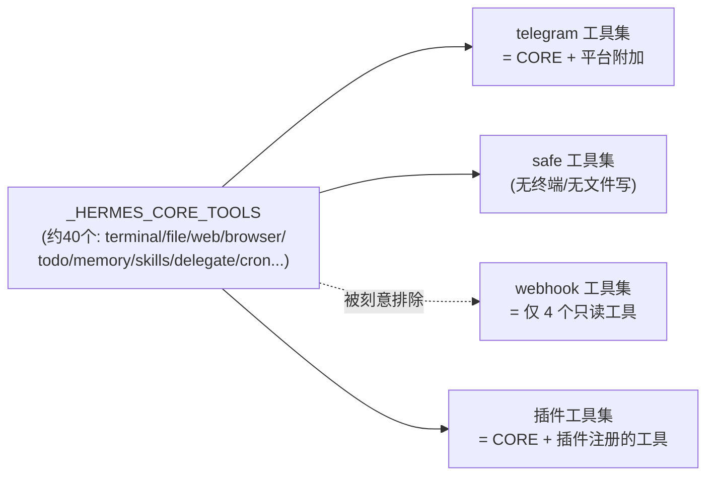
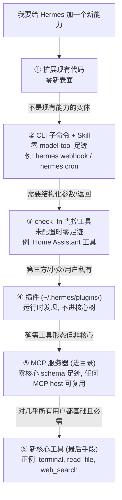

# 03 — 工具系统与 Footprint 阶梯：能力如何在不压垮核心的前提下生长

> 依据：`tools/registry.py`（注册表本体）、`model_tools.py`（编排与分发）、`toolsets.py`（工具集定义与解析）、`AGENTS.md` 的 Footprint Ladder（:182-211）与 Adding New Tools（:509-556）。

---

## 1. 问题定义：工具系统的真实成本在哪里

大多数框架把"加工具"当作免费操作。Hermes 的出发点相反：**每个核心工具的 schema 会随每一次 API 调用发送**。一个 40 工具的 Agent，每个 schema 平均 300 token，意味着每轮对话固定多付 1.2 万 prompt token —— 乘以长会话的轮数，乘以所有用户。所以工具系统的设计目标是双向的：

- **向下压制核心**：`_HERMES_CORE_TOOLS`（`toolsets.py:31-80`）是被刻意管制的清单，新增核心工具是 Footprint 阶梯的最后一级。
- **向上开放边缘**：check_fn 门控、插件、MCP、技能，让能力在"不进 schema 或按需进 schema"的位置生长。

## 2. 注册表：零依赖底座 + import 时自注册

### 2.1 发现机制（约定优于配置）

`tools/registry.py:58` 的 `discover_builtin_tools()` 不维护任何 import 清单，而是：

1. 扫描 `tools/*.py`；
2. 用 **AST 解析**（不是正则）检查模块顶层是否存在 `registry.register(...)` 调用（`:30-55` 的 `_module_registers_tools`）—— 只认模块体语句，函数内部的 register 不算，避免误伤辅助模块；
3. 命中则 `importlib.import_module()`，import 副作用完成注册。

加一个内置工具 = 新建一个文件 + 在 `toolsets.py` 挂入工具集，没有中心化 import 列表要维护。**但注册 ≠ 暴露**：`AGENTS.md:545` 强调 `_HERMES_CORE_TOOLS` 不是死代码 —— 工具只有出现在某个工具集里才会进入某个 Agent 的 schema。注册表管"存在"，工具集管"可见"。

### 2.2 ToolEntry：一个工具的全部元数据

`tools/registry.py:78-107`，字段即设计：

| 字段 | 作用 | 架构含义 |
|------|------|----------|
| `schema` / `handler` | OpenAI 格式 schema + 可调用体 | 声明与实现同址 |
| `check_fn` | 零参可用性探针 | **服务门控**：没配 HASS_TOKEN，Home Assistant 工具就不进 schema，零成本 |
| `requires_env` | 依赖的环境变量清单 | 供 `hermes doctor` / setup 向导做诊断展示 |
| `is_async` | 异步 handler 标记 | 同步循环通过 `_run_async()` 桥接（`model_tools.py:88`） |
| `max_result_size_chars` | 每工具结果截断上限 | 防单个工具结果撑爆上下文 |
| `dynamic_schema_overrides` | 运行时 schema 覆写回调 | 例：`delegate_task` 的描述必须反映用户当前的 `max_concurrent_children` 配置，否则模型会被告知错误的并发上限（`:100-107` 注释） |

### 2.3 check_fn 的 TTL 缓存与"抖动豁免"

`check_fn` 探测的是外部状态（Docker daemon、playwright 二进制、Modal SDK），长驻进程里每次构建 schema 都探测是纯浪费。`tools/registry.py:110-197` 的方案：

- **30 秒 TTL 缓存**（`_CHECK_FN_TTL_SECONDS`）—— `hermes tools enable` 之类的配置变更 1-2 轮内自然生效，无需显式失效；
- **60 秒失败宽限**（`_CHECK_FN_FAILURE_GRACE_SECONDS`）—— 关键细节：一次 `docker version` 超时返回 False，会把整个 terminal+file 工具集从**正在构建的那个 Agent**（最常见是 delegate_task 子代理）的 schema 里静默剥掉，子代理随即报告 "Tool read_file does not exist"（issue #21658/#5304）。因此：距上次成功 60 秒内的失败按抖动处理，返回 last-good True 且**不缓存失败**（下次重探）；持续失败超过宽限期才如实反映。

这是一个值得学习的模式：**在"及时反映真实故障"与"不被瞬时抖动误伤"之间，用两个时间常数（TTL + grace window）而不是布尔开关做权衡**。

### 2.4 安全边界：插件覆写/注销的授权模型

注册表不信任插件（`tools/registry.py:307-514`）：

- 插件想用 `register(override=True)` 顶掉内置工具，必须有运营者在 config.yaml 中显式 opt-in（`plugins.entries.<id>.allow_tool_override: true`），否则抛 `PermissionError`；
- 授权绑定在 **handler 定义处的模块命名空间**（`handler.__globals__["__name__"]`），不是调用点 —— lambda/嵌套函数继承定义模块的 globals，插件无法通过回调"洗白"一次覆写（`:316-338`）;
- `deregister()` 同样被门控（`:450-500`），否则插件可以"先注销再注册"绕过覆写检查 —— 注意这个洞是被显式想到并堵上的；
- MCP 工具集（`mcp-*` 前缀）豁免：动态工具发现本来就要在 `notifications/tools/list_changed` 时"推倒重建"自己的工具。

## 3. 工具调用的完整数据流

```mermaid
sequenceDiagram
    participant LOOP as conversation_loop
    participant MT as model_tools.py
    participant HOOK as 插件钩子<br/>hermes_cli/plugins.py
    participant REG as ToolRegistry<br/>tools/registry.py
    participant H as 工具 handler

    Note over LOOP: 回合开始前
    LOOP->>MT: get_tool_definitions(enabled_toolsets)
    MT->>MT: resolve_toolset() 展开工具集<br/>(toolsets.py:687, 支持 includes 递归)
    MT->>REG: get_definitions(tool_names)
    REG->>REG: 逐工具 check_fn (30s TTL 缓存)<br/>+ dynamic_schema_overrides
    REG-->>MT: OpenAI 格式 schema 列表<br/>(memo: registry generation + config mtime)
    MT-->>LOOP: tools=[...] 随每次 API 调用发送

    Note over LOOP: 模型发出 tool_call
    LOOP->>MT: handle_function_call(name, raw_args, task_id)
    MT->>MT: coerce_tool_args() (model_tools.py:650)<br/>字符串→数字/布尔/JSON 纠偏
    MT->>HOOK: pre_tool_call 钩子
    MT->>REG: registry.dispatch(name, args)
    REG->>H: handler(args, task_id=...)
    H-->>REG: JSON 字符串 (强制约定)
    Note over REG: 异常 → {"error": sanitized}<br/>绝不向循环抛异常
    REG-->>MT: 结果字符串
    MT->>MT: 按 max_result_size_chars 截断
    MT->>HOOK: post_tool_call 钩子
    MT-->>LOOP: tool 消息内容
```

两个容易被忽视但重要的环节：

- **`coerce_tool_args()`**（`model_tools.py:650`）：模型经常把 `5` 写成 `"5"`、把对象写成 JSON 字符串。与其让工具报错浪费一轮迭代，不如按 schema 做类型纠偏。这是"运行时防御维持不变量"哲学在工具层的体现。
- **错误也是数据**：`dispatch()` 捕获一切异常并返回 `{"error": ...}`（`tools/registry.py:589-600`），且错误文本要过 `_sanitize_tool_error()` 清洗 —— 异常字符串里的代码围栏/CDATA 会污染模型对消息结构的理解。

## 4. 工具集（toolsets）：可见性的组合代数

`toolsets.py:95` 的 `TOOLSETS` 是一个支持 `includes` 递归引用的组合结构，`resolve_toolset()`（`:687`）带环检测地展开。平台差异全部收敛在这一层：



最有教学价值的是 webhook 工具集（`toolsets.py:82-90`）：webhook 事件可能携带不受信的第三方内容（公开 PR 的标题/评论），所以默认工具集**只有** `web_search / web_extract / vision_analyze / clarify` 四个只读工具 —— **提示词注入的防线不是过滤输入，而是收缩该上下文里可用的能力**。同理，desktop 专属的 project 工具被刻意排除在核心之外（`toolsets.py:55-59` 注释），只由 GUI 网关启用。

## 5. Footprint 阶梯：新能力的六级决策树

`AGENTS.md:182-211`，按永久足迹从小到大排序，**选能正确解决问题的最高层级**：



配套的治理规则同样重要：当 3+ 个 PR 试图集成同一**类**东西（记忆后端、provider、通知器）时，不逐个合并，而是设计 ABC + 编排器，把内置实现包装成第一个 provider，把竞争 PR 变成该接口的插件（`AGENTS.md:208-211`）。`agent/memory_provider.py` + `plugins/memory/` 就是这条规则的产物（见第 05 篇）。

## 6. 🛠️ 动手实操

### 6.1 最小可运行示例：带 check_fn 门控 + TTL 缓存的微型注册表

零依赖，独立复现本篇三个核心机制（自注册、门控、TTL+宽限缓存）：

```python
# mini_registry.py — 复现 tools/registry.py 的门控与缓存 (零依赖)
import time, json

class MiniRegistry:
    def __init__(self, ttl=2.0, grace=4.0):     # 真实值: 30s / 60s, 演示用 2s/4s
        self._tools, self._cache, self._last_good = {}, {}, {}
        self.ttl, self.grace = ttl, grace
    def register(self, name, schema, handler, check_fn=None):
        if name in self._tools:                  # 对应覆写保护 (简化版)
            raise PermissionError(f"'{name}' 已存在, 拒绝静默覆写")
        self._tools[name] = dict(schema=schema, handler=handler, check_fn=check_fn)
    def _check(self, name, fn):
        now = time.monotonic()
        ts_val = self._cache.get(name)
        if ts_val and now - ts_val[0] < self.ttl:
            return ts_val[1]                     # TTL 命中
        try: ok = bool(fn())
        except Exception: ok = False
        if ok:
            self._last_good[name] = now
            self._cache[name] = (now, True); return True
        lg = self._last_good.get(name)
        if lg and now - lg < self.grace:         # 抖动豁免: 不缓存失败
            print(f"  [grace] {name} 探测失败但距上次成功<{self.grace}s, 按抖动处理")
            return True
        self._cache[name] = (now, False); return False
    def get_definitions(self):                   # 对应 get_definitions()
        return [e["schema"] for n, e in self._tools.items()
                if not e["check_fn"] or self._check(n, e["check_fn"])]
    def dispatch(self, name, args):              # 对应 dispatch(): 异常→错误JSON
        e = self._tools.get(name)
        if not e: return json.dumps({"error": f"Unknown tool: {name}"})
        try: return e["handler"](args)
        except Exception as ex:
            return json.dumps({"error": f"{type(ex).__name__}: {ex}"})

if __name__ == "__main__":
    reg = MiniRegistry()
    flaky = {"up": True}                         # 模拟会抖动的 Docker daemon
    reg.register("terminal", {"name": "terminal"},
                 lambda a: json.dumps({"out": f"ran: {a['cmd']}"}),
                 check_fn=lambda: flaky["up"])
    reg.register("get_time", {"name": "get_time"},
                 lambda a: json.dumps({"t": time.time()}))

    print("① 正常:", [s["name"] for s in reg.get_definitions()])
    flaky["up"] = False; time.sleep(2.1)         # 越过 TTL, 触发重探→失败
    print("② 后端抖动(宽限内):", [s["name"] for s in reg.get_definitions()])
    time.sleep(4.1)                              # 越过宽限期
    print("③ 持续故障(宽限外):", [s["name"] for s in reg.get_definitions()])
    print("④ 错误即数据:", reg.dispatch("no_such_tool", {}))
```

预期输出：① 两个工具都在；② 打印 `[grace]` 且 terminal **仍在**（抖动被吸收）；③ terminal 消失（真实故障如实反映）；④ 返回 `{"error": "Unknown tool: ..."}` 而非抛异常。

### 6.2 改造练习

**练习 1（走一遍 Footprint 阶梯第④级）**：在**真实 Hermes** 里加一个自定义工具而不碰核心：创建 `~/.hermes/plugins/hello/plugin.yaml` 和 `__init__.py`，在 `register(ctx)` 里调用 `ctx.register_tool(...)` 注册一个返回固定字符串的工具（模板见 `AGENTS.md:509-517`）。
*预期*：`hermes` 启动后对话中模型能调用该工具；`hermes tools` 里出现你的插件工具集。全程 `tools/` 和 `toolsets.py` 零改动 —— 这就是"能力生长在边缘"。

**练习 2（体会覆写保护）**：在 mini_registry 里给 `register` 加 `override=True` 参数与授权表 `{module: bool}`，复刻 `tools/registry.py:393-408` 的语义：未授权模块传 `override=True` 时抛 `PermissionError`。
*预期*：授权表置 True 前后，同一段覆写代码一个炸一个成功，且成功路径打印审计日志。

**练习 3（dynamic_schema_overrides）**：给 mini_registry 的 entry 加 `dynamic_schema_overrides` 回调，让某工具的 description 包含一个全局配置值；改配置后再取 definitions。
*预期*：schema 描述随配置实时变化 —— 理解为什么 `delegate_task` 需要这个机制（模型看到的并发上限必须等于真实配置）。

### 6.3 验证方式

- 示例输出与上述 ①-④ 逐条吻合，尤其 ② 必须出现 `[grace]` 行且 terminal 未消失。
- 练习 1：在对话里问"你有哪些工具"，模型列出你的插件工具；或直接看 `~/.hermes/logs/agent.log` 里的注册日志。
- 练习 2/3：对照 `tools/registry.py:393`（覆写门控）与 `:556-566`（动态覆写应用点）确认语义一致。

---

*上一篇：[02 — 控制循环](./02-控制循环与状态机.md) ｜ 下一篇：[04 — 网关与多平台会话路由](./04-网关与多平台会话路由.md)*
