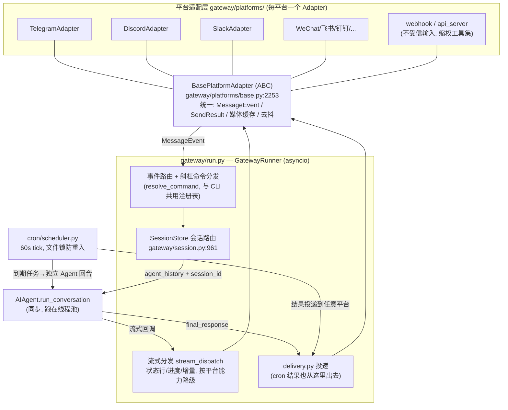
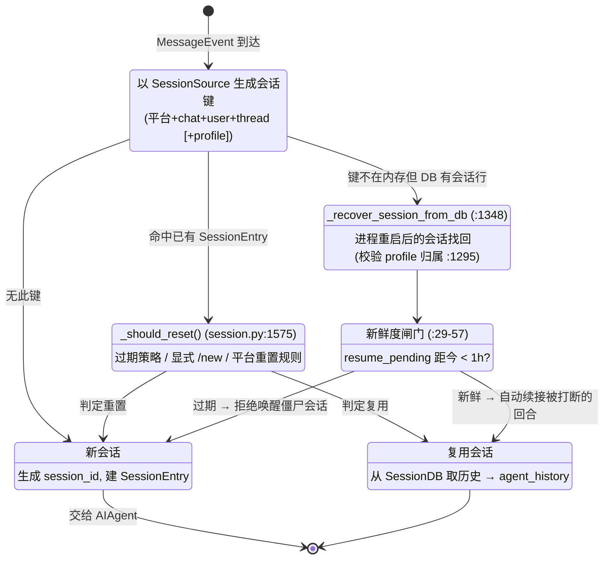

# 04 — 网关与多平台会话路由：20+ 平台共用一个 Agent 核心

> 依据：`gateway/run.py`（`GatewayRunner`，~20.7k 行）、`gateway/session.py`（`SessionSource`/`SessionEntry`/`SessionStore`）、`gateway/platforms/base.py`（`BasePlatformAdapter` ABC）、`gateway/platforms/ADDING_A_PLATFORM.md`、`cron/scheduler.py`。

---

## 1. 架构定位：网关是"翻译 + 路由"，不是第二个 Agent

Hermes 的口号"Lives where you do"（README:25）在架构上的落点是：**一个网关进程**同时挂接 Telegram、Discord、Slack、WhatsApp、Signal、微信/企业微信/飞书/钉钉、Email、SMS 等平台（`gateway/platforms/`），全部收敛到同一个 `AIAgent`。网关自身不含任何智能，它只做四件事：

1. **平台归一**：把各平台的消息/媒体/回复语义翻译成统一的 `MessageEvent`（`gateway/platforms/base.py:1716`）；
2. **会话路由**：决定这条消息属于哪个会话 —— 复用、重置还是恢复（`gateway/session.py`）；
3. **流式分发**：把 Agent 的状态行/工具进度/文本增量按平台能力降级投递（`gateway/stream_dispatch.py`、`stream_consumer.py`）;
4. **生命周期**：重启恢复、平滑排水（`drain_control.py`）、缩容到零（`scale_to_zero.py`）、崩溃取证（`shutdown_forensics.py`）。



关键解耦：**Agent 核心是同步的，网关是 asyncio 的**。同步的 `run_conversation()` 被丢进线程池执行，网关线程只消费流式回调。这让 Agent 核心可以被 CLI（无 asyncio）、批处理、cron 等同步宿主直接复用。

## 2. 会话路由：`get_or_create_session` 的判定漏斗

网关最核心的状态机在 `gateway/session.py`。三个关键抽象：

- **`SessionSource`**（:147）—— 消息从哪来：平台、chat_id、user_id、thread_id 的值对象，其哈希构成会话键（`_generate_session_key`，:1315）；
- **`SessionEntry`**（:642）—— 一个活跃会话的元数据：session_id、最近活动时间、模型覆写、resume_pending 标记等；
- **`SessionStore`**（:961）—— 持久化的路由表（sessions.json + SessionDB 恢复路径），入口是 `get_or_create_session()`（:1687）。

每条入站消息都要过这个判定漏斗：



两个值得细看的设计：

- **自动续接的新鲜度闸门**（`auto_continue_freshness_window`，`session.py:29-57`）：网关重启时被打断的回合会标记 `resume_pending`，重启后自动续跑 —— 但只在 1 小时窗口内。窗口是"resume 调度器"和"路由时僵尸闸门"共用的**单一事实来源**，防止两处各写一个阈值然后漂移。配置经 `config.yaml → 环境变量桥接`（`agent.gateway_auto_continue_freshness` → `HERMES_AUTO_CONTINUE_FRESHNESS`），这是项目"config.yaml 为唯一用户配置面，env 只做内部桥接"策略（`AGENTS.md:102-107`）的实例。
- **恢复路径的 profile 隔离**（:1295 `_recovered_row_allowed_for_active_profile`）：多 profile 场景下，从 DB 恢复的会话必须属于当前激活 profile —— profile 是刻意的独立孤岛（`AGENTS.md:147-154`），恢复逻辑不能变成跨岛暗道。

## 3. 平台适配器：ABC 收敛差异

`BasePlatformAdapter`（`gateway/platforms/base.py:2253`，含少量 `@abstractmethod`，其余全是带默认实现的模板方法）把平台差异压到最小实现面。新增平台按 `ADDING_A_PLATFORM.md` 只需实现连接、收消息→`MessageEvent`、发消息三件事；以下能力从基类免费继承：

- **媒体缓存**（`CachedMedia`，:1595）与语音转写管道；
- **文本去抖**（`TextDebounceState`，:1812）—— 用户连发三条短消息合并为一次 Agent 调用，省一次完整回合的成本；
- **发送结果语义**（`SendResult`，:1855）与**临时回复**（`EphemeralReply`，:2025，一个继承 str 的类型标记 —— 状态行之类"发出去还会被编辑/删除"的消息不进会话历史）；
- 富文本降级、消息分片、速率限制（如 `signal_rate_limit.py`）。

安全上再次体现"能力收缩优于输入过滤"：webhook/api_server 这类**不受信入口**绑定的是缩权工具集（`toolsets.py:82-90`，仅 4 个只读工具），而不是给完整工具集配一个"注入检测器"。

## 4. 跨平台连续性与 cron 回投

会话键包含平台，但**会话历史在 SessionDB 里是平台无关的** —— 这是"在 Telegram 上继续 CLI 里的对话"（cross-platform conversation continuity, README:25）的基础：CLI 与网关写同一个 SQLite 库（`hermes_state.py`），`session_search` 工具用 FTS5 跨全部历史检索。

定时任务是"无人值守回合"：`cron/scheduler.py` 的 `tick()` 每 60 秒被网关后台线程调用一次，文件锁（`~/.hermes/cron/.tick.lock`，Unix `fcntl` / Windows `msvcrt` 双实现，`scheduler.py:24-31`）保证多进程重叠时只有一个 tick 在跑。到期任务以独立 Agent 回合执行，产出经 `gateway/delivery.py` 投递到任务指定的任意平台 —— **cron 输出和普通回复走同一条投递管线**，平台格式化逻辑不重复。

## 5. 🛠️ 动手实操

### 5.1 最小可运行示例：适配器 ABC + 会话路由漏斗（零依赖）

```python
# mini_gateway.py — 复现 平台适配器 + 会话键路由 + 重置策略 (零依赖)
import time, hashlib
from abc import ABC, abstractmethod
from dataclasses import dataclass, field

@dataclass(frozen=True)
class SessionSource:                       # 对应 gateway/session.py:147
    platform: str; chat_id: str; user_id: str; thread_id: str = ""
    def session_key(self):
        raw = f"{self.platform}|{self.chat_id}|{self.user_id}|{self.thread_id}"
        return hashlib.sha1(raw.encode()).hexdigest()[:12]

@dataclass
class SessionEntry:                        # 对应 gateway/session.py:642
    session_id: str
    last_active: float = field(default_factory=time.time)
    history: list = field(default_factory=list)

class SessionStore:                        # 对应 gateway/session.py:961
    def __init__(self, expire_secs=3.0):   # 真实策略按小时计, 演示用 3 秒
        self._entries, self.expire_secs = {}, expire_secs
    def _should_reset(self, entry, text):  # 对应 :1575
        if text.strip() == "/new": return "explicit /new"
        if time.time() - entry.last_active > self.expire_secs: return "expired"
        return None
    def get_or_create_session(self, source, text):  # 对应 :1687
        key = source.session_key()
        entry = self._entries.get(key)
        if entry and (reason := self._should_reset(entry, text)):
            print(f"  [route] 重置会话 ({reason})")
            entry = None
        if entry is None:
            entry = SessionEntry(session_id=f"s-{key}")
            self._entries[key] = entry
        entry.last_active = time.time()
        return entry

class BasePlatformAdapter(ABC):            # 对应 gateway/platforms/base.py:2253
    def __init__(self, store, agent): self.store, self.agent = store, agent
    @abstractmethod
    def parse(self, raw) -> tuple[SessionSource, str]: ...
    @abstractmethod
    def send(self, chat_id, text): ...
    def on_message(self, raw):             # 模板方法: 路由逻辑平台无关
        source, text = self.parse(raw)
        entry = self.store.get_or_create_session(source, text)
        reply = self.agent(text, entry.history)      # 同一个 Agent 核心
        entry.history += [{"role": "user", "content": text},
                          {"role": "assistant", "content": reply}]
        self.send(source.chat_id, reply)

class FakeTelegram(BasePlatformAdapter):
    def parse(self, raw): return SessionSource("telegram", raw["chat"], raw["from"]), raw["text"]
    def send(self, chat_id, text): print(f"  [tg→{chat_id}] {text}")

class FakeSlack(BasePlatformAdapter):
    def parse(self, raw): return SessionSource("slack", raw["channel"], raw["user"]), raw["msg"]
    def send(self, chat_id, text): print(f"  [slack→{chat_id}] {text}")

def echo_agent(text, history):             # 假 Agent: 报告自己看到多少历史
    return f"收到'{text}' (本会话已有 {len(history)//2} 轮历史)"

if __name__ == "__main__":
    store = SessionStore()
    tg = FakeTelegram(store, echo_agent); slack = FakeSlack(store, echo_agent)
    print("① 同源两条消息 → 同一会话:")
    tg.on_message({"chat": "c1", "from": "alice", "text": "你好"})
    tg.on_message({"chat": "c1", "from": "alice", "text": "再来"})
    print("② 不同平台 → 天然隔离:")
    slack.on_message({"channel": "c1", "user": "alice", "msg": "slack 消息"})
    print("③ /new 显式重置:")
    tg.on_message({"chat": "c1", "from": "alice", "text": "/new"})
    print("④ 过期重置:")
    time.sleep(3.1)
    tg.on_message({"chat": "c1", "from": "alice", "text": "隔了很久的消息"})
```

预期输出：① 第二条显示"已有 1 轮历史"；② slack 消息历史为 0（键含平台）；③④ 各打印一次 `[route] 重置会话`，历史归零。

### 5.2 改造练习

**练习 1（加一个平台）**：不改 `SessionStore` 和 `on_message`，新增 `FakeDiscord` 适配器（raw 格式自拟）。
*预期*：三个平台并存，路由/重置逻辑零改动 —— 体会 ABC + 模板方法把"加平台"压缩成两个方法的实现量。这正是 `ADDING_A_PLATFORM.md` 的设计目标。

**练习 2（复现新鲜度闸门）**：给 `SessionEntry` 加 `resume_pending: float | None` 字段，模拟"网关重启"：进程内把某会话标记 `resume_pending=time.time()`，在 `get_or_create_session` 里实现"距标记 < 2 秒则打印 `[resume] 自动续接`，否则按新会话处理"。
*预期*：立刻发消息 → 续接；`sleep(2.1)` 后发 → 新会话。对照 `gateway/session.py:29-57` 理解 1 小时窗口的取舍（太短：正常重启丢上下文；太长：唤醒用户早已遗忘的僵尸回合）。

**练习 3（thread 粒度路由）**：把 `thread_id` 纳入两条消息的构造，观察同 chat 不同 thread 是否隔离。
*预期*：隔离。讨论题：论坛式平台（Discord thread / Slack thread）为什么必须做到 thread 粒度，而私聊平台 thread_id 恒为空也不影响键的稳定性。

### 5.3 验证方式

- 示例输出与 ①-④ 描述逐条吻合。
- 练习 1：`git diff` 应显示只新增了一个类，未触碰 store/模板方法 —— 这就是验收标准。
- 练习 2：两种时序打印不同分支日志；再读 `gateway/session.py:1947`（`mark_resume_pending`）确认真实实现同构。

---

*上一篇：[03 — 工具系统](./03-工具系统与Footprint阶梯.md) ｜ 下一篇：[05 — 记忆系统与学习闭环](./05-记忆系统与学习闭环.md)*
