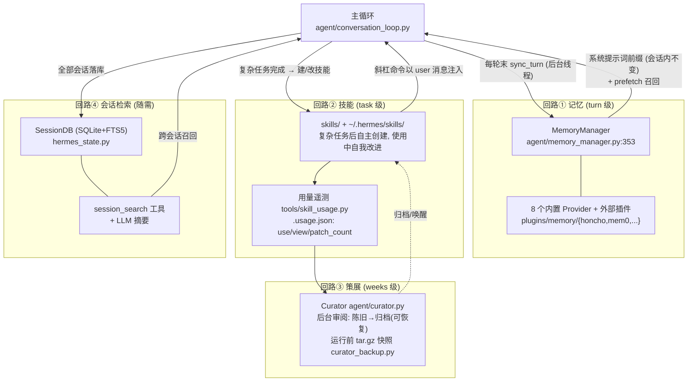
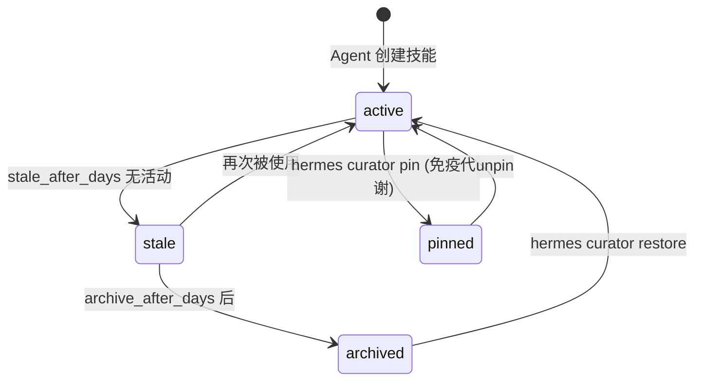

# 05 — 记忆系统与学习闭环："自我改进"如何工程化落地

> 依据：`agent/memory_provider.py`（`MemoryProvider` ABC）、`agent/memory_manager.py`（`MemoryManager` 编排器 + `StreamingContextScrubber`）、`plugins/memory/`（8 个内置 provider）、`agent/skill_commands.py`、`tools/skill_usage.py`、`agent/curator.py` + `agent/curator_backup.py`、`hermes_state.py`（FTS5 会话库）。

---

## 1. 总览："学习"被拆成四条独立回路

README 宣称的 "self-improving"（README:19,26）不是一个单点功能，而是四条各自独立、互相喂养的回路。**每条回路都是主循环的旁路 —— 学习失败绝不阻塞对话**：



时间尺度是理解这个设计的钥匙：记忆按**轮**同步，技能按**任务**沉淀，Curator 按**周**代谢，会话检索**随需**发生。四条回路没有共享状态机，通过文件系统与 SQLite 松耦合。

## 2. 回路①：记忆 —— ABC + 编排器模式的范本

### 2.1 为什么是这个形状

记忆后端是典型的"3+ 个 PR 集成同一类东西"场景（`AGENTS.md:208-211` 的治理规则）：honcho、mem0、supermemory、byterover、hindsight、holographic、openviking、retaindb 八家实现，如果逐个合并会在核心里留下八套私有钩子。实际方案：

- **`MemoryProvider` ABC**（`agent/memory_provider.py:43`）定义生命周期契约；
- **`MemoryManager`**（`agent/memory_manager.py:353`）作为唯一编排器，主循环只认识它；
- provider 全部住在 `plugins/memory/`，且该目录已**政策性封闭**（`AGENTS.md:786-795`）：新后端必须以独立插件仓库发布，实现同一 ABC、走同一发现路径 —— 核心表面从此不再为记忆后端增长。

### 2.2 ABC 的钩子设计：挂在生命周期的每个关节上

`agent/memory_provider.py` 的钩子清单本身就是一张"记忆何时介入"的地图：

| 钩子 | 挂载点 | 语义 |
|------|--------|------|
| `system_prompt_block()` | 会话开始，一次性 | 注入系统提示词的记忆前缀 —— 之后**不再变**（缓存公理） |
| `prefetch(query)` / `queue_prefetch()` | 用户消息到达 | 按 query 召回相关记忆；queue 版本异步不阻塞 |
| `sync_turn(turn_messages)` | 每轮结束 | 增量写入本轮对话（后台线程，`memory_manager.py:592` 的 `_run`） |
| `on_pre_compress(messages)` | 上下文压缩前 | 压缩会丢历史 —— 给 provider 最后机会把要丢的内容持久化 |
| `on_delegation(task, result)` | 子代理完成 | 委派的经验也是经验 |
| `on_session_switch()` / `on_session_end()` | 会话边界 | 收尾与迁移 |
| `get_tool_schemas()` / `handle_tool_call()` | 工具面 | provider 可自带工具（如 honcho 的 dialectic 查询），按需出现在 schema |
| `backup_paths()` | Curator 备份 | 声明自己的持久化文件，纳入统一快照 |

### 2.3 防御细节：`StreamingContextScrubber`

`agent/memory_manager.py:171` 值得单独一提：记忆召回的内容会进入流式输出路径，scrubber 以**流式状态机**（而非攒全量再正则）清洗 provider 返回文本中的上下文标记/技能脚手架，边界 tag 可能被 chunk 切开，所以有 `_max_partial_suffix` 这类"半个 tag 悬在缓冲区"的处理（:273-321）。教训通用：任何"把外部文本拼进模型可见上下文"的地方都需要防结构污染。

### 2.4 memory 工具是 Agent 级拦截

`memory` 和 `todo` 工具不走 `handle_function_call` 的注册表分发，而是被 `run_agent.py` **提前拦截**（`AGENTS.md:555`）——因为它们要读写 Agent 实例自身的状态（当前会话、todo store），而注册表 handler 是无 Agent 上下文的纯函数。这是"窄腰"上一个有意为之的例外，边界清晰：只有需要 Agent 自身状态的工具才允许拦截。

## 3. 回路②③：技能与 Curator —— 用"文件 + 遥测 + 后台代谢"实现能力沉淀

### 3.1 技能是 Agent 可读写的知识单元

技能就是 `~/.hermes/skills/<name>/SKILL.md`（+ scripts/references/templates），三个来源：仓库内置（`skills/`）、可选安装（`optional-skills/`，经 `tools/skills_hub.py` 的 `OptionalSkillSource`）、**Agent 自主创建**（复杂任务完成后的 learning 流程，`agent/learn_prompt.py`）。

注入方式再次体现缓存公理：技能斜杠命令由 `agent/skill_commands.py` 扫描，触发时以 **user 消息**注入而非改系统提示词（`AGENTS.md:381`）。技能内容也因此天然可版本化、可 diff、可被 Agent 自己 `patch` —— "使用中自我改进"的实现基础就是技能是普通文件。

### 3.2 Curator：带保险的自动代谢

能自主创建就会无限堆积。Curator（`agent/curator.py`）是后台维护回路：

- **输入**：`tools/skill_usage.py` 维护的 sidecar `~/.hermes/skills/.usage.json`（每技能 `use_count / view_count / patch_count / last_activity_at / state / pinned`）；
- **决策**：按 `curator` 配置（`interval_hours / min_idle_hours / stale_after_days / archive_after_days`）+ LLM 审阅做状态迁移；
- **动作**：`active → stale → archived`，归档进 `~/.hermes/skills/.archive/`。



安全设计的层次感值得注意：**用户永远不会丢技能** —— 归档可恢复（`restore`）、可豁免（`pin`）、每次 Curator 运行前先做 tar.gz 快照（`agent/curator_backup.py`）、还有 `rollback` verb。一个会自动删东西的后台系统，其信任度完全由"撤销路径的完备性"决定。

## 4. 回路④：会话检索 —— 把"过去的自己"变成检索源

所有宿主（CLI/网关/TUI/cron）的会话都写入同一个 SQLite 库（`hermes_state.py`，~6.3k 行），FTS5 全文索引。`session_search` 是核心工具集的一员（`toolsets.py:61`），Agent 可以在对话中主动检索自己的历史会话并做 LLM 摘要 —— "我们上次讨论的方案"不再依赖当前上下文窗口。

与记忆回路的分工：**记忆是策展过的结论**（provider 决定存什么），**会话库是未加工的全量原文**（兜底召回）。两者一个高信噪比、一个高召回率。

## 5. 🛠️ 动手实操

### 5.1 最小可运行示例：MemoryProvider ABC + 编排器 + 旁路同步（零依赖）

```python
# mini_memory.py — 复现 ABC+编排器 与 "学习不阻塞对话" (零依赖)
import json, threading, time
from abc import ABC, abstractmethod
from pathlib import Path

class MemoryProvider(ABC):                    # 对应 agent/memory_provider.py:43
    @property
    @abstractmethod
    def name(self) -> str: ...
    def system_prompt_block(self) -> str: return ""   # 会话开始注入一次, 之后不变
    def prefetch(self, query: str) -> str: return ""
    def sync_turn(self, turn_messages: list) -> None: ...

class FileMemory(MemoryProvider):             # 极简 provider: JSONL 文件
    def __init__(self, path="mini_mem.jsonl"): self.path = Path(path)
    @property
    def name(self): return "file"
    def system_prompt_block(self):
        if not self.path.exists(): return ""
        lines = self.path.read_text(encoding="utf-8").strip().splitlines()[-3:]
        return "已知的用户事实:\n" + "\n".join(f"- {json.loads(l)['fact']}" for l in lines)
    def prefetch(self, query):
        if not self.path.exists(): return ""
        hits = [json.loads(l)["fact"] for l in self.path.read_text(encoding="utf-8").splitlines()
                if any(w in l for w in query.split())]
        return f"召回: {hits}" if hits else ""
    def sync_turn(self, turn_messages):
        time.sleep(1.0)                       # 模拟慢后端 (网络记忆服务)
        for m in turn_messages:
            if m["role"] == "user" and "我喜欢" in m["content"]:
                with self.path.open("a", encoding="utf-8") as f:
                    f.write(json.dumps({"fact": m["content"]}, ensure_ascii=False) + "\n")

class BrokenMemory(MemoryProvider):           # 永远抛异常的 provider
    @property
    def name(self): return "broken"
    def sync_turn(self, turn_messages): raise RuntimeError("后端挂了")

class MemoryManager:                          # 对应 agent/memory_manager.py:353
    def __init__(self): self.providers = []
    def add_provider(self, p): self.providers.append(p)
    def build_system_prompt(self):
        return "\n\n".join(b for p in self.providers if (b := p.system_prompt_block()))
    def sync_all(self, turn_messages):        # 旁路: 后台线程 + 逐 provider 兜异常
        def _run():
            for p in self.providers:
                try: p.sync_turn(turn_messages)
                except Exception as e: print(f"  [warn] provider {p.name} 同步失败: {e} (对话不受影响)")
        threading.Thread(target=_run, daemon=True).start()

if __name__ == "__main__":
    mm = MemoryManager(); mm.add_provider(FileMemory()); mm.add_provider(BrokenMemory())
    turn = [{"role": "user", "content": "我喜欢用 Vim 写 Python"},
            {"role": "assistant", "content": "记住了"}]
    t0 = time.time(); mm.sync_all(turn)
    print(f"① sync_all 返回耗时 {time.time()-t0:.3f}s (慢后端+坏后端都不阻塞主循环)")
    time.sleep(1.3)                           # 等后台写完
    print("② 下一会话的系统提示词前缀:\n" + mm.build_system_prompt())
    print("③ prefetch('Vim 相关'):", mm.providers[0].prefetch("Vim"))
```

预期输出：① 耗时 ≈0.000s（虽然 FileMemory 要睡 1 秒、BrokenMemory 必炸）；`[warn]` 行出现但程序不死；② 新会话能看到上一会话的事实；③ 召回命中。

### 5.2 改造练习

**练习 1（换一个存储后端）**：不改 `MemoryManager` 和调用方，写一个 `SqliteMemory(MemoryProvider)`（用 stdlib `sqlite3`，可加 FTS5 虚表 `CREATE VIRTUAL TABLE facts USING fts5(fact)`），与 FileMemory 并存。
*预期*：`build_system_prompt()` 自动聚合两个后端的块 —— 体会为什么 Hermes 能同时挂 8 家 provider 而主循环零感知。

**练习 2（实现 on_pre_compress）**：给 ABC 加 `on_pre_compress(messages) -> None` 默认空实现；模拟压缩流程：截断 messages 前先广播给所有 provider，让 FileMemory 把即将被丢弃的 user 消息存下来。
*预期*：压缩后历史里消失的信息在下一会话的记忆前缀中"复活"。这正是 `agent/memory_provider.py:220` 钩子存在的意义 —— 压缩与记忆两个子系统通过钩子解耦协作。

**练习 3（微型 Curator）**：给每条事实加 `last_hit` 时间戳（prefetch 命中时刷新），写一个 `curate()` 函数把 N 秒未命中的事实移到 `mini_mem.archive.jsonl`。先实现"归档前整体备份"，再实现 `restore(fact_substring)`。
*预期*：陈旧事实从前缀里消失但可恢复。按"先写撤销路径、再写删除路径"的顺序做 —— 这是 Curator 设计给出的工程习惯。

### 5.3 验证方式

- 示例：`mini_mem.jsonl` 落盘一行；重复运行第二次时 ② 部分非空。
- 练习 1：删掉 FileMemory 只留 SqliteMemory，调用方代码 `git diff` 为零改动即验收通过。
- 练习 3：`curate()` 后 `build_system_prompt()` 不含旧事实；`restore()` 后恢复；备份文件始终存在。

---

*上一篇：[04 — 网关路由](./04-网关与多平台会话路由.md) ｜ 下一篇：[06 — 上下文工程与提示词缓存](./06-上下文工程与提示词缓存.md)*
