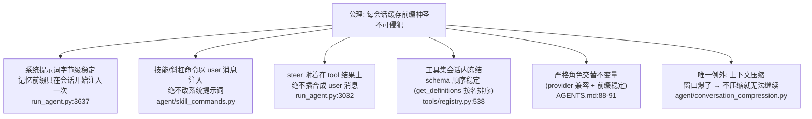
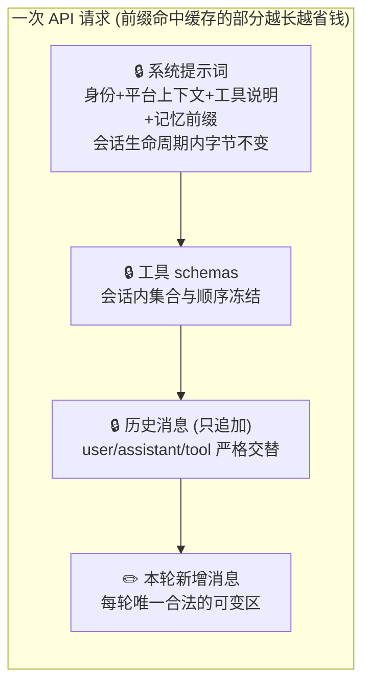

# 06 — 上下文工程与提示词缓存：全项目第一设计公理的展开

> 依据：`AGENTS.md:16-27`（公理声明）、`agent/conversation_compression.py`（`compress_context`）、`agent/context_compressor.py`（`ContextCompressor`）、`run_agent.py`（`_build_system_prompt` :3637、`_anthropic_prompt_cache_policy` :1331、`_check_openrouter_cache_status` :3233）、`agent/context_engine.py`、`trajectory_compressor.py`。

---

## 1. 经济学模型：为什么缓存是公理而不是优化

LLM provider 的提示词缓存（prompt caching）规则大致是：**如果本次请求的前缀与近期某次请求逐字节相同，前缀部分按 1/10 左右计价**。对一次性脚本这无关紧要；对 Hermes 的目标场景 —— 一个常驻数月、单会话上百轮的个人 Agent —— 这是 10 倍成本差，是"能不能在 $5 VPS 上养一个 Agent"的分水岭。

于是得到项目第一公理（`AGENTS.md:19-23`）：**任何在会话中途修改历史上下文、切换工具集、重建系统提示词的行为都会击穿缓存，我们不做**（唯一例外：上下文压缩）。

这条公理的传播半径远超"缓存"本身，前几篇文档中所有"绕着走"的设计都是它的推论：



一个精确的细节佐证公理如何渗透到实现末梢：`registry.get_definitions()` 里 `for name in sorted(tool_names)`（`tools/registry.py:538`）—— 工具 schema 的**序列化顺序**都必须确定化，因为顺序变化同样击穿前缀。

## 2. 上下文的分层结构

一次 API 请求的 messages 数组，按"稳定程度"分层（越靠前越不许动）：



Provider 差异被适配层吸收：Anthropic 需要显式 `cache_control` 断点（`run_agent.py:1331` 的 `_anthropic_prompt_cache_policy`）；OpenAI/OpenRouter 是隐式前缀匹配，Hermes 只做监测（`_check_openrouter_cache_status`，:3233，从响应头读缓存命中情况）。**策略层（"别动前缀"）与机制层（各家怎么标注缓存）分离** —— 循环代码里没有任何 provider 特定的缓存逻辑。

## 3. 唯一例外：上下文压缩的完整流程

窗口爆掉时不压缩就无法继续对话，此时"击穿缓存"成为两害相权的正确选择。但注意压缩的触发和执行有多克制：

```mermaid
sequenceDiagram
    participant LOOP as conversation_loop
    participant CC as compress_context<br/>conversation_compression.py:435
    participant ENG as ContextCompressor<br/>context_compressor.py:699
    participant AUX as 辅助 LLM<br/>agent/auxiliary_client.py

    LOOP->>LOOP: API 调用返回"上下文超限"错误
    Note over LOOP: 压缩是错误驱动的兜底,<br/>不是每轮的主动行为
    LOOP->>CC: compress_context(messages)
    CC->>CC: 跨进程压缩锁 + 租约续期<br/>(_CompressionLockLeaseRefresher :75)
    CC->>ENG: 分级瘦身 (先便宜后昂贵)
    Note over ENG: ① 剥离历史图片/媒体<br/>_strip_historical_media :520<br/>② 截断工具调用参数 :423<br/>③ 摘要化旧工具结果<br/>_summarize_tool_result :577
    ENG->>AUX: 仍不够 → LLM 摘要压缩<br/>(auxiliary 配置可指定便宜模型)
    AUX-->>ENG: 压缩后的历史
    ENG->>CC: 校验不变量
    Note over CC: _ensure_compressed_has_user_turn :394<br/>压缩产物必须仍以 user 回合开场<br/>(角色交替公理在压缩后依然成立)
    CC-->>LOOP: 新 messages (缓存前缀重建, 一次性代价)
    LOOP->>LOOP: 重试原 API 调用<br/>(refund 预算, 不计迭代)
    LOOP->>LOOP: memory.on_pre_compress 已在丢历史前广播<br/>(要丢的信息给记忆系统最后机会持久化)
```

设计要点：

- **分级瘦身**：先做确定性、无损失可控的操作（剥图片、截参数、摘要工具结果），LLM 摘要是最后手段 —— 便宜的先上。
- **压缩也要守不变量**：压缩产物必须通过 `_ensure_compressed_has_user_turn` 等校验，否则等于用一个 bug 换另一个 bug。
- **失败有冷却**：同会话压缩失败后有 cooldown（`conversation_loop.py:995` 附近注释），防止"压缩失败→重试→再失败"的死循环。
- **与记忆协作**：`on_pre_compress` 钩子（第 05 篇）让"遗忘"变成"转存"。
- **跨进程锁**：多个 Agent 进程（CLI + 网关）可能共享会话，压缩锁带租约续期，持有者崩溃后锁能自然过期。

另有独立的 `trajectory_compressor.py`（仓库根目录）：那是**离线**的训练数据管线（README:30 "trajectory compression for training"），与在线压缩共享思路但不共享路径 —— 在线服务对话，离线服务研究。

## 4. 上下文预算的其他消费者

窗口是稀缺资源，除了压缩兜底，还有常态化的预算管制：

- **工具结果截断**：每工具 `max_result_size_chars`（`tools/registry.py:606`），全局默认在 `tools/budget_config.py`；
- **图片的两级降级**：先试缩小（`try_shrink_image_parts_in_messages`，`conversation_compression.py:1105`），再试从 tool 消息剥除（`run_agent.py:5111`）；
- **子代理即上下文隔离**：`delegate_task` 的本质价值之一是**父上下文只花一条摘要的钱**，子代理的几十轮工具调用在自己的窗口里燃烧（`AGENTS.md:983-1013`）；
- **execute_code 的 RPC 模式**：写一个 Python 脚本经 RPC 调用多个工具，把多步管线压成一次工具调用 —— "zero-context-cost turns"（README:28）；
- **上下文占用可观测**：`agent/context_breakdown.py` 提供窗口占用的分解视图。

把这些放在一起看，Hermes 的上下文工程哲学是：**预算管制常态化（截断/降级/隔离），重建缓存例外化（仅压缩）**。

## 5. 🛠️ 动手实操

### 5.1 最小可运行示例：量化"击穿缓存"的代价（零依赖）

用一个模拟计费器直观感受公理的经济学。规则设定为业界典型值：缓存命中的 token 按 0.1 倍计价：

```python
# cache_econ.py — 模拟提示词缓存经济学 (零依赖)
HIT_DISCOUNT = 0.1                      # 缓存命中部分按 1/10 计价

class Provider:
    """模拟带前缀缓存的 LLM 计费"""
    def __init__(self): self.last_prefix = []
    def bill(self, messages):
        toks = [len(str(m)) // 4 or 1 for m in messages]   # 粗糙 token 估算
        hit = 0
        for a, b, t in zip(self.last_prefix, messages, toks):
            if a == b: hit += t
            else: break                  # 前缀匹配在第一个差异处断裂
        total = sum(toks)
        self.last_prefix = list(messages)
        return hit, total, (total - hit) + hit * HIT_DISCOUNT

def run(label, mutate_history):
    p, msgs, cost = Provider(), [{"role": "system", "content": "身份说明" * 200}], 0.0
    for turn in range(1, 21):            # 20 轮对话
        msgs.append({"role": "user", "content": f"第{turn}个问题" * 30})
        if mutate_history:               # 违反公理: 每轮"优化"一下系统提示词
            msgs[0] = {"role": "system", "content": f"身份说明(第{turn}轮更新)" * 200}
        hit, total, c = p.bill(msgs)
        cost += c
        msgs.append({"role": "assistant", "content": f"第{turn}个回答" * 30})
    print(f"{label:<28} 20轮总费用 = {cost:>10.0f} (计费单位)")
    return cost

if __name__ == "__main__":
    a = run("✅ 只追加 (Hermes 公理)", mutate_history=False)
    b = run("❌ 每轮改系统提示词", mutate_history=True)
    print(f"\n违反公理的成本放大倍数: {b/a:.1f}x")
```

预期输出：违反公理的版本贵 **数倍**（消息越长、轮数越多差距越大）—— 而两个版本的模型看到的信息量几乎相同。这就是"anything that mutates past context multiplies the user's cost"的量化版。

### 5.2 改造练习

**练习 1（模拟压缩的取舍）**：在 `run()` 里加规则：messages 总 token 超过阈值（如 5000）时执行"压缩"——把前一半历史替换为一条摘要消息（内容随意），并继续对话到 40 轮。统计总费用与"若不压缩会超窗口的轮数"。
*预期*：压缩那一轮出现一次费用尖峰（前缀断裂、全额计费），之后每轮费用反而更低（历史短了）。你将亲手看到"压缩击穿缓存是一次性代价，换来的是继续对话的可能性 + 更短的常态前缀"。

**练习 2（工具 schema 顺序敏感性）**：把系统消息后追加 5 条"工具 schema"伪消息，对照两种取法：`sorted(tools)` vs `random.shuffle(tools)`（每轮重排）。
*预期*：shuffle 版缓存命中率崩到只剩系统消息 —— 解释了 `tools/registry.py:538` 那个不起眼的 `sorted()` 为什么是缓存关键路径。

**练习 3（真实 API 验证，可选）**：如果有 Anthropic API key，用官方 SDK 发两次相同长系统提示词的请求（system 块加 `cache_control: {"type": "ephemeral"}`），读响应 `usage` 里的 `cache_creation_input_tokens` / `cache_read_input_tokens`。
*预期*：第一次 creation > 0、read = 0；一分钟内的第二次 read > 0。然后在第二次请求里改动系统提示词开头一个字，观察 read 归零 —— 真实世界确认模拟器的规则。

### 5.3 验证方式

- 示例：两行费用输出，倍数 > 2x（随参数增大）。
- 练习 1：绘出每轮费用曲线（纯文本打印即可），应看到"锯齿"：缓慢爬升 → 压缩尖峰 → 回落到更低水位再爬升。
- 练习 2：打印每轮 hit/total 比值，sorted 版稳定接近 1，shuffle 版接近 0。
- 对照源码收尾：读一遍 `agent/conversation_loop.py:995` 附近的压缩重试注释与 `agent/conversation_compression.py:394`，确认真实系统的压缩同样"守不变量、有冷却、计一次性代价"。

---

*上一篇：[05 — 记忆与学习闭环](./05-记忆系统与学习闭环.md) ｜ 返回：[00 — 阅读指南](./00-阅读指南与文档索引.md)*
