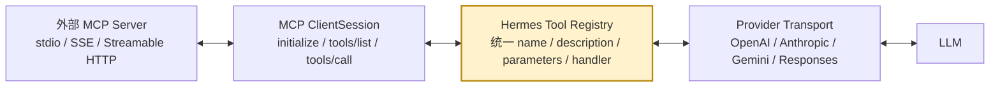
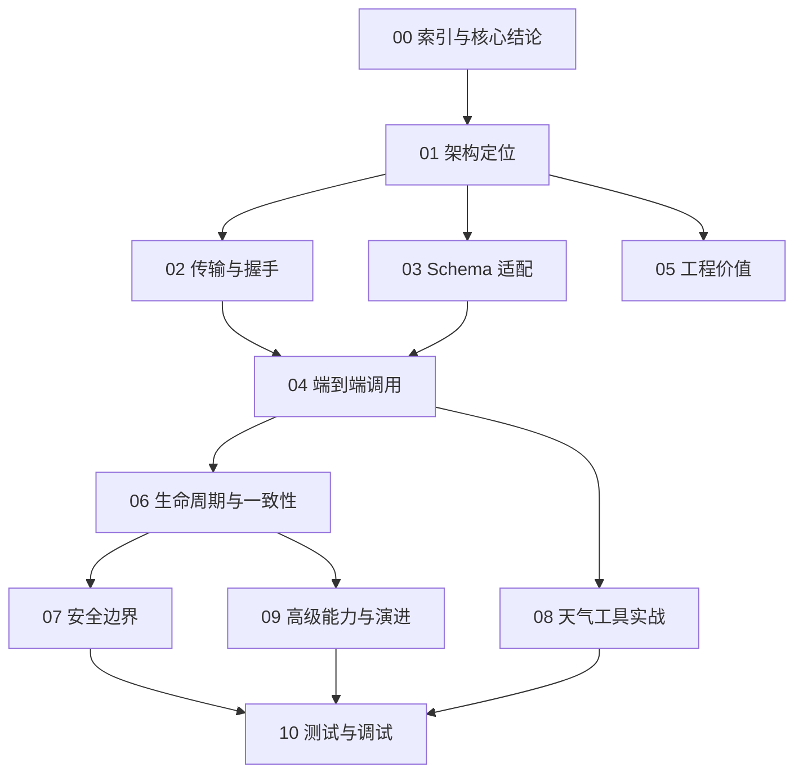

# Hermes MCP 源码架构系列：阅读索引与核心结论

> 分析对象：当前工作区 `hermes-agent`，源码快照 `b913c03c3`（2026-08-06）。  
> 阅读视角：关注数据流、状态机、协议边界和演进动因，不做逐行翻译。  
> 结论若与旧版用户文档冲突，以当前源码和测试为准。

## 1. 先给结论

Hermes 对 MCP 的实现，不应被理解成“又接了一个 API Client”。它实际建立了一个双向适配的窄腰：

1. **南向适配**：把 stdio、SSE、Streamable HTTP 上的 MCP Server，统一映射为 Hermes 内部的工具注册表契约。
2. **北向适配**：把内部统一工具定义，转换成 OpenAI、Anthropic、Gemini、Responses 等模型供应商各自接受的工具 Schema；再把各家的工具调用响应归一化回来。
3. **控制面与数据面分离**：配置、发现、注册、刷新属于控制面；模型选择工具、执行 RPC、返回结果属于数据面。
4. **长连接与同步 Agent 隔离**：MCP 连接运行在专用后台事件循环中，Agent 主循环仍可保持同步接口；两者通过线程安全的 future 桥接。
5. **会话稳定性优先**：动态工具变化不会粗暴地在任意时刻改写正在使用的工具快照，而是在安全边界原子发布，避免半更新状态和提示词缓存抖动。

最重要的结构如下：



`Tool Registry` 是真正的“架构窄腰”。MCP 只是工具来源之一，模型供应商也只是工具消费者之一。两端都可以演进，而不必形成 `某个 MCP Server × 某个模型 Provider` 的组合爆炸。

## 2. 文档地图

| 篇目 | 核心问题 | 建议读者 |
|---|---|---|
| [01：MCP 在 Hermes 中的架构定位](./01-MCP在Hermes中的架构定位.md) | MCP 为什么位于能力边缘？真正的解耦点在哪里？ | 所有人，必读 |
| [02：传输层与协议握手](./02-传输层与协议握手.md) | stdio、SSE、Streamable HTTP 如何连接、初始化和保持会话？ | 协议与基础设施开发者 |
| [03：工具发现与 Schema 适配](./03-工具发现与Schema适配.md) | MCP JSON Schema 如何变成模型可见的 tool definitions，再支撑 `tool_calls`？ | 工具平台、模型适配开发者 |
| [04：工具调用端到端数据流](./04-工具调用端到端数据流.md) | 一次模型工具调用如何穿过验证、钩子、注册表和 MCP RPC？ | Agent 核心开发者 |
| [05：Harness Protocol 的工程价值](./05-Harness协议对比硬编码API客户端.md) | 相比硬编码 API Client，统一协议的决定性优势和代价是什么？ | 架构师、技术负责人 |
| [06：生命周期、并发与一致性](./06-生命周期并发失败恢复与缓存一致性.md) | 重连、熔断、动态发现、并行调用和快照发布如何协作？ | 稳定性与并发开发者 |
| [07：安全与信任边界](./07-安全信任边界与权限治理.md) | stdio 本地代码、远程 OAuth、环境变量、工具暴露各有什么风险？ | 安全、平台与运维人员 |
| [08：极简本地天气 MCP 实战](./08-极简本地天气MCP接入实战.md) | 如何写一个最小 Server，并完整追踪数据流？ | 希望动手接入的开发者 |
| [09：高级能力与架构演进](./09-高级能力与架构演进.md) | Resources、Prompts、Sampling、Elicitation 为什么出现？架构为何演进到今天？ | 深度源码读者 |
| [10：测试、调试与源码阅读路线](./10-测试调试与源码阅读路线.md) | 如何用测试验证协议、不变量和故障场景？ | 贡献者、排障人员 |

## 3. 推荐阅读路径



- **只有 30 分钟**：读 01、04、05。
- **准备写 MCP Server**：读 02、03、07、08。
- **准备修改 Hermes MCP Client**：按顺序通读 01～07，再读 10。
- **关注生产稳定性**：重点读 02、06、07、10。

## 4. 源码地图

| 层次 | 关键文件 | 责任 |
|---|---|---|
| MCP 编排核心 | `tools/mcp_tool.py` | 连接、握手、发现、注册、调用、重连、动态刷新、资源/提示词包装 |
| stdio 进程守护 | `tools/mcp_stdio_watchdog.py` | 子进程生命周期与异常退出治理 |
| OAuth | `tools/mcp_oauth.py`、`tools/mcp_oauth_manager.py` | 远程授权、令牌管理与刷新 |
| 内部窄腰 | `tools/registry.py` | 工具定义、可用性门控、工具集、分发、代际版本 |
| 模型工具编排 | `model_tools.py` | 工具 Schema 获取、参数规整、钩子、审批、统一分发 |
| 工具渐进披露 | `tools/tool_search.py` | 大工具集压缩为搜索、描述、调用三件套 |
| Agent 快照 | `agent/agent_init.py`、`agent/turn_context.py` | 每个 Agent/轮次可见工具集合及安全刷新 |
| 对话状态机 | `agent/conversation_loop.py`、`agent/tool_executor.py` | 识别工具调用、持久化、执行、结果回填、进入下一轮模型调用 |
| Provider 适配 | `agent/transports/`、`agent/anthropic_adapter.py`、`agent/gemini_native_adapter.py`、`agent/codex_responses_adapter.py` | 内部统一 Schema 与各家 API 互转 |
| 配置与安全 UX | `hermes_cli/mcp_config.py`、`hermes_cli/mcp_security.py`、`hermes_cli/mcp_startup.py` | 添加、探测、校验、后台启动、晚到工具 |
| Hermes 消息桥 Server | `mcp_serve.py` | 把消息会话、事件、频道与审批操作暴露为 stdio MCP Server |
| Codex runtime 工具桥 | `agent/transports/hermes_tools_mcp_server.py` | 把精选、无 Agent 上下文依赖的 Hermes 工具以 stdio MCP 提供给 Codex 子进程 |
| 行为证据 | `tests/tools/test_mcp_*.py` 等 | 握手、兼容、重连、安全、Schema、进程清理等契约 |

## 5. 五个贯穿全系列的不变量

### 5.1 内部工具契约不依赖传输

进入 `ToolRegistry` 后，一个工具只剩下四类关键信息：

- 稳定名称；
- 给模型看的描述与参数 Schema；
- 实际执行 handler；
- 可用性与工具集元数据。

它来自 stdio MCP、远程 HTTP MCP、内置 Python 函数还是插件，不应影响上层 Agent 的调用方式。

### 5.2 工具调用结果必须回到严格的消息交替

模型返回 assistant/tool-call 后，Hermes 追加对应 tool result，再进入下一次模型推理。不能在工具调用链中随意插入伪造的 user 消息，否则会破坏供应商协议、会话语义和缓存前缀。

### 5.3 动态能力不能产生半更新视图

MCP Server 可以发出 `tools/list_changed`，连接也可能晚于 Agent 启动才就绪。Registry 用 generation 记录每次注册/注销变化；Agent 在安全边界重建候选快照，**只有工具名称集合变化时**才把 `tools` 与 `valid_tool_names` 一起发布。同名 Schema-only 变化会更新 Registry，但现有 Agent 通常保留旧 definitions，以避免无必要的 Prompt Cache 抖动。Registry 的一批差异更新本身也不是单个事务，原子性承诺只位于发生名称变化时的 Agent 双属性发布层。

### 5.4 默认并发策略必须保守

Hermes 无法仅凭 JSON Schema 推断一个第三方工具是否读写共享状态。MCP 工具默认串行；只有用户在对应 Server 配置中显式 opt-in `supports_parallel_tool_calls: true`，才允许进入批内并发调度。这不是 MCP Server 自描述 capability。

### 5.5 “能连接”不等于“可信”

stdio Server 是在本机执行的程序，HTTP Server 是可返回提示注入内容的远端主体。协议统一只解决互操作性，不自动提供沙箱、授权最小化或业务幂等性。

## 6. 术语约定

本文把用户所说的 **Harness Protocol** 理解为“宿主 Agent 与外部能力之间的统一外壳契约”。在本项目里，这个角色由两部分共同完成：

- 线上协议：MCP 的初始化、能力协商、工具发现和工具调用；
- 宿主内核：Hermes `ToolRegistry` 的统一工具契约。

MCP 本身不是 Hermes 内部所有模块的接口，也不是任意 API 的自动安全封装。准确说法是：**MCP 消除了外部工具接入协议的差异，Registry 消除了 Agent 内部调用来源的差异。**

## 7. 当前源码中的命名事实

当前实现生成的 MCP 工具名为：

```text
mcp__<sanitized_server_name>__<sanitized_tool_name>
```

例如：

```text
mcp__local_weather__get_weather
```

源码位置是 `tools/mcp_tool.py` 中的 `MCP_TOOL_NAME_PREFIX` 与 `mcp_prefixed_tool_name()`。旧材料可能仍展示单下划线形式；扩展时不要依据字符串拆分来恢复来源，Hermes 自身也使用独立的 provenance 映射判断工具属于哪个 Server。

## 8. 阅读边界

本系列重点解释 Hermes 作为 **MCP Client/Host** 的实现。`mcp_serve.py` 中“Hermes 把消息会话桥反向暴露为 MCP Server”的能力会在第 09 篇介绍，但不展开为完整的 Server API 手册。具体 SDK 帧编码、JSON-RPC 消息解析由固定版本的 MCP Python SDK 承担；Hermes 源码的价值主要在 SDK 之上的生命周期、适配、治理和一致性层。

---

[下一篇：MCP 在 Hermes 中的架构定位 →](./01-MCP在Hermes中的架构定位.md)
