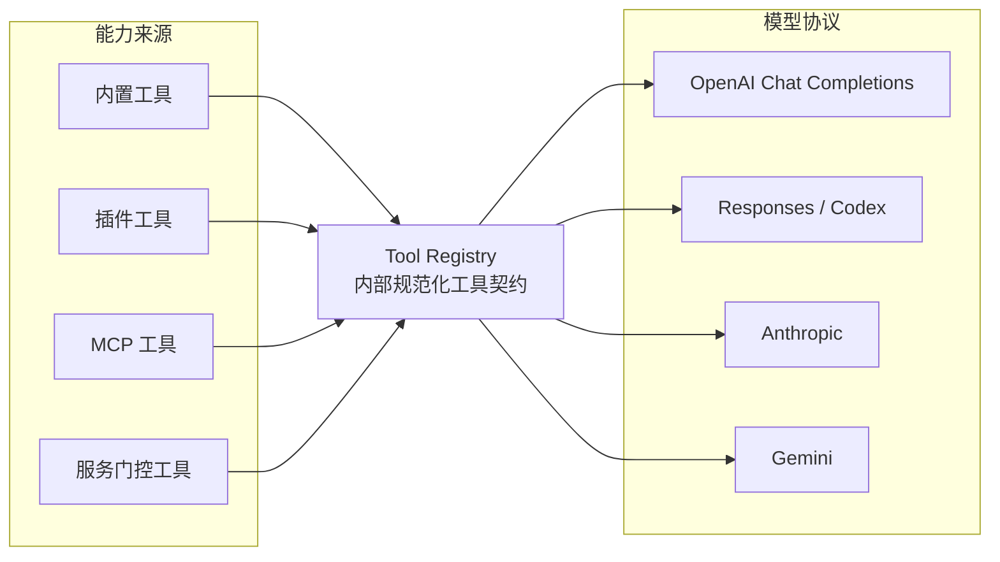
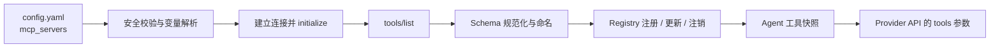
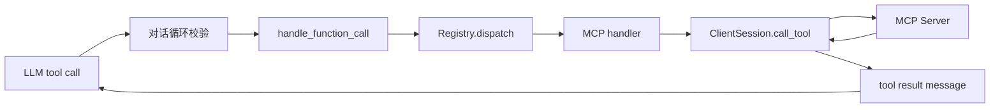
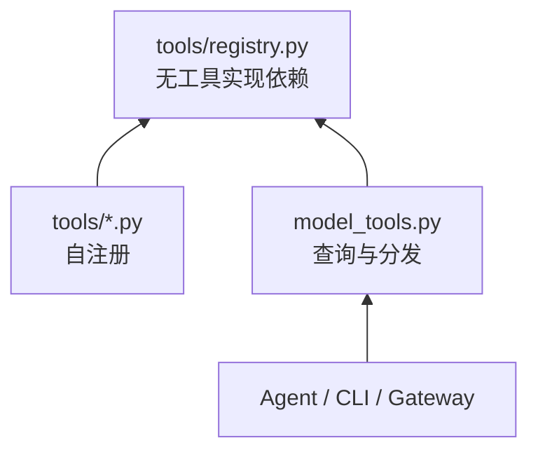

# 01｜MCP 在 Hermes 中的架构定位

## 1. 它解决的不是“少写几个 HTTP 请求”

如果把 MCP 仅理解成统一的 API 调用格式，会低估 Hermes 这套实现的设计价值。Hermes 同时面对两个独立变化轴：

- **能力来源轴**：本地 Python 工具、插件、MCP Server、记忆后端、浏览器、终端等；
- **模型供应商轴**：OpenAI Chat Completions、Responses/Codex、Anthropic、Gemini 等。

若每种能力直接适配每种模型，集成数量趋向 `能力来源数 × 模型协议数`。Hermes 通过内部统一工具契约把它拆为 `能力来源数 + 模型协议数`：



因此，MCP 的直接价值是“外部能力标准化”；`ToolRegistry` 的更深层价值是“内部依赖倒置”。

## 2. 三层窄腰，而不是一个巨型 MCP 模块

Hermes 的工具解耦可以分为三层。

### 2.1 协议窄腰：MCP SDK

`tools/mcp_tool.py` 不自行实现 JSON-RPC 帧解析，而是使用 MCP Python SDK 的：

- `stdio_client`；
- `sse_client`；
- `streamable_http_client` / 兼容旧版的 `streamablehttp_client`；
- `ClientSession`。

SDK 负责线上的读写流、请求 ID、响应匹配、`initialize`、通知和 MCP 数据类型。Hermes 不重新发明协议解析，而是在 SDK 之上解决生产级宿主问题。

### 2.2 领域窄腰：Tool Registry

`tools/registry.py` 几乎不依赖具体工具实现。工具通过注册动作提供：

```text
ToolEntry
├── schema       给模型看的定义
├── handler      运行时执行入口
├── check_fn     当前是否可用
└── toolset      归属、筛选和授权边界
```

上层只向 Registry 查询可见定义并按名称 dispatch。MCP 的连接细节被封装在 handler 闭包里；对话循环不知道它最终会走跨线程 RPC。

### 2.3 模型窄腰：ProviderTransport

内部工具定义采用接近 OpenAI function tool 的规范形态：

```json
{
  "type": "function",
  "function": {
    "name": "mcp__local_weather__get_weather",
    "description": "Query local weather",
    "parameters": {
      "type": "object",
      "properties": {
        "city": {"type": "string"}
      },
      "required": ["city"]
    }
  }
}
```

然后各 Provider Adapter 再转换：Anthropic 使用 `input_schema`，Gemini 使用 `functionDeclarations`，Responses API 使用扁平 function 定义。模型响应也被归一化为内部 `ToolCall(id, name, arguments)`。

这一层让 MCP 不必知道模型供应商，让模型适配器也不必知道工具来自 MCP。

## 3. 控制面与数据面

理解源码时，应把两个流分开。

### 3.1 控制面：决定“有哪些工具”



控制面主要由以下代码承担：

- `hermes_cli/mcp_startup.py`：后台启动发现；
- `tools/mcp_tool.py::register_mcp_servers()`：连接多个 Server；
- `tools/mcp_tool.py::_register_server_tools()`：注册工具；
- `tools/registry.py::ToolRegistry.get_definitions()`：生成统一工具定义；
- `agent/agent_init.py`、`agent/turn_context.py`：构建和刷新 Agent 快照。

### 3.2 数据面：执行“某一个工具”



数据面主要位于：

- `agent/conversation_loop.py`：识别和记录工具调用；
- `agent/tool_executor.py`：串行/并行编排；
- `model_tools.py::handle_function_call()`：参数、钩子、审批和统一错误；
- `tools/registry.py::ToolRegistry.dispatch()`：按名称找到 handler；
- `tools/mcp_tool.py::_make_tool_handler()`：把同步调用桥接到 MCP 后台事件循环。

把两面分开后，许多“看似重复”的代码就有了意义：发现失败不等于每次工具调用都失败；动态列表更新也不应直接干扰一个正在执行的 tool call。

## 4. 为什么 MCP 位于能力边缘

仓库的 Footprint Ladder 把新能力的优先级定义为：扩展现有代码 → CLI + Skill → 服务门控工具 → Plugin → MCP → 新核心工具。

原因不是 MCP 不重要，而是每一个核心工具 Schema 都会进入每一次模型请求：

- 增加 token 成本；
- 降低模型选对工具的概率；
- 扩大权限和提示注入表面；
- 让核心发布周期绑定第三方能力变化。

MCP 把这些能力移到可配置的边缘：未配置就不存在，禁用就不连接，`include` 可以只暴露必要工具，大规模工具集还可由 `tool_search` 渐进披露。

这体现了 Hermes 的核心策略：**产品能力可以快速扩张，但模型每轮都携带的核心表面必须克制。**

## 5. 依赖倒置是如何落实的

### 5.1 工具实现依赖 Registry，Registry 不依赖工具实现

依赖链是：



这里的箭头表示“依赖于”。MCP 模块注册一个 handler，而不是让 Registry import MCP 的内部类。这样删除某个 Server、关闭 MCP SDK，甚至没有安装可选依赖时，核心注册表仍有明确行为。

### 5.2 运行期使用 provenance，不依赖名称猜测

当前 MCP 工具名包含 `mcp__server__tool`，但 Hermes 判断一个工具是否支持并行等属性时，使用工具来源映射，而不是简单拆字符串。理由是：

- Server 名、工具名都要做字符清洗；
- 名称格式可能演进；
- 工具可能被刷新或重注册；
- 安全决策不应建立在脆弱的字符串约定上。

### 5.3 可用性通过 `check_fn` 表达

Registry 的工具定义查询会执行 `check_fn`。这允许一个工具“已注册但当前不可用”，而不要求调用者了解它为何不可用。对于可回收、可重连的 MCP Server，这比到处散落 `if session is not None` 更符合封装原则。

## 6. 为什么启动发现不能是 import 副作用

历史实现曾在 `model_tools.py` 导入时触发 MCP 发现。当前源码明确移除了这一做法，因为同步等待后台 future 可能冻结 Gateway 的异步心跳。

当前策略是：

- 各入口显式启动 MCP 发现；
- `hermes_cli/mcp_startup.py` 在后台线程执行；
- 首次工具快照只进行有界等待；
- 慢 Server 的工具允许“晚到”，再通过 generation 和安全快照刷新发布。

这是一个典型架构演进：从“导入即就绪”的方便，转向“生命周期由宿主明确拥有”。后者代码更多，但启动延迟、事件循环阻塞和失败隔离都可控。

## 7. 解耦后各模块真正承诺什么

| 模块 | 它承诺的事情 | 它刻意不知道的事情 |
|---|---|---|
| MCP Transport | 给出已初始化的 `ClientSession` | 模型如何表示 tool call |
| MCP Tool Adapter | MCP 工具可转为内部 schema + handler | Anthropic/Gemini 的字段格式 |
| Tool Registry | 稳定注册、查询、分发、代际变化 | handler 是本地函数还是 RPC |
| Agent Loop | 工具调用消息顺序、预算、中断、回填 | MCP 帧和子进程细节 |
| Provider Adapter | 内部 schema/响应与供应商 API 互转 | 工具业务逻辑和连接方式 |
| CLI Config | 配置写入、探测、用户反馈 | 对话循环如何执行工具 |

这个责任表比文件名更重要。阅读或修改代码时，如果一个模块开始知道右侧那些“刻意不知道”的细节，通常意味着耦合正在回流。

## 8. 架构收益与代价

收益：

- 外部工具和模型 Provider 可独立增长；
- 生命周期、重连、安全策略可以集中治理；
- 同一工具能出现在 CLI、Gateway、TUI、Desktop 共用的 Agent 核心中；
- 工具过滤、审批、观测、渐进披露可统一复用；
- 第三方能力不必进入 Hermes 核心发布树。

代价：

- Schema 兼容必须做保守规范化；
- 同步 Agent 与异步长连接之间需要复杂桥接；
- 动态发现带来快照一致性问题；
- 统一协议无法自动解决第三方工具的权限、幂等和质量问题；
- 故障可能跨越模型、Agent、Registry、传输、Server 五层，必须有分层诊断方法。

Hermes 接受这些复杂性，是因为它们集中在平台层，换来了所有外部能力不再各自重复承担同一套复杂性。

## 9. 本篇源码锚点

- `tools/registry.py`：模块说明、`ToolEntry`、`ToolRegistry.get_definitions()`、`dispatch()`。
- `tools/mcp_tool.py`：模块说明、`MCPServerTask`、`_register_server_tools()`、`_make_tool_handler()`。
- `model_tools.py`：MCP import 副作用移除说明、`get_tool_definitions()`、`handle_function_call()`。
- `agent/transports/base.py`：`ProviderTransport` 统一接口。
- `agent/agent_init.py`：Agent 工具快照初始化。
- `tools/tool_search.py`：外部工具渐进披露。
- 根目录 `AGENTS.md`：Prompt caching 与 narrow waist 两条设计公理、Footprint Ladder。

---

[← 阅读索引](./00-阅读索引与核心结论.md) ｜ [下一篇：传输层与协议握手 →](./02-传输层与协议握手.md)
