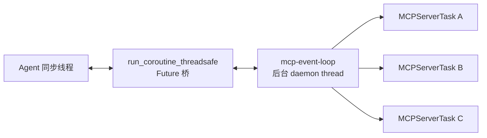
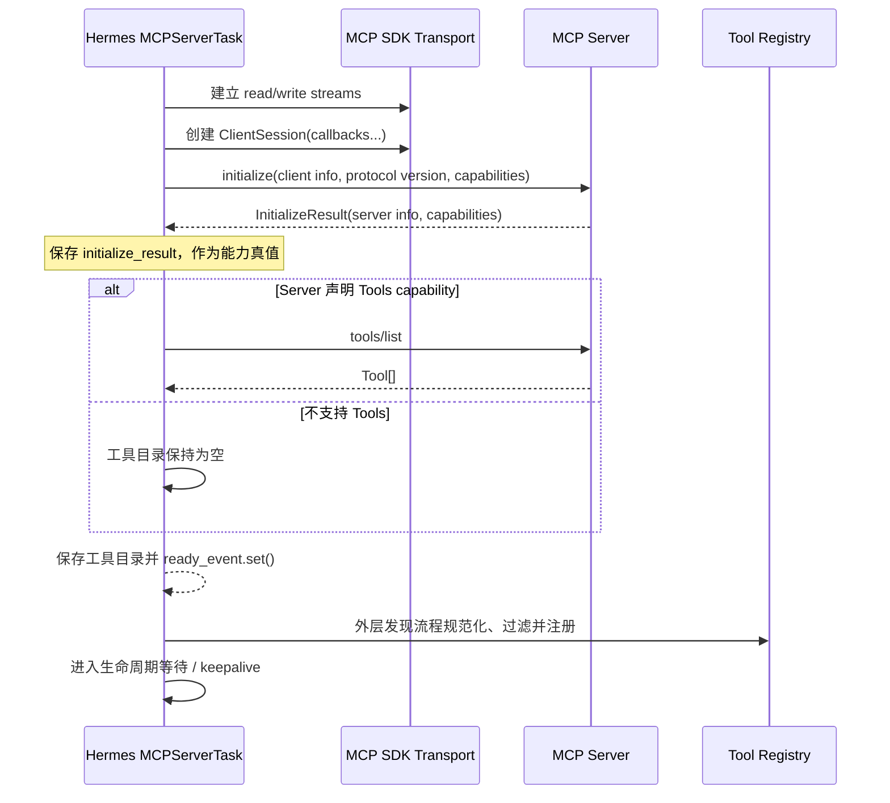
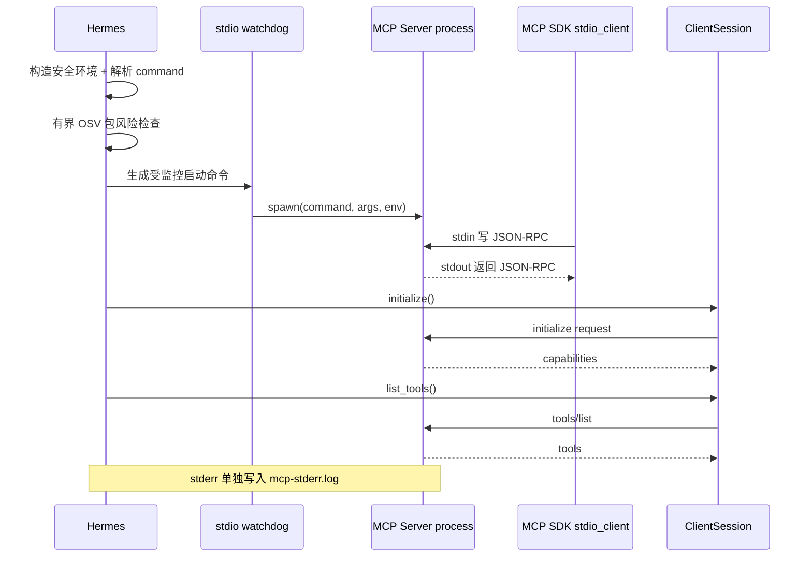
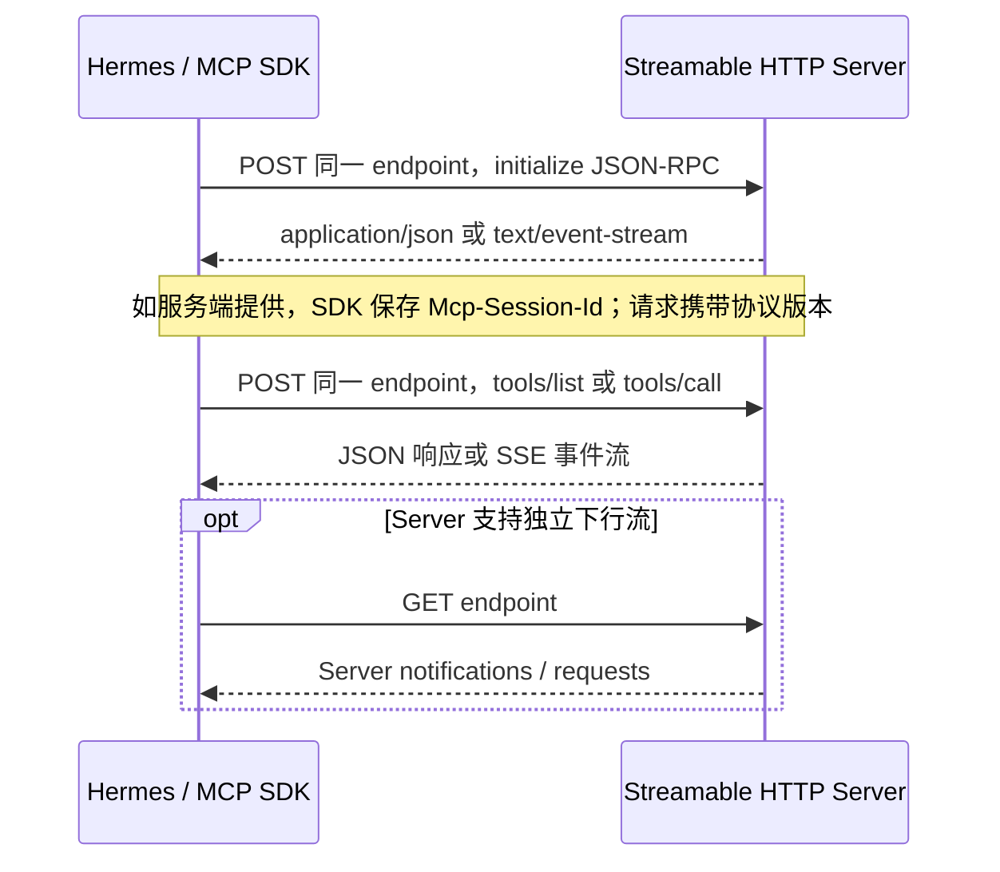
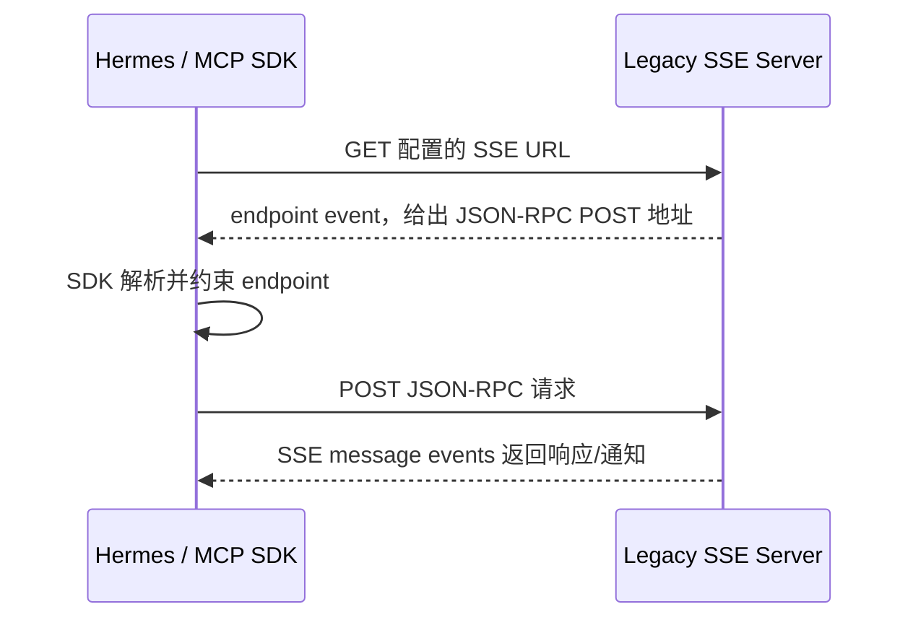
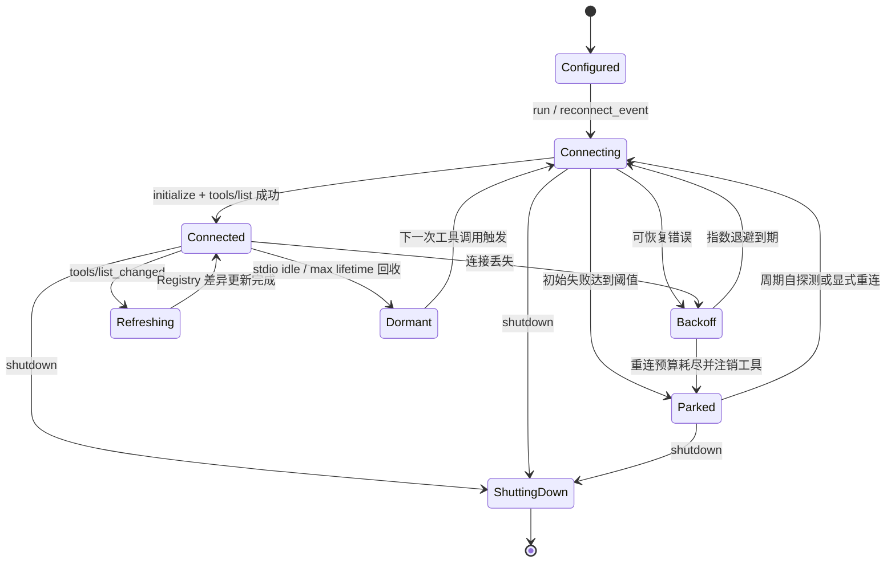

# 02｜传输层与协议握手：stdio、SSE 与 Streamable HTTP

## 1. 关键结论：Hermes 管生命周期，SDK 管协议帧

Hermes 没有手写一套 JSON-RPC parser。`tools/mcp_tool.py` 依赖固定版本的 MCP Python SDK，由 SDK 提供读写流和 `ClientSession`。职责边界是：

| 层 | 负责什么 |
|---|---|
| MCP Python SDK | JSON-RPC 编解码、请求 ID 对应、通知、MCP 类型、`initialize` / `tools/list` / `tools/call` |
| Hermes Transport 编排 | 启动进程或 HTTP Client、TLS/OAuth/header、超时、预检、回调接线 |
| `MCPServerTask` | 单 Server 状态、重连、熔断、keepalive、动态刷新、同 Task 清理 |
| Tool Adapter | Schema、命名、注册、调用结果转换 |

因此，“协议实现”更准确地分为两部分：**SDK 实现线上协议，Hermes 实现宿主语义。**

当前 `pyproject.toml` 固定 `mcp==1.26.0`。这很重要：Hermes 对新旧 Streamable HTTP import 名称仍保留兼容路径，但生产行为应以仓库锁定版本验证，而不是假设任意 MCP SDK 版本都一致。

## 2. 为什么有专用 MCP 事件循环

Agent 核心大量入口仍是同步调用，而 MCP SDK 基于 asyncio/anyio 长连接上下文。Hermes 为此建立一个守护线程：



`_ensure_mcp_loop()` 创建专用 loop；`_run_on_mcp_loop()` 用 `asyncio.run_coroutine_threadsafe()` 提交工作，并以短周期轮询 future，从而仍能响应 Agent 中断和调用超时。

这里有一个不直观但非常关键的约束：**每个 Server 的连接建立、长期等待和上下文退出都必须发生在同一个 asyncio Task 内。** MCP SDK/anyio 的 cancel scope 与创建它的 Task 绑定；若一个 Task `__aenter__`，另一个 Task `__aexit__`，清理可能抛错或泄露连接。因此 `MCPServerTask.run()` 自己拥有完整生命周期，而不是把 session context manager 拆给不同协程。

## 3. 公共握手流程

无论底层传输是什么，逻辑握手都遵循同一序列：



`initialize_result.capabilities` 不是装饰信息，但要注意方向：它描述 **Server capabilities**，Hermes 用它门控 Tools、Resources、Prompts 等服务端能力。Sampling 和 Elicitation 则是 Hermes 作为 Client 在 SDK 支持且本地配置开启时向 Server 广告的 client capabilities，并由相应 callback 承接；不能用 Server 的 `initialize_result` 反向推导它们。

这里有两个相邻但不同的就绪点：`MCPServerTask._ready` 表示 transport、initialize 和初次目录发现已完成；对 Agent 而言，只有外层发现流程随后把目录发布进 Registry，工具才真正可见。因而 Host 级“可用”至少包含：

```text
transport ready
  AND ClientSession initialized
  AND capability result captured
  AND initial tools/list completed，或因 Server 未声明 Tools capability 而合法跳过
  AND registry publication completed
```

## 4. stdio：本地子进程就是传输端点

### 4.1 建连数据流

配置示例：

```yaml
mcp_servers:
  local_weather:
    command: "C:\\path\\to\\python.exe"
    args: ["C:\\path\\to\\weather_server.py"]
    env:
      WEATHER_DATA_DIR: "C:\\weather-data"
```

`MCPServerTask._run_stdio()` 的核心流程：

在线路层，SDK 把每个 JSON-RPC 消息序列化为换行分隔的文本帧写入子进程 stdin，并从 stdout 逐帧读取、解析和按 request ID 关联响应；Hermes 只拿到类型化的 session 方法和结果。



### 4.2 三条 stdout 纪律

stdio 模式下，stdout 是协议通道，不是普通控制台：

1. Server 不应向 stdout `print()` 调试文本；
2. 日志应写 stderr；
3. 业务结果应作为 MCP tool result 返回，而不是直接输出。

Hermes 会把子进程 stderr 引导到 `~/.hermes/logs/mcp-stderr.log`，这既保护协议流，也为排障保留证据。

### 4.3 环境变量不是原样继承

Hermes 使用 `_build_safe_env()` 构造受限基础环境，再合并该 Server 显式配置的 `env`。目的不是提供进程沙箱，而是避免父进程中所有 API Key、Token 和内部变量无意泄露给第三方 Server。

这形成了一条清晰原则：

```text
Server 能看到的秘密 = 运行所需基础环境 + 配置明确授权的变量
```

而不是“Hermes 进程能看到什么，子进程就看到什么”。

### 4.4 子进程治理

本地 Server 比 HTTP Client 多出一类问题：父进程或 SDK 异常退出后，孙进程可能残留。当前实现组合使用 watchdog、PID 快照、孤儿追踪与 shutdown 清理。连接重试前也会尝试回收上一轮遗留进程。

这说明 stdio 并非“简单管道”：一旦进入长驻 Agent，它就是进程监督问题。

## 5. Streamable HTTP：当前远端默认路径

只要配置存在 `url` 且未显式指定 `transport: sse`，`_run_http()` 会走现代 Streamable HTTP 路径。

```yaml
mcp_servers:
  company_api:
    url: "https://mcp.internal.example.com/mcp"
    headers:
      Authorization: "Bearer ${COMPANY_MCP_TOKEN}"
```

主要步骤：

1. 解析显式 headers，并按需注入 `mcp-protocol-version`；
2. 构建 TLS 或 mTLS 配置；
3. 如 `auth: oauth`，接入 OAuth auth provider；
4. 构建专用 `httpx.AsyncClient`；
5. 开启重定向，但跨 origin 时剥离敏感 Authorization；
6. 把 client 交给 `streamable_http_client`；
7. 在得到的 streams 上创建 `ClientSession`；
8. 执行公共初始化和发现流程。

Streamable HTTP 允许服务端按协议返回普通 JSON 或事件流；session 标识、请求/响应和流式事件细节由 MCP SDK 处理。Hermes 关心的是 endpoint 是否可信、认证是否正确、连接是否可恢复。

在线路上可概括为：



Session ID、事件恢复标识和响应关联都由 SDK 管理；Hermes 不在业务代码里拼接这些 header 或手工匹配 request ID。

## 6. SSE：兼容路径，不是简单的 HTTP 开关

显式配置：

```yaml
mcp_servers:
  legacy_remote:
    url: "https://legacy.example.com/sse"
    transport: sse
```

此时 Hermes 使用 SDK 的 `sse_client`。它仍然建立 `ClientSession` 并执行相同的 `initialize → tools/list`，所以传输差异止于 SDK streams 下面；上层注册与调用逻辑不变。

旧 SSE 使用分离的读写通道：



也就是说，SSE 流主要承担 Server → Client，下行 endpoint 事件告诉 Client 将请求 POST 到哪里。该建链与帧解析仍由 SDK 完成。

SSE 路径也复用：

- OAuth provider；
- TLS/mTLS client factory；
- 连接超时；
- 较长的 SSE read timeout；
- 统一的 session callback。

这种结构避免了“stdio 一套工具发现、SSE 再复制一套”的分叉。

## 7. HTTP 预检为何采用保守的 fail-open

`MCPServerTask._preflight_content_type()` 会用 HEAD/GET 探测 endpoint；若看到 HTML，还会尝试发送最小 `initialize` POST，以区分真正 MCP endpoint 与登录页/错误页。这是 Hermes 少数手工构造 JSON-RPC payload 的地方，但只用于端点诊断，不承担正式 session 的帧解析、request ID 关联或握手状态机。

但它只在证据明确时拒绝：例如成功状态码却明确返回非 MCP 内容类型。网络失败、某些非 2xx 或预检自身不确定时，通常让正式 SDK 握手给出最终结论。

原因是预检只是用户体验优化，不是协议真值：

- 有些 Server 禁止 HEAD；
- 反向代理对 GET/POST 行为不同；
- OAuth endpoint 未授权时响应会变化；
- 预检规则过严会误杀合法实现。

所以其策略是：**确定错误时尽早报错，不确定时交给标准握手。**

## 8. 连接状态机

`MCPServerTask` 可抽象成以下状态机：



外部状态查询会归纳为 `configured / connecting / connected / disabled / failed`，但内部状态还包含 backoff、parked、recycle 和 breaker 等细节。

`Dormant` 与 `Parked` 不能合并：前者只用于 stdio 的 idle/max-lifetime 回收，工具仍保留在 Registry，可由下一次调用懒唤醒；后者表示连接失败预算耗尽，工具已注销，只能靠周期自探测或显式 reconnect/reload 恢复。HTTP 不应用 stdio 的 idle/max-lifetime recycle。

## 9. RPC 锁与 keepalive

每个 Server 有 `_rpc_lock`。这并不等于所有 MCP Server 永远不能并行，而是默认保护单一 session 的 RPC 流，尤其避免 `tools/list_changed` 触发的刷新与正在执行的 RPC 互相楔住。

工具批次是否进入并行候选，由用户在 Server 配置中的 `supports_parallel_tool_calls` 决策；它不是 MCP capability。即便配置允许，上层并发也必须服从具体 session/SDK 的安全边界。

keepalive 优先调用 `ping`。如果 Server 返回方法不存在（`-32601`），则退回轻量 `list_tools` 探测。这样兼容未实现 ping 的 Server，同时能发现半开连接。

## 10. Server 发起的消息如何进入 Hermes

创建 `ClientSession` 时，Hermes按 SDK 能力接入：

- message handler：处理 `tools/list_changed` 等通知；
- logging callback：接收 Server 日志；
- sampling callback：允许 Server 请求宿主模型采样；
- elicitation callback：允许 Server 请求用户参与；当前 Hermes form 路径只返回同意/拒绝/取消，不收集字段值。

这些回调仍发生在 MCP 事件循环中。需要与当前工具调用上下文关联的能力会捕获 contextvars，使审批/交互能回到正确会话，而不是误投给另一个并发用户。

## 11. 传输选择建议

| 场景 | 推荐 | 原因 |
|---|---|---|
| 本机脚本、开发调试、单用户私有能力 | stdio | 部署最小，无端口和服务发现 |
| 长期远端服务、多客户端共享 | Streamable HTTP | 现代 MCP 远程传输，适合认证与集中运维 |
| 兼容旧 MCP 服务 | SSE | Hermes 保留明确兼容入口 |
| 不可信第三方二进制 | 不要仅因支持 stdio 就直接运行 | stdio 是本地代码执行，协议不提供沙箱 |

## 12. 本篇源码锚点

- `tools/mcp_tool.py` 文件头：总体线程与 Task 生命周期说明。
- `tools/mcp_tool.py::MCPServerTask`：Server 级连接状态与所有权。
- `tools/mcp_tool.py::MCPServerTask._run_stdio()`：stdio 建连。
- `tools/mcp_tool.py::MCPServerTask._run_http()`：SSE/Streamable HTTP 建连。
- `tools/mcp_tool.py::MCPServerTask._preflight_content_type()`：远端端点预检。
- `tools/mcp_tool.py::_ensure_mcp_loop()`、`_run_on_mcp_loop()`：同步/异步桥。
- `tools/mcp_stdio_watchdog.py`：子进程监督。
- `tools/mcp_oauth.py`、`tools/mcp_oauth_manager.py`：OAuth 生命周期。
- `pyproject.toml`：MCP SDK 固定版本。

---

[← 上一篇：架构定位](./01-MCP在Hermes中的架构定位.md) ｜ [阅读索引](./00-阅读索引与核心结论.md) ｜ [下一篇：工具发现与 Schema 适配 →](./03-工具发现与Schema适配.md)
