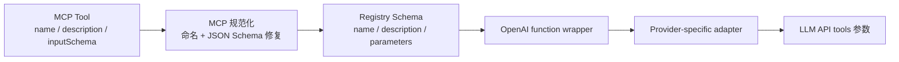
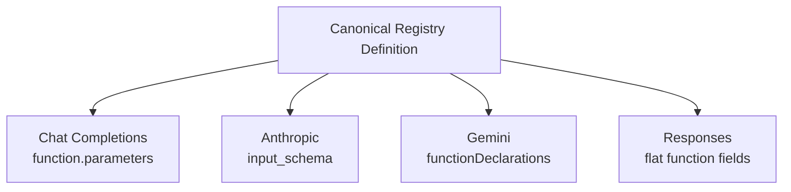
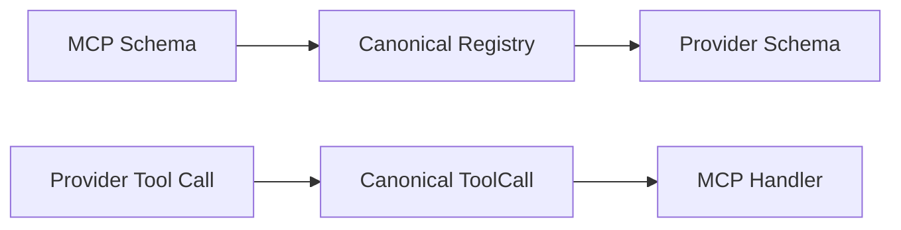
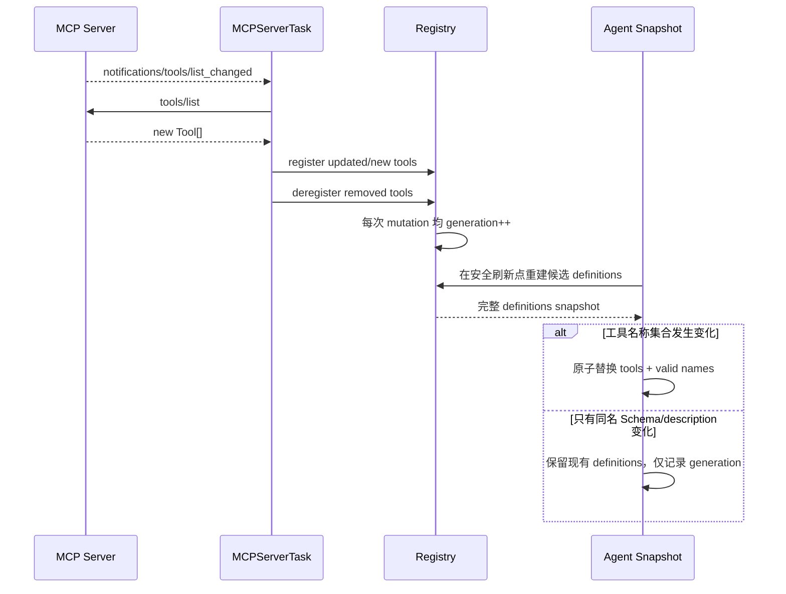

# 03｜工具发现与 Schema 适配

## 1. 一次转换不够：Hermes 使用“双适配”

MCP Server 给出的 `Tool.inputSchema` 不能直接假定被所有模型 Provider 接受。Hermes 的转换链分两段：



- 第一段解决“第三方 MCP Server 的 Schema 差异”；
- 第二段解决“模型供应商工具协议差异”。

这两段必须分开，否则 MCP 模块会逐渐塞满 Anthropic、Gemini、OpenAI 的特殊分支，失去协议解耦意义。

## 2. 工具发现：`tools/list` 是能力目录，不是执行结果

握手完成后，`MCPServerTask._discover_tools()` 先检查协商能力，再通过 `ClientSession.list_tools()` 取回工具目录。每个 MCP Tool 通常提供：

- `name`：Server 内的原始名称；
- `description`：给 Host/模型理解用途的自然语言；
- `inputSchema`：参数 JSON Schema；
- 某些实现还可能包含 annotations、output schema 等扩展信息。

Hermes 当前的模型工具主契约主要消费前三项。执行时仍使用 **原始 MCP tool name** 调 `session.call_tool()`，而模型看到的是带 Server 命名空间的 Hermes 名称。这是外部协议身份与内部全局身份的分离。

### 2.1 进入窄腰时保留了什么、暂未保留什么

| MCP 元数据 | 当前投影 | 架构后果 |
|---|---|---|
| `name` | 保留语义，加 Server namespace | 可全局路由且避免普通同名冲突 |
| `description` | 保留并做注入模式告警 | 直接影响模型选工具，仍是不可信输入 |
| `inputSchema` | 规范化后成为 `parameters` | 支撑参数描述和有限类型规整 |
| `outputSchema` | 当前不进入 Registry 核心契约 | Hermes 不按它完整验证 `CallToolResult` |
| read-only/destructive 等 annotations | 当前不作为核心调度依据 | 不会仅凭 MCP annotation 自动审批写操作或判定并行安全 |

因此这条窄腰是有意的“最小公共契约”，并非 MCP Tool 对象的无损镜像。并行需要用户在 Server 配置中显式设置 `supports_parallel_tool_calls`；审批依赖 Hermes 的 hook/策略；最终业务参数和输出语义仍由 Server 验证。

## 3. 名称适配：解决全局冲突，而不污染 Server

不同 Server 很容易都暴露 `search`、`list`、`create_issue`。Hermes 将模型可见名称构造成：

```text
mcp__<sanitized_server>__<sanitized_tool>
```

例如：

```text
Server: local-weather
MCP name: get-weather
Registry/LLM name: mcp__local_weather__get_weather
```

`sanitize_mcp_name_component()` 把不在 `[A-Za-z0-9_]` 内的字符替换成 `_`，以满足 Provider 对 function name 的限制。

这里有两个设计细节：

1. 双下划线分隔 Server 和 Tool，降低组件自身含下划线时的歧义；
2. 执行 handler 闭包保留原始 `tool_name`，所以 Server 无需知道 Hermes 的前缀规则。

若规范化后的名字与内置非 MCP 工具冲突，`_register_server_tools()` 保留内置工具并跳过 MCP 工具。核心能力不会被第三方 Server 静默覆盖。

## 4. JSON Schema 为什么必须修复

“都叫 JSON Schema”不等于每个模型 API 支持同一子集。第三方 Server 生成器、Pydantic 版本和模型 Provider 的校验器都可能不同。`_normalize_mcp_input_schema()` 在进入 Registry 前做一次 Provider 无关的兼容处理。

### 4.1 空 Schema 变成空对象

输入为空时，生成：

```json
{
  "type": "object",
  "properties": {}
}
```

这样“无参数工具”仍是一个合法 function parameters 对象，而不是 `null`。

### 4.2 `definitions` 提升为 `$defs`

旧 draft-07 常见：

```json
{
  "definitions": {
    "Location": {"type": "object"}
  },
  "properties": {
    "where": {"$ref": "#/definitions/Location"}
  }
}
```

会被改为：

```json
{
  "$defs": {
    "Location": {"type": "object"}
  },
  "properties": {
    "where": {"$ref": "#/$defs/Location"}
  }
}
```

转换是上下文敏感的：若某个真实业务参数恰好叫 `definitions`，位于 `properties` 映射的键中，它不会被误改为 `$defs`。这避免“修 Schema 的代码反而改了参数名”。

### 4.3 nullable union 收敛

Pydantic 常把可选字段表示成：

```json
{
  "anyOf": [
    {"type": "string"},
    {"type": "null"}
  ],
  "default": null
}
```

部分 Provider 不接受工具输入中的 null 分支。Hermes 通过共享 `tools.schema_sanitizer.strip_nullable_unions()` 收敛到非 null 分支，并保留 nullable hint；字段是否必填仍由父对象的 `required` 决定。

### 4.4 修复对象形状

递归规则包括：

- 有 `properties` 或 `required` 却缺 `type` 时，推断为 `object`；
- `type: object` 却缺 `properties` 时补空映射；
- `required` 中不存在于 `properties` 的名字被删除；
- 若顶层声明为 `object`，保证它拥有合理的 `properties`。对于明确声明成其他类型的 dict，当前函数会保留而不是强制改成 object；最终兼容性还要经过全局 sanitizer 和 Provider 校验。工具作者仍应主动输出 object 顶层，因为 function arguments 的正常契约是参数对象。

这些修复针对的是真实 Provider 拒绝场景：同一份 Schema 可能在某家宽松校验器通过，却在 Gemini、Anthropic 或 Moonshot 上直接 400。

## 5. 从 MCP Tool 到 Registry Entry

`_convert_mcp_schema()` 输出内部 schema：

```json
{
  "name": "mcp__local_weather__get_weather",
  "description": "Return weather for a supported city",
  "parameters": {
    "type": "object",
    "properties": {
      "city": {"type": "string"},
      "unit": {
        "type": "string",
        "enum": ["celsius", "fahrenheit"]
      }
    },
    "required": ["city"]
  }
}
```

随后 `_register_server_tools()` 注册一个 `ToolEntry`：

```text
name      = mcp__local_weather__get_weather
toolset   = mcp-local_weather
schema    = 上述内部定义
handler   = 闭包(server=local_weather, original_tool=get_weather)
check_fn  = 该 Server 当前是否可用
is_async  = false（对同步 Agent 暴露同步桥）
```

Registry 查询定义时，再包装成 OpenAI 风格的统一外形：

```json
{
  "type": "function",
  "function": {
    "name": "mcp__local_weather__get_weather",
    "description": "Return weather for a supported city",
    "parameters": {
      "type": "object",
      "properties": {"city": {"type": "string"}},
      "required": ["city"]
    }
  }
}
```

这只是 **Hermes 内部规范形态**，不意味着底层模型一定是 OpenAI。

## 6. Provider 适配：同一工具如何送给不同模型

### 6.1 OpenAI Chat Completions

`agent/transports/chat_completions.py` 基本保持统一 wrapper：

```json
{"type":"function","function":{"name":"...","description":"...","parameters":{}}}
```

### 6.2 Anthropic

`agent/anthropic_adapter.py` 转成：

```json
{
  "name": "mcp__local_weather__get_weather",
  "description": "...",
  "input_schema": {
    "type": "object",
    "properties": {"city": {"type": "string"}},
    "required": ["city"]
  }
}
```

### 6.3 Gemini

`agent/gemini_native_adapter.py` 把工具放入 function declarations，并进一步遵守 Gemini 接受的 Schema 子集。

### 6.4 Responses / Codex

`agent/codex_responses_adapter.py` 将内部 function wrapper 展平为 Responses API 所需字段，并处理 `strict` 等差异。

转换结构如下：



## 7. 反向路径：模型 `tool_calls` 如何归一化

不同 Provider 的响应形式也不同：OpenAI 返回 `tool_calls[].function.arguments`，Anthropic 返回 `tool_use` content block，Gemini 和 Responses 又有自己的事件/字段。

Provider Transport 将它们统一为逻辑对象：

```text
ToolCall
├── id
├── name
└── arguments
```

之后 `conversation_loop` 只处理这套抽象：

1. 检查名称是否属于当前工具快照；
2. 修复或拒绝非法参数 JSON；
3. 保存 assistant tool-call 消息；
4. 交给工具执行器；
5. 将结果形成匹配 `tool_call_id` 的 tool message。

这就是双适配的闭环：



## 8. 过滤、工具集与最小暴露

Schema 转换前，Hermes 使用原始 MCP tool name 应用配置：

```yaml
mcp_servers:
  issue_tracker:
    command: "..."
    tools:
      include: [list_issues, create_issue]
      exclude: [delete_issue]
```

规则是：

- `include` 非空时只注册白名单；
- 否则应用 `exclude`；
- 两者同时存在时 `include` 优先；
- 均未配置则注册全部。

这些工具归入 `mcp-<server>` toolset，并为原始 Server 名注册 alias。工具集是配置、Agent 授权和 progressive disclosure 的共同边界。

## 9. Resources 与 Prompts 为什么包装成工具

MCP 不只有 Tools，还可以声明 Resources 和 Prompts。为了让现有 Agent 工具循环无需增加第二套动作语义，Hermes在 Server 声明相应 capability 且配置允许时，注册辅助工具：

- `list_resources`；
- `read_resource`；
- `list_prompts`；
- `get_prompt`。

它们同样带 Server 前缀、handler 和 `check_fn`。这是一个重要取舍：MCP 协议面更丰富，但 Agent 内部仍保持“模型选择工具 → 返回工具结果”的单一窄腰。

## 10. 大工具集：Schema 正确仍可能不可用

一个 Server 暴露数十或数百个工具时，即使每个 Schema 都合法，把它们全部送给模型仍会产生：

- 大量 token 成本；
- prompt cache 前缀膨胀；
- 工具选择干扰；
- 每次动态变化都更昂贵。

`tools/tool_search.py` 在工具 Schema 占上下文比例超过阈值时，把非核心外部工具替换为三个桥接工具：

```text
tool_search    按名称、描述、参数名检索候选
tool_describe  获取候选的完整 Schema
tool_call      在授权范围内执行已发现工具
```

搜索目录从当前 Registry 快照重建，且 bridge dispatch 仍走原有审批、钩子和工具集限制。它不是绕过 Registry 的后门，而是工具 Schema 的渐进式加载层。

## 11. 动态 Schema 变化如何传播

当 Server 发 `tools/list_changed`：



Registry 的 monotonically increasing generation 是变化信号，每次 register/deregister 都会递增；一批 MCP diff 可能跨越多个 generation。Registry 本身不会把整批 diff 包成一个事务。Agent 刷新会按 **名称集合** 比较：新增/删除名称时，在锁内同时发布 `tools` 与 `valid_tool_names`；若名字完全相同，即便 Schema/description 已更新，也保持现有 Agent definitions 不变。

这是一项明确的缓存取舍，也带来兼容义务：Registry 中同名工具的 handler 已可能被换成新实现，而长会话中的模型仍依据旧 Schema 生成参数。因此 Server 不应在同一工具名下做破坏性参数变更；需要破坏性升级时应发布新工具名，或让用户启动重新构建工具快照的新 Agent/session。

## 12. Schema 设计建议

自己实现 MCP Tool 时，即使 Hermes 有修复层，也应主动提供干净 Schema：

- 顶层固定 `type: object`；
- 参数名稳定、简短，不用含义模糊的 `data`；
- `required` 只列真正必需参数；
- enum 明确表达有限选择；
- description 描述“何时调用、返回什么、是否有副作用”；
- 避免巨大嵌套和无限制自由文本；
- 返回结构应有稳定字段，不让模型解析人类日志；
- 不依赖 Provider 专有 JSON Schema 扩展。

Hermes 的 sanitizer 是兼容防线，不应成为 Server 输出低质量 Schema 的理由。

## 13. 本篇源码锚点

- `tools/mcp_tool.py::MCPServerTask._discover_tools()`：能力检查与 `tools/list`。
- `tools/mcp_tool.py::_normalize_mcp_input_schema()`：Schema 修复。
- `tools/mcp_tool.py::sanitize_mcp_name_component()`、`mcp_prefixed_tool_name()`：命名。
- `tools/mcp_tool.py::_convert_mcp_schema()`、`_register_server_tools()`：内部映射与注册。
- `tools/registry.py::ToolRegistry.get_definitions()`：OpenAI 风格统一 wrapper。
- `tools/schema_sanitizer.py`：跨来源共享 Schema 兼容逻辑。
- `agent/transports/` 与各 Provider adapter：北向转换和响应归一化。
- `tools/tool_search.py`：大目录渐进披露。

---

[← 上一篇：传输层与协议握手](./02-传输层与协议握手.md) ｜ [阅读索引](./00-阅读索引与核心结论.md) ｜ [下一篇：工具调用端到端数据流 →](./04-工具调用端到端数据流.md)
