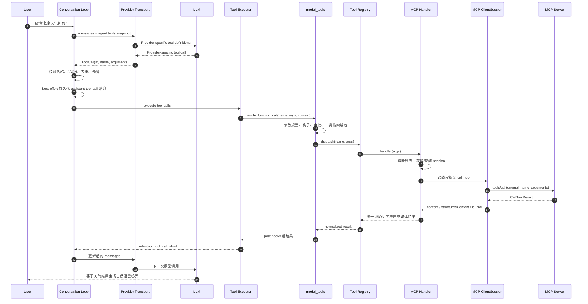
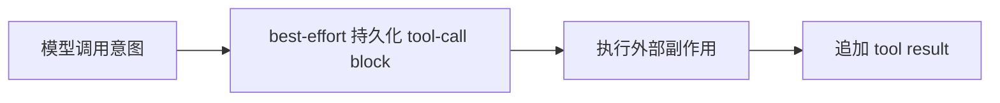
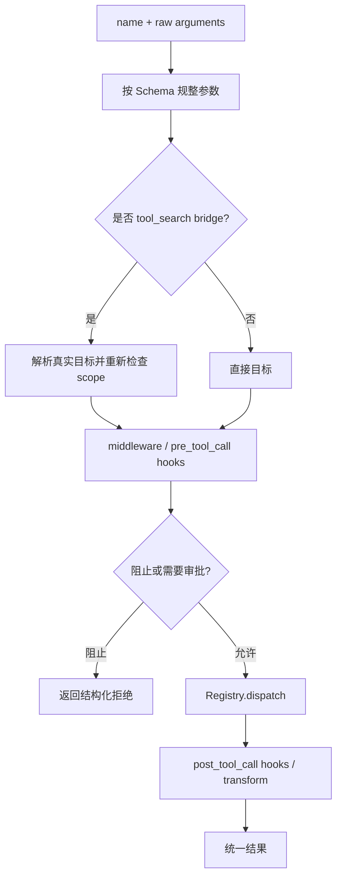
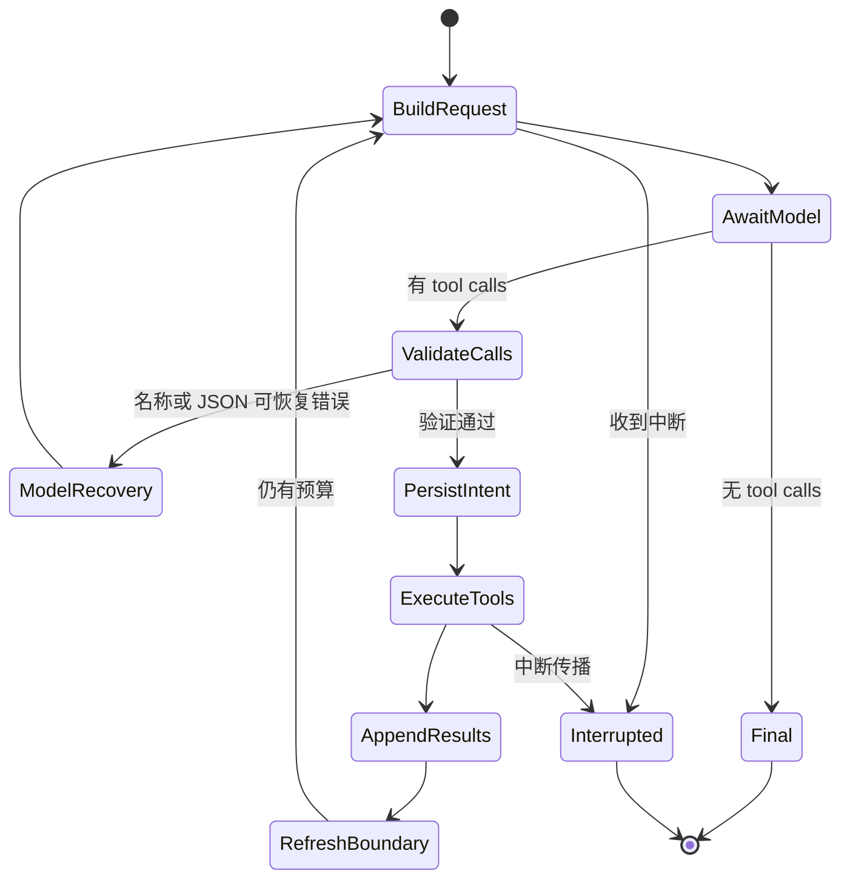

# 04｜工具调用端到端数据流与对话状态机

## 1. 先纠正一个常见表述

MCP Tool Schema 并不是“转换成 `tool_calls`”。准确流程是：

1. MCP Schema 转成模型请求中的 **tool definitions**；
2. 模型基于这些 definitions 生成 **tool calls**；
3. Hermes 把 tool calls 归一化、校验并路由到 MCP；
4. MCP 结果变成 **tool result message**；
5. 模型读取结果后继续推理。

这四类数据不要混淆：

| 数据 | 产生者 | 作用 |
|---|---|---|
| Tool definition | MCP Server → Hermes → Provider Adapter | 告诉模型“能调用什么、参数是什么” |
| Tool call | LLM → Provider Adapter → Hermes | 模型选择“调用哪个工具、传什么参数” |
| CallToolResult | MCP Server → MCP SDK → Hermes | 工具执行结果，可能含 text/image/structuredContent |
| Tool message | Hermes → Provider Adapter → LLM | 把执行结果与原 tool call ID 关联回模型 |

## 2. 完整时序



这条链最值得观察的不是函数数量，而是每一层都只转换一次语义：

- Provider 层只处理模型协议；
- 对话层只处理消息状态；
- `model_tools` 只处理工具治理；
- Registry 只处理名称到 handler；
- MCP handler 只处理 RPC 与结果映射。

## 3. 模型调用前：工具快照如何进入请求

Agent 初始化时，`agent/agent_init.py` 从 `model_tools.get_tool_definitions()` 得到工具定义，并同时构建 `valid_tool_names`。两者必须来自同一个逻辑快照：

```text
agent.tools             给模型看的定义
agent.valid_tool_names  回来后允许执行的名称集合
```

`agent/chat_completion_helpers.py::build_api_kwargs()` 把 `agent.tools` 交给当前 Provider Transport。Provider 再完成协议转换。

为什么不是每次工具调用临时查询 Registry？因为模型只能调用它在该请求中看到的工具。执行阶段如果突然接受一个刚注册、但模型本轮没见过的名字，会让授权、可复现性和缓存边界混乱。

## 4. 模型响应后：先验证，再允许副作用

`agent/conversation_loop.py` 对 tool calls 执行多层守卫。

### 4.1 名称验证与有限修复

模型可能幻觉工具名。Hermes 会尝试修复可判断的轻微不匹配；仍不在 `valid_tool_names` 中则不执行，并以 tool result 告诉模型正确错误。

连续失败有上限，防止模型在不存在的工具上无限消耗迭代预算。

### 4.2 参数 JSON 验证

- dict/list 先序列化；
- 空字符串按 `{}` 处理；
- 非空字符串必须能 `json.loads()`；
- 若看起来是截断的 JSON，拒绝执行；
- 普通格式错误允许有限重试。

恢复错误使用 `role: tool` 消息，而不是插入合成 user 消息。这维持严格的 assistant/tool 关联和消息角色交替。

### 4.3 去重和调用数量守卫

执行前还会去重重复调用，并限制 `delegate_task` 等特殊工具的数量。它们属于 Agent 级防护，不应下沉到每个 MCP Server 重复实现。

### 4.4 副作用前先尝试增量持久化调用意图

Hermes 在调用工具前先尝试把 assistant tool-call block 写入 session DB。原因是破坏性工具可能重启或终止 Hermes；写入成功时，恢复逻辑至少能看到“哪个精确调用已经被发出”。

它在顺序上借鉴写前记录思想，但只是 **best-effort**：写 DB 失败时源码记录 warning，随后仍继续执行工具。因此它不是 durability barrier、事务 WAL 或 exactly-once 保证。



写入成功时，它比“先执行、后记录”更容易审计与恢复；写入失败时则必须接受可观测性缺口，不能据此推断某个副作用一定未发生。

## 5. `handle_function_call()`：统一治理入口

`model_tools.py::handle_function_call()` 是工具世界的策略层。典型顺序为：



这保证 MCP Tool 与内置 Tool 共用：

- 参数容错；
- 插件前后钩子；
- 用户审批；
- ACP 编辑类保护；
- 日志和错误约定；
- tool search 的授权范围。

若 MCP handler 自己直接从 conversation loop 被调用，这些横切治理会被绕开。

## 6. Registry dispatch：最后一次来源无关的跳转

`ToolRegistry.dispatch()` 按名称找 `ToolEntry`，调用 handler，并把输出规范为 Agent 支持的形态。它不知道 handler 内部会：

- 读本地文件；
- 启动浏览器；
- 调插件；
- 跨线程访问 MCP session；
- 请求远程 SaaS。

这使 Registry 成为最后一个“与来源无关”的点。越过它之后，才进入 MCP 专属路径。

## 7. MCP handler：同步外观，异步内核

`_make_tool_handler(server_name, tool_name, timeout)` 生成同步 handler。调用时：

1. 检查 Server circuit breaker；
2. 查找 `MCPServerTask`；
3. 若 session 短暂切换，有限等待新 session；
4. 若 transport 已停，发出 reconnect 信号并返回“不要立即重试”；
5. 构造 `_call()` 协程；
6. 在 Server `_rpc_lock` 内调用 `session.call_tool(original_name, arguments=args)`；
7. 用 `_run_on_mcp_loop()` 提交到专用事件循环；
8. 在同步调用者侧等待、有界超时并可响应中断。

注意执行时使用的是原始 MCP 名称 `get_weather`，不是 Registry 名称 `mcp__local_weather__get_weather`。

## 8. CallToolResult 如何进入模型上下文

MCP Tool 结果可能包含多种表示。

### 8.1 错误

`result.isError` 为真时，Hermes 汇总文本块、清洗敏感错误信息，返回：

```json
{"error": "sanitized error text"}
```

业务错误被作为工具结果交给模型，而不是让异常直接击穿整个对话循环。

### 8.2 文本内容

多个 text block 用换行拼接：

```json
{"result": "first block\nsecond block"}
```

### 8.3 图片内容

合法 `image/*` 且可解码时，ImageContent 会尝试经 Hermes 媒体缓存生成 `MEDIA:` 标签，从而复用 Gateway/平台已有的图片发送通道，而不要求 MCP 模块理解 Telegram、Discord 等平台。若 gateway 媒体依赖不可用、base64/MIME 非法或缓存失败，该图片块会记录调试信息后跳过，其他文本块仍继续返回；因此媒体支持是条件能力，不是无损保证。

### 8.4 结构化内容

若同时存在面向模型的 `content` 和机器可读的 `structuredContent`：

```json
{
  "result": "Sunny, 26°C",
  "structuredContent": {
    "condition": "sunny",
    "temperature": 26,
    "unit": "celsius"
  }
}
```

只有 structured content 时，它直接放在 `result` 中。这样模型既得到可读摘要，也保留稳定字段。

## 9. 错误恢复不是无限重试

MCP handler 区分几类失败：

| 失败 | 策略 |
|---|---|
| 工具返回 `isError` | 作为结构化 error 回给模型，累计 Server 失败计数 |
| OAuth 认证失效 | 走 auth recovery，重连后最多重试一次 |
| 服务端 session 过期 | 重建 transport/session，最多重试一次 |
| 用户中断 | 返回明确中断结果 |
| 普通 transport/SDK 异常 | 清洗错误，增加 breaker 计数 |
| breaker open | 快速失败并告诉模型冷却剩余时间，不打远端 |

“最多重试一次”的恢复路径很重要。工具可能有写副作用；不确定请求是否已经被 Server 执行时，无界自动重试会制造重复创建、重复扣费等问题。

## 10. 一轮 Agent 状态机



MCP 只是 `ExecuteTools` 中的一条 handler 分支；Agent 的预算、角色交替、持久化和中断语义都由外层状态机统一拥有。

## 11. 批量工具调用与顺序

一个模型响应可包含多个 tool calls。执行器可以并行执行被明确标记为安全的工具，但结果仍按模型原始顺序回填，以保证 tool call ID 与上下文稳定。

MCP 默认串行。只有用户在对应 `mcp_servers.<name>` 配置中显式设置 `supports_parallel_tool_calls: true` 时，才进入并行候选；这不是 MCP Server 自描述 capability。真正的并行仍要遵循工具执行器和 session RPC 约束。

不要仅凭“都是查询接口”就假设安全。例如两个查询可能共享速率限制、游标或本地缓存，Server 应明确给出并发承诺。

## 12. 最关键的三个不变量

1. **定义与调用一致**：本轮允许执行的名称必须来自本轮发送给模型的工具快照。
2. **消息关联完整**：每个 assistant tool call 都有相同 `tool_call_id` 的 tool result，即使结果是拒绝或错误。
3. **副作用前优先留痕**：先尝试增量持久化调用意图；失败会告警但不阻断执行，所以这是可恢复性增强而非持久性硬屏障。

## 13. 本篇源码锚点

- `agent/agent_init.py`：`agent.tools` 与 `valid_tool_names` 初始化。
- `agent/chat_completion_helpers.py::build_api_kwargs()`：工具定义进入模型请求。
- `agent/transports/*::normalize_response()`：供应商响应归一化。
- `agent/conversation_loop.py` 的 tool call 分支：名称、JSON、持久化、消息回填。
- `agent/tool_executor.py`：批量执行、并发与结果顺序。
- `model_tools.py::handle_function_call()`：统一治理。
- `tools/registry.py::ToolRegistry.dispatch()`：handler 路由。
- `tools/mcp_tool.py::_make_tool_handler()`：RPC 和结果映射。

---

[← 上一篇：工具发现与 Schema 适配](./03-工具发现与Schema适配.md) ｜ [阅读索引](./00-阅读索引与核心结论.md) ｜ [下一篇：Harness 协议对比硬编码 Client →](./05-Harness协议对比硬编码API客户端.md)
