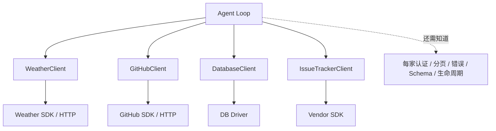
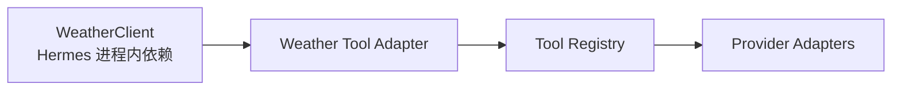
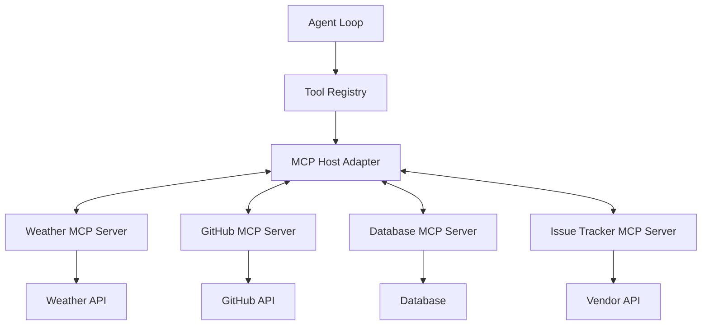
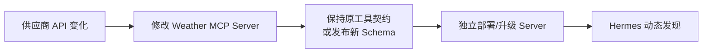

# 05｜Harness Protocol 对比硬编码 API Client

## 1. “Harness Protocol”在这里指什么

仓库中没有一个正式命名为 `HarnessProtocol` 的模块。本文沿用问题中的说法，把 Harness 理解为宿主侧统一外壳：

```text
MCP 线协议
+ Hermes 连接生命周期
+ Tool Registry 内部契约
+ Provider 工具适配
+ 审批、安全、日志、工具集等治理
```

仅有 MCP 线上协议还不够。若收到 `tools/list` 后仍在业务代码里写大量 `if server == ...`，系统依旧耦合。Hermes 的决定性价值是把外部自描述协议接入内部统一 Registry，并让整个 Agent 只认这条窄腰。

## 2. 硬编码 Client 的最差拓扑与公平基线

假设要接天气、GitHub、数据库和工单系统，最直接、也最容易失控的实现会变成：



常见连锁反应：

- Agent 构造器不断增加 credential、timeout、endpoint 参数；
- 每个 Client 手写函数 Schema；
- 分发器出现按工具名判断的条件树；
- 每种错误有不同返回格式；
- CLI、Gateway、Desktop 各自决定如何初始化；
- 第三方 SDK 升级迫使核心重新发布；
- 新 Provider 还要验证这些 Schema 能否通过其校验。

问题不在“API Client 写得不优雅”，而在依赖方向错误：核心 Agent 认识了过多业务边缘。

不过，不能把所有硬编码 Client 都等同于这种坏设计。一个合理的中间方案是“业务 Client + Registry Adapter”：



它同样能让 Agent/Provider 只依赖 Registry，也同样把 `N × M` 降为 `N + M`。因此，**乘法降维首先是 Hermes 内部窄腰的功劳，不是 MCP 独占的优势。**

这个中间方案仍把以下责任留在 Hermes 代码库和进程内：供应商 SDK 依赖、业务 Schema 维护、凭证初始化、版本发布、故障生命周期，以及该集成通常只能被 Hermes 使用。MCP 的独有价值，是在不破坏 Registry 窄腰的前提下，再获得运行时自描述、跨语言、进程/部署隔离和跨 Host 复用。

## 3. Harness 拓扑：把变化限制在边缘



Agent 只知道 Registry；MCP Host 只知道标准协议；具体 Server 自己拥有业务 API Client。第三方 API 变化首先在其 Server 内被吸收。

## 4. 八个决定性优势

### 4.1 依赖关系从业务耦合变成协议耦合

硬编码模式的依赖是：

```text
Hermes core → vendor SDK → vendor API semantics
```

MCP 模式的依赖是：

```text
Hermes core → MCP contract
MCP Server → vendor SDK → vendor API semantics
```

协议依赖仍然存在，但它比 N 个供应商依赖更稳定、更少。模型、Agent 和工具业务可分别发布。

### 4.2 保持 Registry 的加法复杂度，并把业务实现移出核心

若有 `N` 种工具来源、`M` 种模型 Provider，Hermes 的 Registry + Provider Adapter 已经把拓扑从直接耦合的 `N × M` 收敛为约 `N + M`。MCP 的作用不是再次发明这次降维，而是让其中每个外部来源只需实现标准 MCP 端口：

- 进程内业务 Client 可以通过专属 Adapter 进入 Registry；
- MCP Server 可以通过通用 MCP Adapter 进入同一个 Registry；
- 两者都复用已有的 `M` 个 Provider Adapter。

所以 MCP 的增量收益体现在：新增第 `N+1` 个外部能力时，Hermes 通常只增加配置和运行时目录项，不再增加一套供应商依赖与专属 Adapter 代码。

### 4.3 工具自描述替代重复手写 Schema

Server 通过 `tools/list` 发布名称、描述和输入 Schema。Hermes 无需为每个业务 API 再维护一份函数声明。

更重要的是，Schema 与执行实现由同一 Server 版本发布，减少以下漂移：

```text
模型看到参数 A、B
实际 Client 已改成参数 A、C
```

Hermes 仍需做兼容性 sanitizer，但不再拥有业务字段定义。

### 4.4 多语言与进程隔离

MCP Server 可以用 Python、TypeScript、Go、Rust 实现。Hermes 通过 stdio 或 HTTP 看到相同协议。

硬编码 Client 必须进入 Hermes 的 Python 依赖图；MCP Server 则可以：

- 使用最适合该 SDK 的语言；
- 带自己的依赖锁；
- 独立升级和回滚；
- 远端托管；
- 崩溃后单独重启。

这不是强安全隔离——stdio 仍以当前用户权限运行——但它是发布和故障域隔离。

### 4.5 横切治理只实现一次

所有 MCP 工具汇入 Registry 和 `handle_function_call()`，因此统一获得：

- 工具集启停与 `include/exclude`；
- 参数规整；
- 插件 pre/post hooks；
- 审批入口；
- 调用超时；
- 错误脱敏；
- 观测和进度回调；
- tool search 渐进披露；
- Agent 中断与迭代预算。

若每个 API Client 直接嵌入 Agent，以上能力很容易各做一遍且语义不同。

### 4.6 故障被限制在 Server 级

`MCPServerTask` 按 Server 管理：

- connect/initialize 超时；
- 指数退避；
- circuit breaker；
- parked 自探测；
- stdio 进程回收；
- OAuth/session 过期恢复；
- 动态注销与重新注册。

一个天气 Server 挂掉时，可以让对应工具暂时不可见或快速失败，而不是让 Agent 整体初始化失败。

### 4.7 能力不必进入核心工具永久表面

Hermes 最在意的不只是代码包大小，而是每轮模型请求携带的 Schema。MCP Server 是按配置出现的边缘能力：

- 未配置：零连接、零 Schema；
- 禁用：不发现；
- 白名单：只暴露少数工具；
- 工具很多：用 progressive disclosure 延后完整 Schema。

这让产品能力扩张，不等于核心提示词无限膨胀。

### 4.8 生态复用与所有权更清晰

一个标准 MCP Server 可被 Hermes、Claude Code、Codex 或其他 Host 使用。业务团队可以拥有自己的 Server 仓库，而不要求 Hermes 核心维护其供应商 SDK。

这同时改善贡献边界：第三方 SaaS 的持续维护成本留在独立集成方，Hermes 只维护通用 MCP Host 能力。

## 5. 变更传播对比

以天气供应商把字段 `temp` 改为 `temperature_c` 为例。

### 硬编码 Client


### MCP Server



若 Server 能在内部兼容旧契约，Hermes 完全无改动。若契约确需变化，变化通过 `tools/list_changed` 进入统一刷新路径。

## 6. 这不是“免费抽象”

Harness 把复杂度集中起来，并没有让复杂度消失。

### 6.1 需要处理协议版本与兼容

MCP SDK、Server 实现和传输规范会演进。Hermes 固定 SDK 版本，并保留新旧 Streamable HTTP import 兼容；这本身就是维护成本。

### 6.2 Schema 最小公分母可能损失表达力

JSON Schema 的完整能力并不被所有模型 Provider 支持。为跨 Provider 可用，Hermes 会把 nullable 等表达收敛到更保守形式。

### 6.3 跨进程/网络增加延迟与故障点

硬编码函数调用可能只需微秒；MCP 要经过序列化、管道或网络、SDK session 和 Server。低延迟、高频、核心路径未必适合外置。

### 6.4 自描述不等于高质量描述

Server 可以给出含糊、巨大甚至带提示注入的 description。Host 必须过滤、告警、最小暴露，不能盲目信任“标准协议”。

### 6.5 通用生命周期层更复杂

重连、熔断、动态刷新、快照一致性、OAuth、进程孤儿、跨线程取消都聚集到 Host。好处是只解决一次，但这“一次”必须足够可靠。

## 7. MCP 不会自动解决的业务问题

| 问题 | MCP 是否自动解决 | 仍由谁负责 |
|---|---|---|
| API 鉴权协议 | 部分标准化 | Server/Host OAuth 或显式凭证配置 |
| 业务权限最小化 | 否 | API 凭证、Server 实现、Hermes include 白名单 |
| 写操作幂等 | 否 | Server 与上游 API |
| 数据正确性 | 否 | Server 业务逻辑 |
| 事务一致性 | 否 | Server/后端系统 |
| 提示注入 | 否 | Host 治理、工具设计、用户信任判断 |
| 本地代码沙箱 | 否 | 操作系统/容器/独立运行环境 |
| Tool Schema 跨 Provider 可用 | 只提供基础格式 | Hermes sanitizer 与 Provider Adapter |

统一协议解决的是互操作性，不应被宣传成权限系统或业务正确性证明。

## 8. 什么时候硬编码仍然更合理

Hermes 的 Footprint Ladder 并不要求所有能力都变成 MCP。以下情形可以优先扩展已有核心代码：

- 能力是几乎每个用户都需要的 Agent 基元；
- 必须与核心状态机深度共享事务或中断语义；
- 极低延迟或高吞吐使跨协议成本不可接受；
- terminal/file 等已有核心工具已经能表达，仅需扩展现有实现；
- 安全边界要求由宿主直接控制，无法信任外部进程；
- MCP 化只会把两行内部调用包装成一个没有复用消费者的 Server。

反之，第三方、垂直领域、用户自定义、独立部署、需要结构化 I/O 的能力，通常是 MCP 的优势区间。

## 9. 决策矩阵

| 维度 | 扩展现有核心 | CLI + Skill | Plugin | MCP Server |
|---|---:|---:|---:|---:|
| 每轮核心 Schema 成本 | 可能增加 | 不增加 | 视注册策略 | 仅配置后增加，可渐进披露 |
| 结构化参数/结果 | 强 | 通过 CLI 文本 | 强 | 强 |
| 独立部署 | 弱 | 中 | 中 | 强 |
| 跨语言 | 弱 | 强 | 通常弱 | 强 |
| 生命周期隔离 | 弱 | 命令级 | 进程内 | 强 |
| 访问 Hermes 内部钩子 | 强 | 弱 | 强 | 通过协议能力，受限 |
| 跨 Host 复用 | 弱 | 中 | 弱 | 强 |
| 适合第三方 SaaS | 通常不适合 | 简单操作适合 | 独立插件可用 | 很适合 |

## 10. 对“解耦”的验收标准

一个 MCP 集成真正解耦，应同时满足：

1. 删除 Server 配置后，Agent 核心无需代码分支；
2. Server 工具变化通过 discovery/Registry 传播，不修改 conversation loop；
3. 切换模型 Provider 时，Server 无需改代码；
4. 切换 stdio 为 HTTP 时，上层 ToolEntry 语义不变；
5. 工具故障只影响其 Server/toolset，不阻断无关工具；
6. 审批、过滤、日志和错误仍走统一治理链；
7. 业务凭证不会因父进程环境继承而无意扩散；
8. 能用其他 MCP Host 调用同一 Server。

若做不到这些，项目可能只是“用了 MCP 的 JSON 格式”，还没有获得 Harness 架构的收益。

## 11. 本篇源码锚点

- 根目录 `AGENTS.md`：narrow waist 与 Footprint Ladder。
- `tools/registry.py`：内部工具契约与依赖倒置。
- `tools/mcp_tool.py`：外部协议、生命周期与 Registry 适配。
- `model_tools.py`：工具统一治理。
- `tools/tool_search.py`：大工具面的成本治理。
- `agent/transports/`：模型 Provider 解耦。
- `hermes_cli/mcp_security.py`：协议之外仍需显式信任治理。

---

[← 上一篇：工具调用端到端数据流](./04-工具调用端到端数据流.md) ｜ [阅读索引](./00-阅读索引与核心结论.md) ｜ [下一篇：生命周期、并发与一致性 →](./06-生命周期并发失败恢复与缓存一致性.md)
