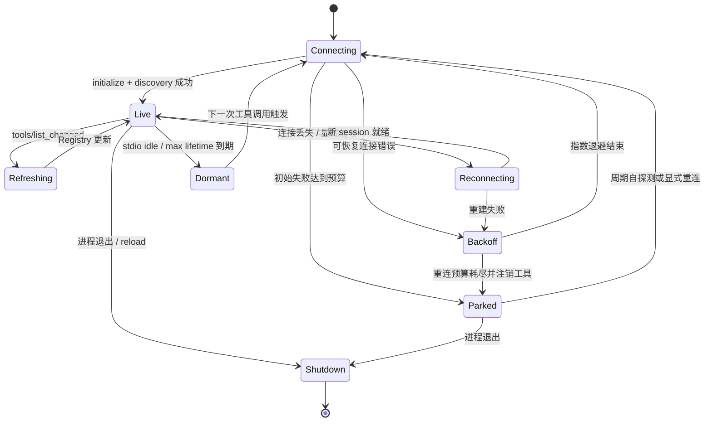
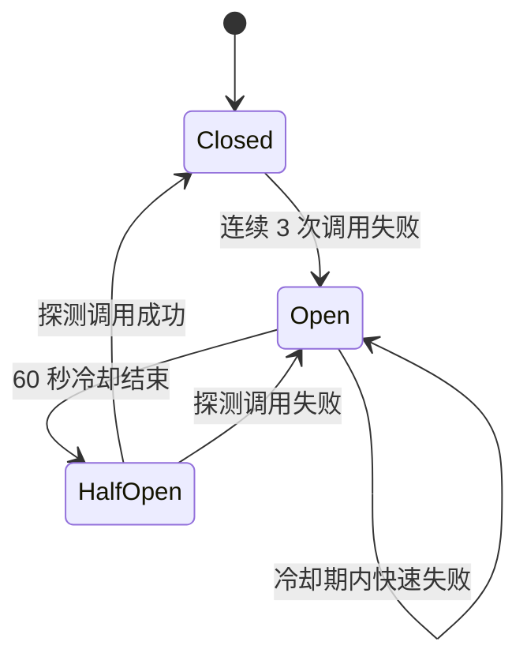
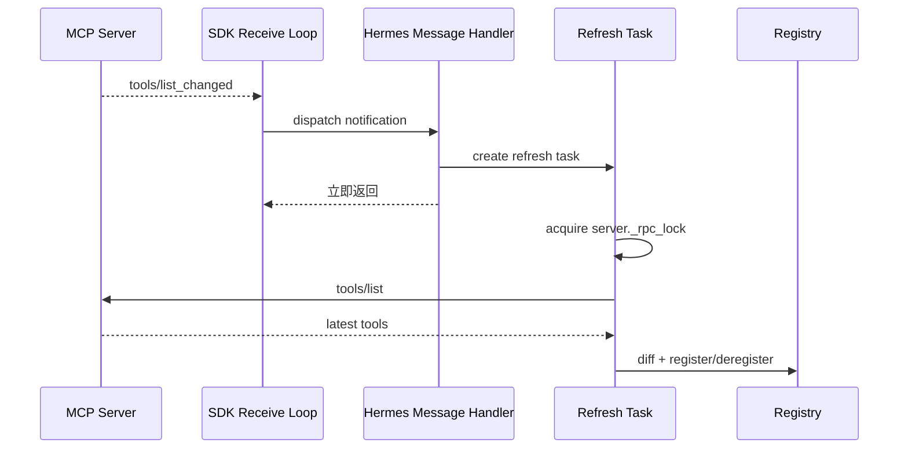
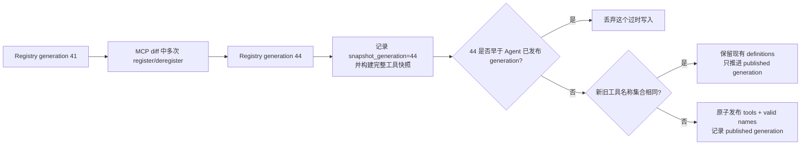

# 06｜生命周期、并发、失败恢复与缓存一致性

## 1. 为什么这是 MCP 实现中最难的一层

完成 `initialize` 和 `tools/call` 只是协议可用；让它在长驻 CLI、Gateway、TUI、Desktop 中连续运行，才是工程难点。Hermes 同时要处理：

- 本地子进程会崩溃、残留或吃掉大量内存；
- HTTP session、OAuth token 和网络连接会过期；
- Server 可以动态改变工具目录；
- Agent 可能有多个会话和并发工具调用；
- Agent 核心是同步循环，MCP SDK 是异步长连接；
- 工具定义变化会影响模型 Prompt Cache；
- shutdown 必须在正确 Task 中退出 anyio context。

因此 `MCPServerTask` 不只是“连接对象”，而是每个 Server 的小型监督器。

## 2. 每个 Server 的状态所有权

`MCPServerTask` 保存的关键状态可以按四组理解：

| 状态组 | 示例 | 用途 |
|---|---|---|
| 连接状态 | `session`、ready/shutdown/reconnect events | 当前是否能发 RPC、谁触发重连 |
| 能力状态 | `initialize_result`、`_tools` | Server 声明了什么、最新工具目录是什么 |
| 并发状态 | `_rpc_lock`、pending call context | 串行化 session RPC、关联 elicitation |
| 生命周期状态 | connect/retry counters、last activity、created time | 退避、park、keepalive、空闲/寿命回收 |

整个 connect → serve → reconnect → cleanup 循环由 `MCPServerTask.run()` 所在 Task 持有。这是资源所有权，不是代码风格偏好。

## 3. 两套状态机不能混成一个计数器

### 3.1 连接生命周期状态机



它管理“有没有可用 session”。

### 3.2 调用级熔断状态机



它管理“是否值得继续击打这个 Server”。

两者分离是必要的：transport 可以刚重连成功，但业务工具连续报错；反之，session 短暂切换也不应立即把所有工具调用视为永久故障。

### 3.3 当前实现中的业务错误张力

虽然概念上应区分“Server 不健康”和“用户给了不支持的城市”，当前 MCP handler 会把 `CallToolResult.isError=true` 计入该 Server 的连续失败数。于是多个预期领域校验错误也可能打开 breaker。

Server 设计者可把可预期、可恢复的领域失败返回成成功结果中的稳定对象，例如 `{"ok": false, "error": "unsupported_city"}`；把真正无法完成调用的内部/协议故障留给 MCP `isError`。长期看，更理想的是让 Host 基于明确错误分类决定是否影响健康度，而不是只看一个布尔位。

## 4. 重连、退避与 Parked

当前默认策略大致是：

| 参数 | 默认值 | 目的 |
|---|---:|---|
| connect/initialize timeout | 60 秒 | 防止握手永久挂住 |
| tool call timeout | 300 秒 | 允许长任务，但保持有界 |
| 初始失败预算 | 3 次重试 | 快速判断错误配置或启动失败 |
| 已连接后的重连预算 | 5 次 | 对临时网络/进程故障更宽容 |
| 最大退避 | 60 秒 | 避免重试风暴 |
| parked 自探测 | 300 秒 | 无调用也能重新发现恢复 |
| keepalive 间隔 | 180 秒 | 识别半开 session |
| breaker 阈值/冷却 | 3 次 / 60 秒 | 保护数据面 |

具体值来自 `tools/mcp_tool.py` 常量，配置可覆盖其中部分。

### 4.1 为什么要 Park，而不是让 Task 退出

如果 Server 失败后彻底退出并注销工具，会出现恢复悖论：

```text
工具已注销 → 模型无法再调用 → 没有调用触发重连 → 永远无法恢复
```

Parked 状态保留监督 Task 和定时自探测入口。恢复成功后重新发现并注册工具。

### 4.2 为什么失败时要注销“幻影工具”

若长期失效的工具仍留在 Registry，模型会不断选择一个实际不存在的能力，浪费迭代预算并诱发重试循环。长期失败/关闭时注销，是“对模型可见性必须反映可执行性”的一致性原则。

这与短暂 recycle 不完全相同：内存回收后的 stdio Server 可以透明懒启动，因此可按恢复策略保留或快速重建能力。

## 5. keepalive 与资源回收

### 5.1 keepalive

Hermes 优先发送 MCP `ping`。若 Server 明确返回 JSON-RPC `-32601`，说明不支持该方法，之后回退到 `tools/list` 探活。

这比固定用 `tools/list` 更轻量，也避免把真正的协议不支持误判成连接故障。

### 5.2 idle/max lifetime recycle

浏览器类 stdio Server 可能持有数百 MB 子进程。配置可指定：

```yaml
idle_timeout_seconds: 900
max_lifetime_seconds: 86400
```

到期后 Hermes 在所属 Task 内退出 transport，下一次调用再懒重建。这是一种资源弹性策略：工具逻辑身份不变，承载它的具体进程可轮换。

## 6. 动态工具发现为什么不能在通知回调里直接 RPC

Server 发出 `notifications/tools/list_changed` 后，message handler 不会在接收循环中直接 `await list_tools()`，而是调度独立 refresh Task。



如果在处理通知的同一接收路径中阻塞等待新 RPC 响应，某些 stdio 实现会形成重入/等待环，导致 session 卡死。

刷新采用差异策略：

- 新工具注册；
- 变化工具以新 Schema/handler 覆盖；
- 消失工具注销；
- 未变化工具保持；
- Registry generation 递增。

## 7. Registry generation：轻量 MVCC 思路

`ToolRegistry` 使用锁保护单次条目操作，并维护单调递增 generation。它不是数据库事务；一次 MCP diff 的多次注册/注销会分别递增 generation。该值承担的是版本戳角色：



`refresh_agent_mcp_tools()` 重建 Registry 派生定义，补回 memory/context 等特殊工具，并用“构建所基于的 generation”与“Agent 已发布的 generation”比较，防止并发刷新中的慢旧写入覆盖已经发布的新版本。只有名称集合变化时，才同时替换：

```text
agent.tools
agent.valid_tool_names
```

这避免模型看到定义 A，而验证集合仍是 B。若名称集合不变，函数不会发布新的 definitions，即便 Registry 中同名 Schema 已变；它只推进 Agent 记录的 generation。

## 8. Prompt Cache：动态性的硬约束

Hermes 的顶层原则是每会话 Prompt Cache 稳定。工具 Schema 通常属于模型请求的长前缀；一旦增删或改写，Provider 很可能无法复用此前缓存。

因此“动态发现”并不意味着随时修改当前请求：

- MCP discovery 在后台启动，避免阻塞入口；
- 第一次工具快照只进行短暂、有界等待；
- 慢 Server 可在后续安全刷新点进入快照；
- `tools/list_changed` 先更新 Registry；名称新增/删除时再在 turn/调用边界发布 Agent 快照；
- 同名 Schema-only 变化通常不进入已构建 Agent，其旧 definitions 会保持稳定；Registry handler 却可能已更新，因此 Server 必须保持同名工具参数向后兼容；
- 显式 reload 可重新连接并吸收名称/toolset 变化；仅同名 Schema 变化仍可能因名称比较而保留旧 Agent definitions，完整更新需重建 Agent/session；
- 不会在一个 in-flight API request 中修改已发送的 definitions。

必须诚实说明：**若下一轮工具名称集合确实变化，Prompt Cache 仍可能 miss。** Hermes 通过不自动发布 Schema-only 变化进一步偏向缓存稳定，但代价是长会话不会立即看到同名 Schema 更新。它解决的是变化时机和发布一致性，不是让动态协议零成本。

### 8.1 启动时 1.5 秒等待的取舍

CLI/TUI 启动不能因某个远端 MCP 等 60～120 秒。后台 discovery 启动后，首次快照只进行约 1.5 秒的有界等待：

- 快 Server 通常进入首轮；
- 慢 Server 不阻断 UI；
- 晚到工具通过刷新机制补入；
- 代价是首轮可能暂时看不到慢 Server。

这是启动延迟、能力完整性和缓存稳定性三者之间的现实折中。

## 9. 三层并发，不要混淆

### 9.1 Server 连接并发

多个 MCP Server 初次发现通过 `asyncio.gather()` 并行。一个远端超时不应串行拖慢所有其他 Server。

### 9.2 Agent 批内工具并发

模型一次可以返回多个 tool calls。工具执行器最多使用有限 worker 并行执行已判定安全的调用，并按原调用顺序组装结果。

### 9.3 单 Server RPC 并发

每个 `MCPServerTask` 有 `_rpc_lock`。当前每次 `call_tool` 和动态刷新都需要获取它。因此：

```text
不同 MCP Server：可以真正并行
MCP 与其他并行安全工具：可以并行
同一 MCP Server 的多个 RPC：当前通常在 _rpc_lock 上排队
```

`supports_parallel_tool_calls: true` 的含义，是允许这些调用进入上层并发调度，不等于绕过底层 session 锁或保证 Server 内部同时执行。

这个保守设计源于 stdio 单 JSON-RPC 流和真实 Server 的并发缺陷。若未来要实现单 Server 真并行，应先证明 SDK/session/Server 都支持，并重新设计 refresh 与调用的互斥范围。

## 10. ContextVar 与多会话路由

MCP Server 可以在某次 tool call 中发起 elicitation。SDK 接收回调运行在独立 recv Task 中，不会天然继承原 Agent 调用的 contextvars。

Hermes 在 `_rpc_lock` 内、发起 `call_tool` 前保存当前 `contextvars.copy_context()`，回调再使用这份上下文判断 platform/session，把确认请求路由到正确用户。

这是一个典型的异步上下文传播问题：网络响应属于某个 RPC，不等于运行它的 Task 自动知道哪个聊天会话发起了 RPC。

## 11. shutdown 为什么也是一致性问题

关闭流程需要：

1. 给所有 Server Task 发 shutdown event；
2. 等待它们在原 Task 内退出 SDK context managers；
3. 对超时 Task 取消；
4. 注销 Registry 条目与 provenance；
5. 清理孤儿进程；
6. 仅在无其他用户时停止全局事件循环。

若直接从主线程强行关闭底层 pipe，可能留下：

- anyio cancel scope 跨 Task 错误；
- stdio 孤儿进程；
- Registry 仍显示已死工具；
- 后台线程无法退出；
- 下一次 reload 复用污染状态。

所以 shutdown 与 initialize 一样，是协议宿主的正式状态转换，不是程序末尾随手 `close()`。

## 12. 三个值得继续审视的竞态

### 12.1 Snapshot 与立即撤销

Agent 当轮的 `valid_tool_names` 可能仍包含刚被 Registry 注销的工具。出于安全，dispatch 以实时 Registry 为准并返回 unknown tool，而不是执行旧 handler。这牺牲当轮可重复性，换取立即撤权。

### 12.2 规范化名称碰撞

`foo-bar`、`foo.bar`、`foo_bar` 都会清洗为 `foo_bar`。不同 Server/工具组合也可能形成相同最终名称。当前内置工具优先，但 MCP 与 MCP 的 owner 级注销仍值得加强：理想做法是名称含稳定 hash，注销时验证 provenance owner。

### 12.3 慢刷新覆盖快刷新

generation 检查防止 Agent 快照的旧构建覆盖**已经发布**的新版本；但任何新增动态来源都必须遵循同一发布方式，不能直接修改 `agent.tools` 的一半。

这些不是否定当前架构，而是说明“动态 Registry + 长会话快照”天然需要版本化思维。

## 13. 本篇源码锚点

- `tools/mcp_tool.py::MCPServerTask`、`run()`：连接监督状态机。
- `tools/mcp_tool.py::MCPServerTask._keepalive_probe()`：ping 与 fallback。
- `tools/mcp_tool.py::MCPServerTask._make_message_handler()`、`MCPServerTask._refresh_tools()`：动态发现。
- `tools/mcp_tool.py::_make_tool_handler()`：调用熔断与重连恢复。
- `tools/mcp_tool.py::refresh_agent_mcp_tools()`：快照重建和 generation 防护。
- `tools/registry.py` 的 `_generation`：注册表版本。
- `hermes_cli/mcp_startup.py`：后台发现和首次有界等待。
- `agent/turn_context.py`：安全刷新边界。
- `agent/tool_executor.py`、`agent/tool_dispatch_helpers.py`：并发许可和有序回填。
- `tools/mcp_stdio_watchdog.py`：进程治理。

---

[← 上一篇：Harness 协议对比硬编码 Client](./05-Harness协议对比硬编码API客户端.md) ｜ [阅读索引](./00-阅读索引与核心结论.md) ｜ [下一篇：安全信任边界 →](./07-安全信任边界与权限治理.md)
