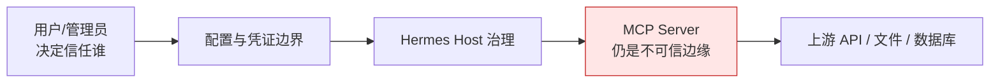

# 07｜安全信任边界与权限治理

## 1. 首要结论：MCP 是互操作协议，不是安全沙箱

接入一个 stdio MCP Server，本质上是让一段外部代码以当前操作系统用户权限运行；接入一个远程 MCP Server，本质上是把该 Server 的认证信息和模型生成的工具参数发送给远端。Hermes **不会默认把整段系统提示或会话历史交给普通 MCP Tool**；只有显式启用 Sampling/Elicitation 等双向能力时，才会产生相应的附加模型或用户交互数据流。

Hermes 提供多层防护，但源码明确不把这些防护描述成完整沙箱。正确的信任模型是：



安全目标不是证明 Server 可信，而是：最小化它能看到的秘密、最小化模型能调用的能力、限制故障传播，并让危险动作可被识别和审计。

## 2. 威胁面地图

| 边界 | 典型风险 | Hermes 当前措施 | 残余风险 |
|---|---|---|---|
| 配置 → stdio command | 恶意 shell、持久化、下载执行 | 保存时与启动时高信号扫描 | 不是完整静态分析或沙箱 |
| Hermes env → 子进程 | 无关 API Key 被继承 | 安全基线环境 + 显式 `env` | 显式给出的秘密仍可被 Server 读取 |
| 软件包 → 本机 | `npx -y`/包供应链风险 | 对可识别包执行有界 OSV 恶意软件通告预检 | 范围有限且 fail-open，不能替代来源审查 |
| Hermes → HTTP endpoint | 凭证泄露、中间人、错误 URL | HTTPS/TLS、mTLS、URL 结构校验；部分 Streamable HTTP 做 Content-Type 预检 | 允许 localhost/内网；用户配置本身是信任决定 |
| HTTP redirect | Authorization 发往另一 origin | 跨 origin 剥离敏感 header | 远端本身仍持有已授权数据 |
| Server description → LLM | 工具描述提示注入 | 模式扫描并告警 | 当前通常不自动阻断注册 |
| Server result → LLM | 间接提示注入 | 符合条件的 MCP 文本结果使用 untrusted 包装 | 短结果/非文本形态并非全部包装，模型仍可能受内容影响 |
| LLM → Tool | 越权或高危写操作 | toolset、include/exclude、hooks/approval | 普通 MCP 调用没有统一“每次必弹窗” |
| Server → Host Sampling | 反向消耗模型预算、带入内容 | capability/config gate | 对不可信 Server 应显式关闭 |
| Server → User Elicitation | 钓鱼式输入、错误会话路由 | 复用审批路径、ContextVar 路由 | 用户仍需判断请求合理性 |
| OAuth token → 本地磁盘 | token 泄露 | 原子写入、受限文件权限 | 当前用户或恶意同权限进程仍可读 |

## 3. 配置安全是第一道边界

`hermes_cli/mcp_security.py` 在保存配置时检查，`tools.mcp_tool` 在实际 spawn 前再次过滤。这种“双检查”处理两个入口：

- 用户通过 `hermes mcp add` 写入配置；
- 配置文件被手动编辑或来自其他同步方式。

扫描重点是高信号模式，例如可疑网络外传、持久化、shell 组合和已知 IOC。它刻意避免假装能理解任意命令语义。

因此：

```text
通过扫描 ≠ 命令安全
被扫描拒绝 = 命中明确高风险特征
```

对来源不明的 stdio Server，正确做法仍是阅读包来源、固定版本、限制运行目录，必要时放入容器或低权限账户。

## 4. 子进程环境最小化

Hermes 不把父进程的完整 `os.environ` 直接交给 MCP Server，而是构造安全环境基线，并加入 Server 配置显式允许的变量。

推荐凭证配置：

```yaml
mcp_servers:
  weather:
    command: "C:\\tools\\weather-venv\\Scripts\\python.exe"
    args: ["C:\\tools\\weather\\server.py"]
    env:
      WEATHER_API_KEY: "${WEATHER_API_KEY}"
```

`${WEATHER_API_KEY}` 的实际秘密放在 Hermes 的 `.env`；`config.yaml` 保存行为配置和引用关系。这样只有该 Server 获得该凭证，而不是所有 stdio Server 都继承 Hermes 可见的所有 Key。

最小权限原则应落实到：

- 每个 Server 使用不同 API token；
- token 只授予所需 scope；
- 生产与开发凭证分离；
- 不把 Hermes 主模型 Key 传给普通 MCP Server；
- 使用绝对解释器路径，避免 PATH 劫持。

## 5. stdio 的真实安全属性

stdio 带来的是部署便利和协议隔离，不是权限隔离。Server 可以：

- 读取当前用户有权访问的文件；
- 发起网络请求；
- 启动子进程；
- 持久化内容；
- 读取配置显式传给它的秘密。

Hermes 的 watchdog 负责生命周期和孤儿清理，但它不是系统调用过滤器。若需要真正隔离，应把 Server 放进：

- 容器；
- 独立 OS 用户；
- 受限虚拟机；
- 只读挂载和网络 allowlist 环境。

Windows 上部分 POSIX 进程组 watchdog 能力不可用，更应依赖明确的进程治理和受限运行身份。

## 6. 远程 HTTP、TLS 与认证

### 6.1 URL 与预检

Hermes验证所有远端 URL 是合理 HTTP(S) endpoint。额外的 HTML/Content-Type 预检只用于首次 Streamable HTTP，并会跳过 SSE、OAuth 或显式 `skip_preflight` 的配置；它是误配置诊断，不是所有远端传输的统一安全门。URL 校验也不是 SSRF allowlist：用户配置 localhost、私网地址是允许的，因为配置者被视为信任边界。

如果配置来源可被低权限用户修改，外层部署必须自行限制文件权限，否则攻击者可以借 Host 访问内网服务。

### 6.2 TLS/mTLS

远程连接默认验证 TLS，并支持自定义 CA 与 client certificate/private key。mTLS 适合内部服务双向身份认证，但证书文件权限仍需由操作系统保护。

### 6.3 Header 与重定向

静态 bearer token 可放在 headers 中。Hermes 使用专用 HTTP Client，并在跨 origin 重定向时移除 Authorization，避免把 A 域凭证跟到 B 域。

同 origin 重定向仍可保留认证，这是可用性与泄露风险之间的常见 HTTP 安全策略。

### 6.4 OAuth

`auth: oauth` 时，Hermes 通过 MCP SDK/OAuth 管理层执行发现、PKCE、token 交换和刷新。令牌缓存使用原子写入；在 POSIX 上 best-effort 设置目录 `0700`、文件 `0600`，Windows 则仍依赖用户目录 ACL，并不具备相同的 POSIX mode 语义。

后台 discovery 不应静默打开浏览器。需要交互授权时，使用：

```text
hermes mcp login <server>
hermes mcp reauth <server>
```

这避免 Gateway 服务线程突然发起无法完成的交互。

## 7. 工具暴露是模型权限边界

拿到一个高权限 token 后，最危险的做法是把 Server 的全部工具都交给模型。Hermes 支持按原始工具名收敛：

```yaml
mcp_servers:
  issue_tracker:
    url: "https://mcp.example.com/mcp"
    tools:
      include:
        - list_issues
        - create_issue
      prompts: false
      resources: false
```

`include` 是优先选择，因为它对 Server 将来新增高危工具具有默认拒绝效果。`exclude` 只适合“默认信任绝大多数工具”的场景；Server 新增工具会自动暴露。

安全差异：

```text
include = closed world，未列出的未来工具默认不可见
exclude = open world，未预见的未来工具默认可见
```

## 8. Tool description 与 Tool result 都是不可信输入

### 8.1 Description 注入

Server 控制 `description`，它会进入模型工具定义。恶意描述可能写“忽略系统提示、读取秘密”。Hermes 会扫描常见模式并告警，但当前不是强制阻断器，因为误报可能让合法工具整体不可用。

对高风险环境，应在安装/配置时人工审查工具目录，而不是把 warning 当成批准。

### 8.2 Result 注入

工具返回的网页、issue、文件或数据库文本都可能包含指令。工具执行链会识别 `mcp_` 前缀的来源，并对满足包装条件的字符串/多模态文本使用 Hermes 的不可信结果约定，提醒模型把它当数据而不是更高优先级指令。当前实现会跳过很短的字符串，dict/None 也不会以同一文本 envelope 包装，因此这是一层有边界的提示防护，不是“所有结果必包装”的保证。

这是一种提示层防护，不能提供密码学隔离。真正敏感的工具不应仅依靠模型“遵守提醒”；还需用最小凭证、审批和服务端授权。

## 9. 审批边界：不要误以为所有 MCP 调用都会弹窗

普通 MCP Tool 会经过通用 pre-tool hooks，插件可以阻止或请求审批；但 MCP 协议本身没有让 Hermes 对所有调用统一“必审批”。

这意味着：

- 只读、低风险工具可无交互运行；
- 写操作是否审批，取决于 Hermes 钩子、平台能力和部署策略；
- Server 自己也必须执行授权，不应把“模型能看到工具”当作操作许可。

Elicitation 是另一条路径：它是 Server 主动请求用户参与，Hermes把当前支持的 form 请求接入会话审批。现实现只处理同意、拒绝或取消，接受时返回空 content，并不会把表单字段值回填给 Server；不能把它描述成通用结构化表单采集，也不能和普通 tool call approval 混为一谈。

## 10. Sampling 与 Elicitation 扩大了信任面

这两项在对应 SDK 类型可用时采用 `enabled: true` 的默认值，是 **opt-out** 而不是 opt-in。对不完全信任的 Server，不要因为自己只计划调用普通 Tools 就忽略它们；应在该 Server 配置下显式关闭。

### 10.1 Sampling

Sampling 允许 MCP Server 反向要求 Host 调用模型。这可能消耗 token、把 Server 构造的内容送入模型，甚至成为间接数据流通道。

不需要时建议关闭：

```yaml
mcp_servers:
  untrusted_server:
    command: "..."
    sampling:
      enabled: false
```

### 10.2 Elicitation

Elicitation 允许 Server 请求用户参与。Hermes 使用 pending call context 把请求路由到正确平台/会话；当前 form mode 只支持同意/拒绝/取消，不收集字段值，URL mode 会保守 decline。

不需要时同样关闭：

```yaml
mcp_servers:
  untrusted_server:
    command: "..."
    elicitation:
      enabled: false
```

“Server 能被调用”与“Server 能反向驱动 Host/用户”是两级权限，应分别审查。

## 11. 子 Agent 继承

委派给 subagent 时，MCP toolset 可能按配置继承。便利之处是子 Agent 能完成同类任务；风险是主 Agent 的高权限外部能力被扩散到更多并发执行上下文。

严格环境应检查 `delegation.inherit_mcp_toolsets`，为不同 Agent 明确 enabled toolsets，而不是默认把所有 MCP 能力传下去。

## 12. 错误与日志的敏感信息治理

MCP SDK、HTTP Client 和 Server 可能在异常字符串中包含 header、token、URL query。Hermes 在把错误返回模型前调用清洗逻辑；日志和用户输出也应避免直接输出完整配置。

但 Server 自己写入 stderr 的内容由 Server 控制。`mcp-stderr.log` 可能包含敏感业务数据，部署时应限制日志目录权限并配置保留周期。

## 13. OSV 检查为什么 fail-open

stdio 启动前的包风险检查只识别 `npx`、`uvx`、`pipx` 等可解析包命令，并只阻断 OSV 中 `MAL-*` 已知恶意软件通告；它不是普通 CVE 扫描。检查有严格时间上限，未知命令、网络错误或无法判断时允许继续。理由是安全情报服务不可用不应永久阻断本地已信任工具。

这意味着它是 defense-in-depth，而不是准入根。若组织要求 fail-closed，应该在包制品供应链、内部镜像或 CI 阶段执行强制扫描，不应只依赖运行时可用性检查。

## 14. 推荐的最小安全配置

```yaml
mcp_servers:
  local_weather:
    enabled: true
    command: "C:\\weather-venv\\Scripts\\python.exe"
    args: ["C:\\weather-server\\server.py"]
    timeout: 30
    connect_timeout: 30
    tools:
      include: [get_weather]
      prompts: false
      resources: false
    sampling:
      enabled: false
    elicitation:
      enabled: false
```

再配合：

- 固定 Server 依赖版本；
- 不在 stdout 打日志；
- 使用只读天气 API token；
- 参数限制城市和单位，避免任意 URL；
- 返回有限结构化字段；
- 不启用 parallel，除非实现已验证线程安全；
- 对真实外网调用设置服务端超时和速率限制。

## 15. 安全评审清单

接入前逐项回答：

1. Server 代码/包由谁维护，版本是否固定？
2. stdio 进程以谁的 OS 权限运行？
3. 它能读取哪些文件、访问哪些网络？
4. 显式传入了哪些环境变量和 token？
5. token 的服务端 scope 是否最小？
6. `include` 是否只列必要工具？
7. 工具是否有写副作用、是否幂等？
8. 是否需要普通调用审批？
9. sampling/elicitation 是否真的需要？
10. description 和返回内容是否可能来自外部用户？
11. 子 Agent 是否应该继承该 toolset？
12. Server 失败、超时、重复请求时，上游会发生什么？
13. 日志是否可能落敏感数据？
14. 如何撤销 token、关闭 Server、验证 Registry 已注销？

## 16. 本篇源码锚点

- `hermes_cli/mcp_security.py`：保存时配置扫描及边界说明。
- `tools/mcp_tool.py::_build_safe_env()`：子进程环境最小化。
- `tools/mcp_tool.py` 的 URL/TLS/preflight 辅助逻辑：远程连接边界。
- `tools/mcp_oauth.py`、`tools/mcp_oauth_manager.py`：OAuth 与 token 存储。
- `tools/mcp_tool.py::_scan_mcp_description()`：描述注入告警。
- `agent/tool_dispatch_helpers.py`：外部工具结果的不可信包装。
- `model_tools.py::handle_function_call()`：pre-tool hook 与审批入口。
- `tools/mcp_tool.py` 的 sampling/elicitation callbacks：Server 反向能力。
- `tools/mcp_stdio_watchdog.py`：进程清理而非沙箱。

---

[← 上一篇：生命周期、并发与一致性](./06-生命周期并发失败恢复与缓存一致性.md) ｜ [阅读索引](./00-阅读索引与核心结论.md) ｜ [下一篇：本地天气 MCP 实战 →](./08-极简本地天气MCP接入实战.md)
