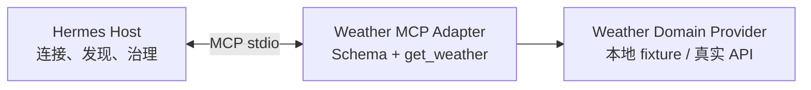
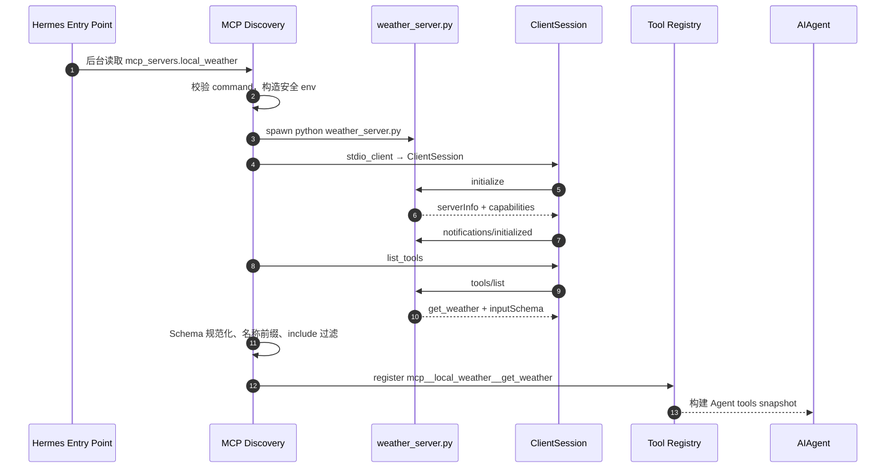
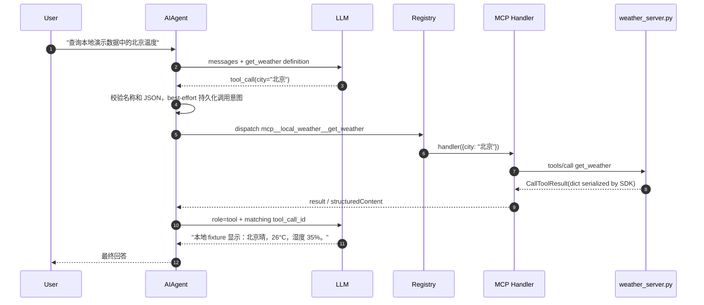
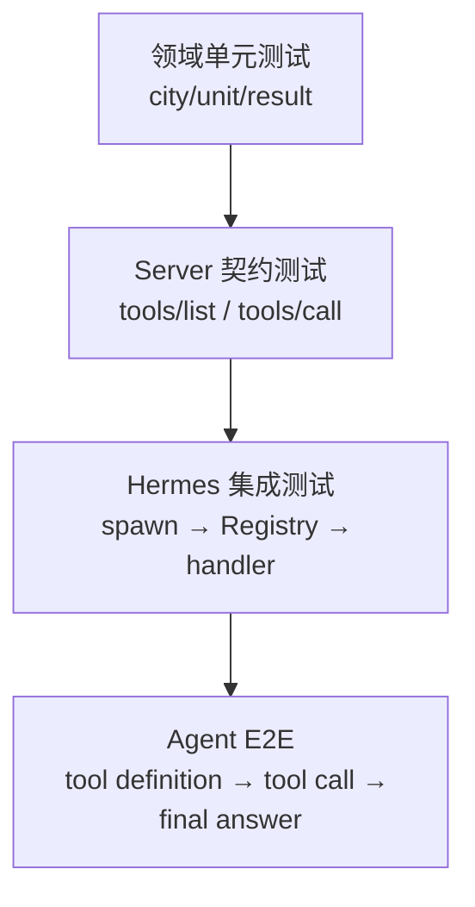

# 08｜极简本地天气 MCP 接入实战

## 1. 实战目标

这一篇实现一个本地 stdio MCP Server，只暴露一个无副作用工具：

```text
get_weather(city, unit="celsius")
```

为避免把教程变成某家天气 API 的鉴权手册，第一版使用本地固定数据。它足以验证完整协议链：

```text
真实子进程
→ initialize
→ tools/list
→ Registry 注册
→ LLM tool call
→ tools/call
→ structured result
→ 最终回答
```

最后再说明如何只替换“天气数据提供器”，而不改 MCP 和 Hermes 边界。

## 2. 设计边界

最小实现仍遵循三层责任：



- Hermes 不知道天气数据如何获取；
- Weather Provider 不知道 LLM 或 MCP；
- MCP Adapter 只把领域函数暴露成标准工具。

即使示例把后两层写在一个文件里，也要保留这个心智边界。

## 3. 准备独立运行环境

Server 的 Python 解释器必须安装 MCP SDK。Hermes 主项目固定 `mcp==1.26.0`，示例建议使用相同版本：

```powershell
py -m venv C:\tools\weather-mcp\.venv
C:\tools\weather-mcp\.venv\Scripts\python.exe -m pip install "mcp==1.26.0"
```

使用独立 venv 的原因：

- Server 依赖不污染 Hermes；
- Hermes 升级不迫使天气依赖同步升级；
- 配置中可写绝对解释器路径；
- 复现和回滚更明确。

## 4. 最小 Server

创建 `C:\tools\weather-mcp\weather_server.py`：

```python
from __future__ import annotations

import logging
import sys
from typing import Literal

from mcp.server.fastmcp import FastMCP


# stdio 模式下 stdout 是 MCP JSON-RPC 通道；日志只能写 stderr。
logging.basicConfig(
    stream=sys.stderr,
    level=logging.INFO,
    format="%(asctime)s %(levelname)s %(message)s",
)

mcp = FastMCP("local-weather")

WEATHER_FIXTURES = {
    "北京": {"condition": "晴", "temperature_c": 26, "humidity_pct": 35},
    "上海": {"condition": "多云", "temperature_c": 28, "humidity_pct": 72},
    "beijing": {"condition": "sunny", "temperature_c": 26, "humidity_pct": 35},
    "shanghai": {"condition": "cloudy", "temperature_c": 28, "humidity_pct": 72},
}


def _to_fahrenheit(celsius: float) -> float:
    return round(celsius * 9 / 5 + 32, 1)


@mcp.tool()
def get_weather(
    city: str,
    unit: Literal["celsius", "fahrenheit"] = "celsius",
) -> dict:
    """Return deterministic weather for a supported city.

    Use this tool only to query the local demo weather snapshot. It performs
    no write operation and makes no network request; it is not live weather.
    """
    normalized = city.strip().lower()
    if not normalized:
        return {
            "ok": False,
            "city": city,
            "error": "invalid_city",
            "message": "city must not be empty",
        }

    item = WEATHER_FIXTURES.get(normalized)
    if item is None:
        return {
            "ok": False,
            "city": city,
            "error": "unsupported_city",
            "supported_cities": ["北京", "上海", "beijing", "shanghai"],
        }

    temperature_c = item["temperature_c"]
    temperature = (
        temperature_c
        if unit == "celsius"
        else _to_fahrenheit(temperature_c)
    )
    return {
        "ok": True,
        "city": city,
        "condition": item["condition"],
        "temperature": temperature,
        "unit": unit,
        "humidity_pct": item["humidity_pct"],
        "source": "local_fixture",
    }


if __name__ == "__main__":
    mcp.run(transport="stdio")
```

这个实现故意做了几件事：

- 参数使用具体类型和 enum，而不是任意 `dict`；
- description 告诉模型何时使用以及无副作用；
- 返回稳定字段，而不是一段需要二次解析的日志；
- 未支持城市返回领域错误，不让进程崩溃；
- 空城市同样返回 `{ok: false}`，而不是抛出 MCP `isError`：Hermes 会把连续 `isError` 计入 Server breaker，预期的领域校验失败不应污染连接健康；
- stdout 不写普通日志；
- 没有接受任意 URL、命令或文件路径。

## 5. FastMCP 帮你生成了什么

装饰器会基于函数签名和 docstring 生成近似如下的工具定义：

```json
{
  "name": "get_weather",
  "description": "Return deterministic weather for a supported city...",
  "inputSchema": {
    "type": "object",
    "properties": {
      "city": {"type": "string"},
      "unit": {
        "type": "string",
        "enum": ["celsius", "fahrenheit"],
        "default": "celsius"
      }
    },
    "required": ["city"]
  }
}
```

Hermes 收到后会把名称改成：

```text
mcp__local_weather__get_weather
```

注意逻辑 Server 名来自 Hermes 配置键 `local_weather`；FastMCP 内部显示名 `local-weather` 主要用于 Server info。模型全局名称以 Host 配置命名空间为准。

## 6. 配置 Hermes

在 `~/.hermes/config.yaml`（Windows 通常是 `%USERPROFILE%\.hermes\config.yaml`）加入：

```yaml
mcp_servers:
  local_weather:
    enabled: true
    command: "C:\\tools\\weather-mcp\\.venv\\Scripts\\python.exe"
    args:
      - "C:\\tools\\weather-mcp\\weather_server.py"
    connect_timeout: 30
    timeout: 30
    tools:
      include:
        - get_weather
      prompts: false
      resources: false
    sampling:
      enabled: false
    elicitation:
      enabled: false
```

为什么使用绝对路径：Hermes 会过滤子进程环境，后台服务的工作目录和 PATH 也可能不同。绝对解释器和脚本路径可以消除“在我的终端能跑、Gateway 中找不到”的歧义。

## 7. 或使用 CLI 添加

PowerShell 示例：

```powershell
hermes mcp add local_weather `
  --command "C:\tools\weather-mcp\.venv\Scripts\python.exe" `
  --args "C:\tools\weather-mcp\weather_server.py"
```

`--args` 使用 remainder 语义，必须放在整条命令最后。之后可运行：

```powershell
hermes mcp list
hermes mcp test local_weather
hermes mcp configure local_weather
```

CLI 添加流程会先做安全校验和探测，再写入配置；直接编辑 YAML 也合法，运行时仍会再次校验。

## 8. 第一次连接的真实数据流



此时没有执行天气函数。`tools/list` 只完成控制面发现。

## 9. 用户询问天气时的数据流



关键映射：

| 阶段 | 名称 |
|---|---|
| Server 内函数 | `get_weather` |
| MCP `tools/list` | `get_weather` |
| Registry / 模型可见 | `mcp__local_weather__get_weather` |
| RPC `tools/call` | 再映射回 `get_weather` |

## 10. 如何判断接入成功

### 10.1 控制面检查

应能看到：

- `hermes mcp list` 中 Server 配置为 enabled；该命令只显示配置启停，不代表运行时已连接；
- `hermes mcp test local_weather` 能完成 initialize 和工具发现；
- 工具目录含 `get_weather`；
- Hermes 工具列表中显示带命名空间的工具。

### 10.2 数据面检查

分别问：

```text
请查询本地演示数据中的北京天气，并明确使用摄氏度和说明数据来源。
请查询本地演示数据中的 Shanghai 天气，使用 fahrenheit。
请查询本地演示数据中的广州天气，并解释工具返回的错误。
```

验证：

- 前两次调用参数正确；
- 未支持城市不会导致 Server 退出；
- 工具结果能进入下一次模型调用；
- 最终自然语言没有捏造 fixture 中不存在的数据，并明确它不是实时天气。

### 10.3 日志检查

Server stderr 在：

```text
~/.hermes/logs/mcp-stderr.log
```

Hermes 连接、注册、重连信息在常规 Agent 日志中。不要为了调试在 Server stdout 打印。

## 11. 常见故障定位

| 症状 | 最可能原因 | 检查方式 |
|---|---|---|
| `mcp` 包不可导入 | 配置用了错误 Python | 用配置中的绝对解释器执行 `-c "import mcp"` |
| initialize 超时 | Server 启动卡住或 stdout 被污染 | 直接运行脚本看 stderr；检查是否有普通 `print()` |
| 首轮看不到工具 | 后台发现超过首次短等待 | 稍后刷新/重开首轮；检查 discovery 日志 |
| 工具被过滤 | `include` 拼写不是原始 MCP name | 白名单应写 `get_weather`，不是带前缀名 |
| 模型调用 unknown tool | 快照/Registry 刚发生动态变化 | 检查 reload、Server 重启和 generation 日志 |
| `--args` 后参数不生效 | `--args` 不是最后一个选项 | 把它和后续值移到命令末尾 |
| JSON-RPC parse error | stdout 有日志或第三方库 banner | 所有输出改到 stderr |
| Server 周期性消失 | 进程崩溃、keepalive/session 生命周期 | 查看 `mcp-stderr.log` 和 reconnect/park 日志 |
| 工具注册但模型不直接看到 | 工具过多触发 Tool Search | 用 `tool_search` 检索该工具或调整工具集 |

## 12. 替换成真实天气 API：只改领域端口

不要让 MCP tool 接收 `endpoint`、`headers` 等任意网络参数。建议定义内部 Provider：

```python
from typing import Protocol


class WeatherProvider(Protocol):
    def get_current(self, city: str) -> dict: ...


class RemoteWeatherProvider:
    def __init__(self, api_key: str, timeout_seconds: float = 5.0):
        self.api_key = api_key
        self.timeout_seconds = timeout_seconds

    def get_current(self, city: str) -> dict:
        # 1. city 转为供应商请求
        # 2. 设置严格 connect/read timeout
        # 3. 将供应商错误映射为稳定领域错误
        # 4. 只返回允许字段
        raise NotImplementedError
```

然后 `get_weather()` 只依赖 `provider.get_current(city)`。这样：

- 换天气供应商不改变 MCP Tool Schema；
- API Key 只存在于 Server 进程；
- 重试、限流和缓存属于 Provider；
- Hermes 仍只看到 `get_weather`。

真实 API 版本还应增加：

- 连接与读取超时；
- 有界重试，仅重试安全的查询；
- 速率限制；
- 城市输入长度/字符校验；
- 响应字段白名单；
- 缓存与数据时间戳；
- 供应商错误码到稳定领域错误的映射；
- API Key 脱敏日志。

## 13. 推荐测试分层



最低应验证：

1. `get_weather("北京")` 返回稳定结构；
2. FastMCP `tools/list` 生成正确 required/enum；
3. Hermes 真实启动子进程并注册 `mcp__local_weather__get_weather`；
4. Registry dispatch 确实触发 `tools/call`，不是只测发现；
5. Server 错误、超时、退出后 Hermes 能返回可解释错误并恢复；
6. stdout 无额外文本；
7. shutdown 后无残留进程。

## 14. 扩展到 Resources/Prompts 的判断

天气查询本质是带参数的即时计算，Tool 最合适。不要为了展示协议能力而无必要增加：

- Resource：除非确有稳定可寻址的气象数据集；
- Prompt：除非需要复用结构化天气分析模板；
- Sampling：天气 Server 不应反向要求 Host 再调用模型；
- Elicitation：城市缺失应由 tool Schema 的 required 和模型澄清处理即可。

最小协议表面通常也是最安全、最稳定的表面。

## 15. 本篇源码锚点

- `tests/tui_gateway/test_slash_worker_mcp_discovery.py`：仓库内 FastMCP 真实子进程示例。
- `tools/mcp_tool.py::MCPServerTask._run_stdio()`：Server 启动、日志与握手。
- `tools/mcp_tool.py::_convert_mcp_schema()`：工具命名和 Schema。
- `tools/mcp_tool.py::_make_tool_handler()`：`tools/call` 与结果转换。
- `hermes_cli/mcp_config.py::cmd_mcp_add()`：添加、探测和保存。
- `hermes_cli/subcommands/mcp.py`：`--args` remainder 规则。
- `hermes_cli/mcp_security.py`：命令安全检查。

---

[← 上一篇：安全信任边界](./07-安全信任边界与权限治理.md) ｜ [阅读索引](./00-阅读索引与核心结论.md) ｜ [下一篇：高级能力与架构演进 →](./09-高级能力与架构演进.md)
