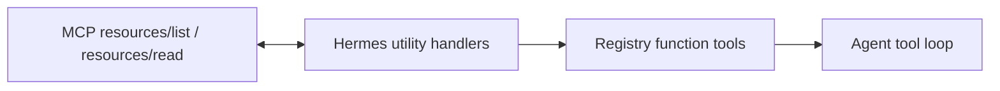
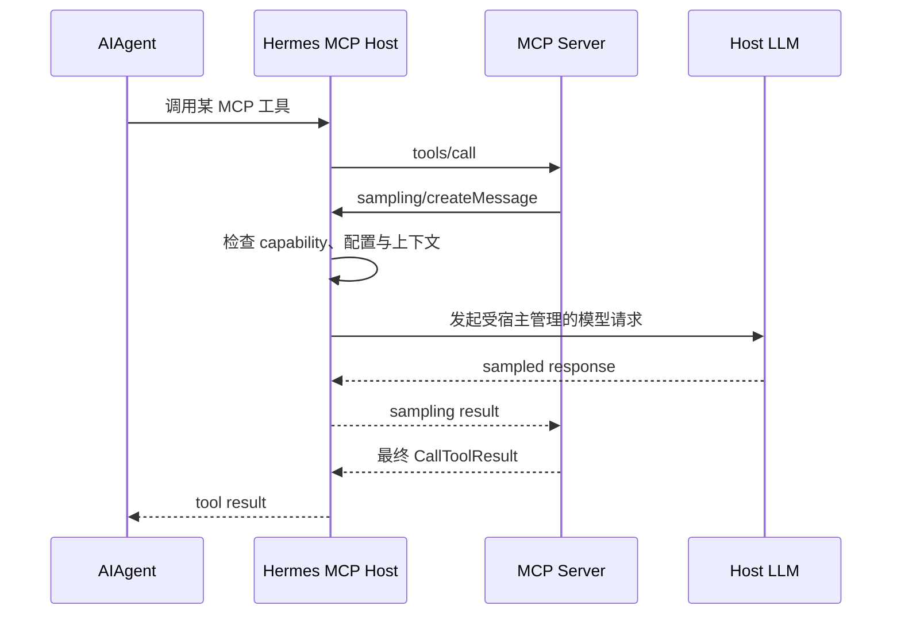
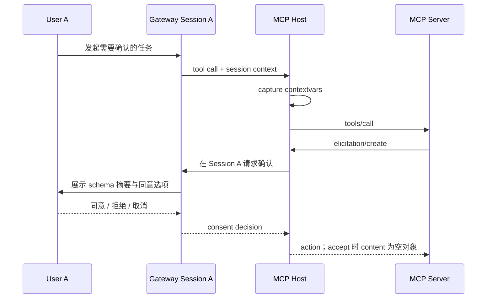
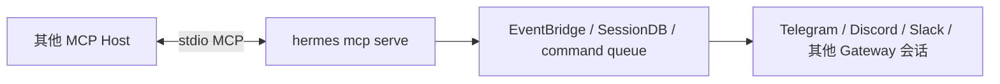
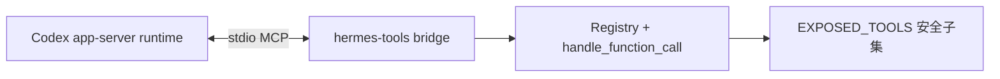
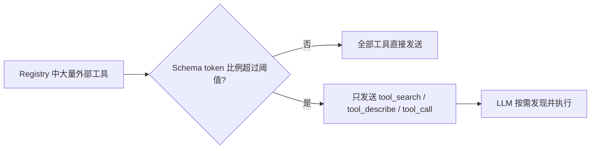
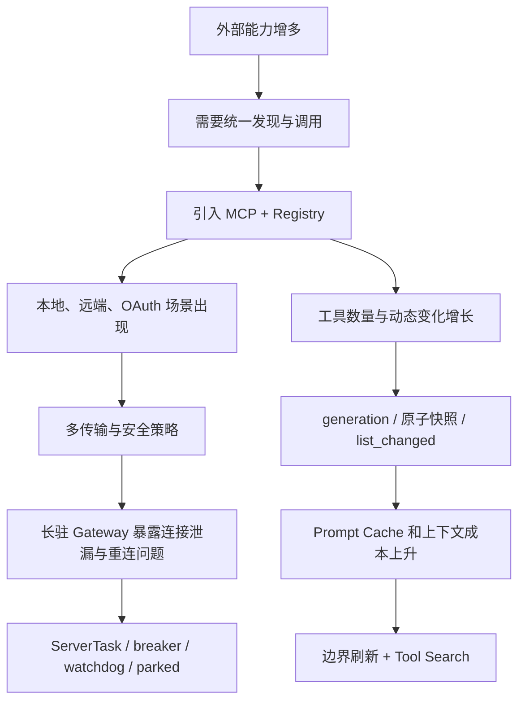

# 09｜高级 MCP 能力与架构演进的必然性

## 1. MCP 不是“远程函数调用协议”这么简单

只看 `tools/list` 和 `tools/call`，MCP 很像带 Schema 的 RPC。但当前 Hermes 还处理：

- Resources：可枚举、可读取的上下文资源；
- Prompts：Server 提供的参数化提示模板；
- Sampling：Server 反向请求 Host 进行模型推理；
- Elicitation：协议允许 Server 反向请求用户参与；Hermes 当前只实现 form 请求的同意/拒绝/取消，不回填字段值；
- Logging：Server 日志通知；
- `tools/list_changed`：运行期能力目录变化。

这说明 MCP 更接近“Agent Host 与能力 Server 之间的双向会话协议”。Hermes 的内部窄腰仍是工具系统，但 Host 适配层必须处理比普通 API Client 更丰富的状态。

## 2. Resources：协议对象如何进入单一 Agent 动作模型

MCP Resource 有 URI、名称、MIME 类型和内容等语义。多数 LLM Provider 并不原生理解 MCP Resource。Hermes 的做法是：在 capability 协商确认支持、配置也允许时，生成辅助工具：

```text
list_resources
read_resource
```

并加上 Server 命名空间。



优势是 conversation loop 无需再增加 `resource_call` 分支；代价是模型需要通过两步工具调用发现和读取资源。

配置可关闭：

```yaml
tools:
  resources: false
```

这既减少 Schema，也缩小数据暴露面。

## 3. Prompts：模板也是能力，而不是系统提示词突变

类似地，Server 的 Prompts 被包装成：

```text
list_prompts
get_prompt
```

这项设计与 Prompt Cache 原则一致：Server prompt 不在会话中途偷偷改写 system prompt，而是作为一次显式工具结果进入正常消息流。模型可以读取和使用它，但历史前缀不会被宿主暗中重建。

配置可关闭：

```yaml
tools:
  prompts: false
```

## 4. Sampling：控制方向反转

普通工具调用是 Host 请求 Server。Sampling 则是 Server 请求 Host 调模型：



Sampling 的架构意义：Server 可以完成需要模型参与的复合工作，而不用持有自己的模型凭证。安全意义同样重大：Server 获得了反向消耗 Host 预算和影响上下文的能力，所以必须可配置关闭，并受 Host 策略约束。

## 5. Elicitation：异步协议如何回到正确的人

Elicitation 允许 Server 在执行过程中请求用户参与。当前 Hermes 会展示 form schema 的摘要并让用户同意、拒绝或取消；同意时返回空 content，尚不是通用字段采集器。实现难点首先在路由：Gateway 可能同时服务多个平台、用户和会话，SDK callback 又运行在独立接收 Task 中。

Hermes 在 `call_tool` 前捕获当前 contextvars，收到 elicitation 时重放上下文，从而定位原始 platform/session，再走现有审批交互。



URL 型 elicitation 会保守拒绝。这里体现了一个原则：协议声明的能力只有在宿主能保证交互与安全语义时才启用；对尚未实现的字段采集，不能用“近似支持”冒充完整协议语义。

## 6. Hermes 也能反向成为 MCP Server

`mcp_serve.py` 使用 FastMCP 把 Hermes 的**消息会话桥**暴露给其他 MCP Host。它提供会话列表、历史读取、附件获取、消息发送、事件轮询/等待、频道列表和审批响应等工具；命令 `hermes mcp serve` 当前是 stdio-only。

方向如下：



不要把它与 Hermes 接入天气 Server 混淆：

- `mcp_servers` 配置：Hermes 是 Client/Host；
- `hermes mcp serve`：Hermes 是 Server，供别的 Host 调用。

这里不是把 `AIAgent` 的全部 Registry 工具自动转发出去，而是为消息会话域建立一组明确、受控的 Server 工具。它体现的是同一种边界思想：复用 Hermes 已有的会话、事件和审批基础设施，在边缘增加协议适配，而不是让外部 Host 直接依赖内部数据库或 Gateway 实现。

### 6.1 不要混淆三个 MCP 角色

Hermes 当前有三个名称相近、方向不同的 MCP 面：

| 角色 | 文件 | 谁连接谁 | 暴露内容 |
|---|---|---|---|
| 外部能力 Host | `tools/mcp_tool.py` | Hermes 连接用户配置的外部 Server | 外部 Tools/Resources/Prompts |
| 消息会话 Server | `mcp_serve.py` | 任意 MCP Client 通过 `hermes mcp serve` 连接 Hermes | 会话、消息、附件、事件、频道、审批 |
| Codex runtime 工具 Server | `agent/transports/hermes_tools_mcp_server.py` | Hermes 启动的 Codex app-server 子进程反向连接精选 Hermes 工具 | web/browser/vision/image/skills/TTS/kanban 等无状态安全子集 |

第三种是内部 runtime bridge：Codex 自己拥有推理循环和 shell/file 工具，因此 Hermes 不重复暴露 terminal、read/write/patch；`delegate_task`、memory、session_search、todo 等依赖当前 `AIAgent` 中途状态的工具也被排除，因为 stateless MCP callback 无法安全驱动它们。



这再次说明“能注册到 Registry”不等于“适合从任何运行时导出”。是否依赖当前 Agent 上下文，是另一条必须显式审查的边界。

## 7. MCP、Plugin、Skill 与 Catalog 的边界

| 机制 | 本质 | 最适合 | 生命周期 |
|---|---|---|---|
| MCP Server | 标准协议上的外部能力提供器 | 结构化 I/O、跨语言、独立部署、跨 Host 复用 | 独立进程/远端服务 |
| Plugin | 扩展 Hermes 内部注册、hook、Provider 等 | 需要宿主内部扩展点的能力 | Hermes 进程内或插件定义方式 |
| Skill | 给模型的操作知识与工作流 | 已有 CLI/工具的使用方法 | 按技能加载/注入 |
| MCP Catalog | 安装与配置元数据 | 帮用户发现审核过的 Server | 控制面，不参与调用协议 |

Plugin 和 MCP 最终都可以进入 Registry，但发现、信任和故障边界完全不同。Skill 通常不提供新的结构化执行端点，它告诉 Agent 如何组合现有能力。

## 8. Tool Search：当协议成功带来新的规模问题

MCP 降低接入成本后，一个自然结果是工具数量爆炸。把数百个 Schema 每轮发送给模型，会使系统从“能力不足”转成“上下文过载”。

`tools/tool_search.py` 是这一演进的第二阶段：



它保留核心工具直接可见，把 MCP/插件等外部目录变成按需目录。搜索 catalog 每次从 Registry 快照构建，bridge 调用仍受 toolset scope、审批和 hooks 约束。

架构演进逻辑是：

```text
标准协议让接入变容易
→ 工具数量增长
→ Schema 成本和选择干扰增长
→ 必须引入渐进披露
```

## 9. 从 Git 历史看到的演进阶段

当前实现不是一次性设计出来的。提交历史显示出清晰的生产化路径。

### 阶段一：协议可用

- `3c252ae44`：初始 MCP Client、stdio、Registry、后台事件循环。

核心问题：能否发现并调用一个外部工具。

### 阶段二：传输、认证与基础安全

- `64ff8f065`：Streamable HTTP、重连、安全环境、脱敏、超时；
- `654e16187`：Sampling；
- `b7091f93b`：OAuth；
- 后续加入 SSE、TLS/mTLS、远端预检。

核心问题：不同部署形态能否安全连接。

### 阶段三：动态能力与共享 Registry

- `d5d22fe7b`：`tools/list_changed` 动态发现；
- Registry generation、toolset alias、Resources/Prompts utilities 逐步完善。

核心问题：Server 不再是启动时静态清单，能力如何变化且不污染 Agent。

### 阶段四：多入口与缓存约束

- `dd789a4fd`：移除 `model_tools` import 时的阻塞 discovery；
- `0c6e133c0`：后台启动发现；
- `93d6e7302`：慢连接工具晚到、原子快照与缓存安全。

触发动因非常具体：在模块导入时同步等待 MCP future，会冻结 Discord/Telegram heartbeat。由此架构从“全局副作用方便”演进成“入口显式拥有生命周期”。

### 阶段五：规模与成本治理

- `369075dc9`：progressive tool disclosure / Tool Search；
- `e01f58ff1`：命名统一为 `mcp__server__tool`。

核心问题：工具生态变大后，模型上下文和命名互操作如何保持稳定。

### 阶段六：长期运行自愈

- keepalive 改用 ping；
- parked Server 始终保留恢复入口并周期自探测；
- initialize 全传输硬超时；
- watchdog、孤儿进程回收、session 过期单次恢复。

核心问题：Gateway 连续运行几天或几周后，系统能否自愈、回收资源并避免幻影工具。

## 10. 为什么这些演进具有必然性

可以把演进驱动力画成因果链：



每一步都不是为了抽象而抽象，而是前一阶段成功后产生的新规模问题：

- 没有多 Server，就不需要并行发现和名字命名空间；
- 没有动态目录，就不需要 generation；
- 没有长驻进程，就不需要 parked 自探测和孤儿回收；
- 没有大量工具，就不需要渐进披露；
- 没有多平台并发会话，就不需要 contextvars 路由 elicitation。

## 11. 当前设计仍有的张力

### 11.1 动态性与 Prompt Cache

工具动态变化是协议能力，Schema 稳定是成本要求。名称新增/删除会在安全边界触发 Agent 快照替换；同名 Schema-only 变化只更新 Registry，现有 Agent 通常继续发送旧 definitions，而 dispatch 可能已经指向新 handler。Hermes 无法让动态性与缓存同时零成本，因此 Server 设计者应保持同名参数向后兼容，破坏性版本发布新名称，并尽量把非契约变化放在返回数据中。

### 11.2 并发吞吐与 session 安全

上层允许并行能提升不同 Server 吞吐，但单 Server `_rpc_lock` 仍串行。这是稳定优先。未来若缩小锁范围，需要用真实 Server E2E 证明通知、调用和断线重连不会互相楔住。

### 11.3 可读命名与唯一编码

字符清洗后的名称可读、跨 Provider 兼容，但不是严格单射。稳定 hash 后缀、owner-aware deregistration 是值得考虑的演进方向。

### 11.4 通用兼容与协议特性完整度

把 Resources/Prompts 包装成工具保持了 Agent 窄腰，却没有完整保留所有 Provider 原生表现。未来即使增加更丰富呈现，也应让 conversation core 依赖抽象能力，而不是绑定某一 MCP SDK 类型。

### 11.5 全局 Registry 与多 Profile

进程全局 Registry 简单高效，但多 profile、多 Agent、热 reload 需要锁、generation、ContextVar 和快照补偿。任何新动态来源都应证明不会跨 profile 泄露或覆盖。

## 12. 未来改进的架构优先级

按风险和收益，值得优先验证：

1. 真实跨进程 E2E：`tools/list → Registry → tools/call → structuredContent`；
2. 名称碰撞的稳定唯一编码与 owner-aware 注销；
3. Catalog stdio 凭证是否总能通过显式 env 进入受限子进程；
4. 对工具 description 的可配置阻断/审查模式；
5. 更精确的 MCP 写操作审批元数据，而不是按来源一刀切；
6. 在有协议和 Server 证据时缩小 RPC 锁粒度；
7. 工具 Schema 变更的会话级可观测性和 cache 影响提示。

这些改进都应扩展通用接口，而不是为某个天气、GitHub 或 SaaS Server 在核心中加特判。

## 13. 本篇源码锚点

- `tools/mcp_tool.py`：Resources/Prompts utility handlers、Sampling、Elicitation、通知处理。
- `tools/tool_search.py`：渐进式工具披露。
- `mcp_serve.py`：Hermes 作为 stdio MCP Server。
- `agent/transports/hermes_tools_mcp_server.py`：Codex runtime 的精选工具 MCP bridge。
- `hermes_cli/mcp_catalog.py`：Catalog 控制面。
- `plugins/` 与 `agent/skill_commands.py`：Plugin/Skill 对照边界。
- `git log -- tools/mcp_tool.py model_tools.py tools/tool_search.py`：演进证据。

---

[← 上一篇：本地天气 MCP 实战](./08-极简本地天气MCP接入实战.md) ｜ [阅读索引](./00-阅读索引与核心结论.md) ｜ [下一篇：测试、调试与源码阅读 →](./10-测试调试与源码阅读路线.md)
