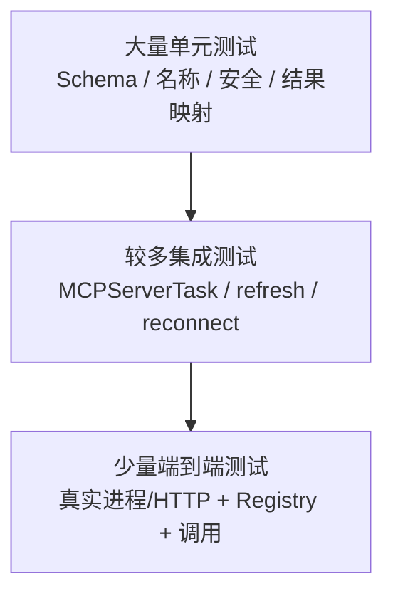
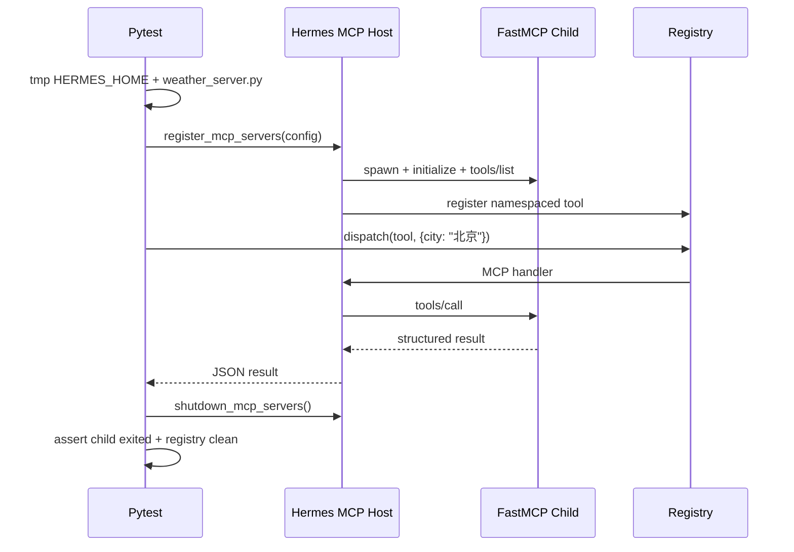
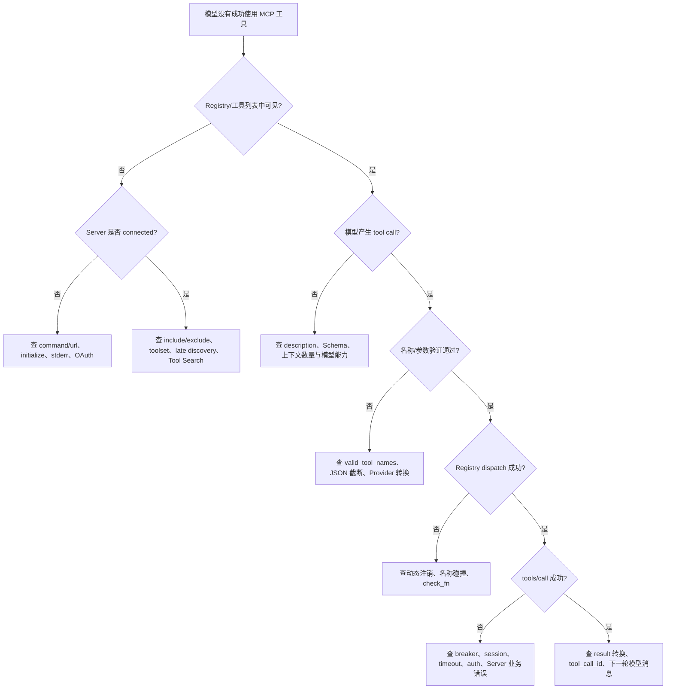

# 10｜测试、调试与源码阅读路线

## 1. 测试目标不是“SDK mock 返回成功”

MCP 集成跨越配置、进程/网络、协议、Registry、Agent 快照和消息状态机。只 mock `ClientSession.call_tool()` 能验证局部结果映射，却无法证明：

- 配置中的命令真的能启动；
- stdout framing 没被日志破坏；
- `initialize` 与 capability gate 正确；
- Schema 真能注册并送入 Agent；
- handler 真能回到同一个 Server；
- shutdown 后没有进程/Task 泄漏；
- profile 和会话没有串线。

Hermes 根目录开发指南强调行为契约和真实路径测试。MCP 尤其需要分层，而不是把所有层都 mock 掉。

## 2. 推荐的测试金字塔



### 2.1 单元测试

适合验证纯规则和故障分支：

- JSON Schema 规范化；
- 名称清洗与命名空间；
- include/exclude；
- URL/TLS/header 校验；
- error/result/structuredContent/image 映射；
- breaker 状态转换；
- config 安全规则。

### 2.2 集成测试

适合验证协作不变量：

- `initialize` 超时后 context 正确退出；
- `tools/list_changed` 不在 recv loop 内重入；
- Registry register/deregister 与 generation；
- auth/session 过期后只重试一次；
- reconnect event 和 shutdown event 优先级；
- slow discovery 不阻断入口；
- agent 快照原子替换。

### 2.3 端到端测试

至少应有一条真实链：

```text
创建临时 HERMES_HOME
→ 写 config.yaml
→ 启动真实 FastMCP 子进程
→ initialize + tools/list
→ Registry 出现名称
→ Registry.dispatch / Agent 触发 tools/call
→ 验证 structured result
→ shutdown
→ 验证无残留进程
```

## 3. 现有测试按关注点分类

### 3.1 Schema、命名与结果

- `tests/tools/test_mcp_tool.py`：主干 Schema、命名、注册、HTTP、调用行为；
- `tests/tools/test_mcp_structured_content.py`：结构化结果；
- `tests/tools/test_mcp_image_content.py`：图片结果；
- `tests/tools/test_mcp_empty_error_message.py`：空错误处理；
- `tests/agent/test_anthropic_mcp_prefix_strip.py`：Provider 名称互操作。

### 3.2 传输与握手

- `tests/tools/test_mcp_stdio_init_timeout.py`：stdio initialize 卡死；
- `tests/tools/test_mcp_sse_transport.py`：SSE timeout/OAuth；
- `tests/tools/test_mcp_preflight_content_type.py`：HTTP 预检；
- `tests/tools/test_mcp_invalid_url.py`：URL 拒绝；
- `tests/tools/test_mcp_client_cert.py`：mTLS；
- `tests/tools/test_mcp_probe.py`：临时探测不污染 Registry。

### 3.3 生命周期与恢复

- `tests/tools/test_mcp_reconnect_signal.py`：重连信号；
- `tests/tools/test_mcp_reconnect_retry_reset.py`：成功后清零连续失败；
- `tests/tools/test_mcp_circuit_breaker.py`：open/half-open；
- `tests/tools/test_mcp_parked_self_probe.py`：parked 自探测；
- `tests/tools/test_mcp_stability.py`：长期稳定性行为；
- `tests/tools/test_mcp_tool_session_expired.py`：session 过期；
- `tests/tools/test_mcp_tool_401_handling.py`：认证恢复；
- `tests/tools/test_mcp_cancelled_error_propagation.py`：取消语义。

### 3.4 动态发现与快照

- `tests/tools/test_mcp_dynamic_discovery.py`：`tools/list_changed`；
- `tests/tools/test_refresh_agent_mcp_tools.py`：Agent 快照重建；
- `tests/tools/test_mcp_register_wakes_stale.py`：失效 Task 唤醒；
- `tests/test_tui_mcp_late_refresh.py`：TUI 晚到工具；
- `tests/tui_gateway/test_mcp_late_refresh_thread_owner.py`：线程所有权；
- `tests/gateway/test_mcp_reload_refreshes_cached_agents.py`：Gateway 缓存 Agent 刷新；
- `tests/cli/test_cli_mcp_config_watch.py`：配置监听。

### 3.5 能力与双向交互

- `tests/tools/test_mcp_capability_gating.py`：能力门控与 ping fallback；
- `tests/tools/test_mcp_utility_capability_gating.py`：Resources/Prompts；
- `tests/tools/test_mcp_elicitation.py`：用户交互路由；
- `tests/tools/test_mcp_server_log_notifications.py`：日志通知；
- `tests/tools/test_mcp_oauth*.py`：OAuth 多阶段行为。

### 3.6 配置、入口与反向 Server

- `tests/hermes_cli/test_mcp_config.py`、`test_mcp_tools_config.py`：配置 UX；
- `tests/hermes_cli/test_mcp_security.py`：命令扫描；
- `tests/hermes_cli/test_mcp_startup.py`：后台发现；
- `tests/hermes_cli/test_mcp_catalog.py`：Catalog；
- `tests/tui_gateway/test_slash_worker_mcp_discovery.py`：真实 FastMCP 进程发现；
- `tests/test_mcp_serve.py`：Hermes 作为 Server；
- `tests/agent/transports/test_hermes_tools_mcp_server.py`：相关传输接口。

## 4. 最值得补的一条天气 E2E

现有 slash worker 测试已经会真实启动 FastMCP Server，并验证 `/tools` 能看到工具；但天气示例适合再补一条完整调用契约：



关键断言应是数据之间的关系，而不是脆弱快照：

- 发现到的原始名 `get_weather` 必须映射到带 Server namespace 的名称；
- dispatch 的参数必须原样到达 Server；
- 返回温度和请求 unit 对应；
- shutdown 后该 tool name 不再可分发；
- 不断言“Registry 一共有 N 个工具”或固定 generation 数字。

## 5. 参数校验的真实测试边界

文档和测试不要写成“Hermes 完整执行 JSON Schema validation”。当前链路主要提供：

- tool call arguments 必须是 JSON object；
- 按 schema 做常见类型容错转换；
- 字符串数字可转 integer/number；
- 字符串布尔可转 boolean；
- JSON 字符串可转 array/object；
- nullable hint 可帮助把字符串 `null` 规整为 None。

最终 `required`、`enum`、`pattern`、业务范围等语义仍应由 MCP Server 验证。测试应覆盖两层责任，避免 Host 的宽容转换替代服务端校验。

## 6. 故障定位决策树



## 7. 按层看日志，不要从最终错误倒猜

### 7.1 配置层

检查：

- 当前 profile 的 `HERMES_HOME`；
- `config.yaml` 是否读到了正确 Server；
- `${VAR}` 是否解析；
- `enabled`、include/exclude；
- URL 与 command 是否同时存在（URL 会成为实际选择）。

### 7.2 进程/传输层

检查：

- `~/.hermes/logs/mcp-stderr.log`；
- command 使用的解释器；
- Server 是否向 stdout 打了 banner；
- initialize 是否超时；
- HTTP endpoint 是否返回 HTML；
- SSE 是否显式设置 `transport: sse`；
- OAuth 是否已通过交互命令完成。

### 7.3 Registry 层

检查：

- 实际名称是否是 `mcp__server__tool`；
- toolset 是否启用；
- `check_fn` 是否认为 Server 可用；
- generation 是否变化；
- 工具是否因长期失败注销；
- 是否触发 Tool Search 渐进披露。

### 7.4 数据面

检查：

- Provider 返回的 tool call name；
- arguments 是否完整 JSON；
- breaker 是否 open；
- `_rpc_lock` 是否被长 RPC 占用；
- `CallToolResult.isError` 与内容；
- tool result 是否带正确 `tool_call_id`。

## 8. 常用验证命令

根据本地虚拟环境选择命令：

```powershell
hermes mcp list
hermes mcp test <server>
hermes mcp login <server>
hermes logs --level debug
```

运行精选测试：

```powershell
.venv\Scripts\python.exe -m pytest tests\tools\test_mcp_tool.py -q
.venv\Scripts\python.exe -m pytest tests\tools\test_mcp_dynamic_discovery.py -q
.venv\Scripts\python.exe -m pytest tests\tools\test_mcp_stdio_init_timeout.py -q
.venv\Scripts\python.exe -m pytest tests\tui_gateway\test_slash_worker_mcp_discovery.py -q
```

如果 `.venv` 不存在，按根目录 `AGENTS.md` 使用 `venv` 或共享 Hermes 环境。不要为了让测试“绿”而 mock 掉本来要验证的真实进程边界。

## 9. 源码阅读路线

### 第一遍：只建立边界

1. `tools/registry.py` 文件头、`ToolEntry`、`get_definitions()`、`dispatch()`；
2. `tools/mcp_tool.py` 文件头、`MCPServerTask`；
3. `_convert_mcp_schema()`、`_register_server_tools()`；
4. `_make_tool_handler()`；
5. `model_tools.handle_function_call()`；
6. `agent/conversation_loop.py` 的 tool call 分支。

目标：能画出 definition 和 invocation 两条数据流。

### 第二遍：理解生产状态机

1. `MCPServerTask.run()`；
2. `_run_stdio()`、`_run_http()`；
3. `_keepalive_probe()`；
4. `_make_message_handler()`、`_refresh_tools()`；
5. breaker helpers；
6. shutdown 与 orphan cleanup。

目标：能解释 connected、backoff、parked、recycled、breaker open 的差异。

### 第三遍：理解多模型与缓存

1. `tools/registry.py::ToolRegistry.get_definitions()`；
2. `model_tools.get_tool_definitions()`；
3. `tools/schema_sanitizer.py`；
4. `agent/transports/` 与三个 Provider adapters；
5. `refresh_agent_mcp_tools()`；
6. `agent/turn_context.py`；
7. `tools/tool_search.py`。

目标：能解释“双适配”和“为什么动态工具不能任意时刻发布”。

### 第四遍：安全与高级能力

1. `hermes_cli/mcp_security.py`；
2. `_build_safe_env()` 和 URL/TLS helpers；
3. OAuth manager；
4. Sampling callback；
5. Elicitation callback；
6. Resources/Prompts utility wrappers；
7. `mcp_serve.py`。

目标：能画出双向信任边界。

## 10. 代码评审时应守住的不变量

### 10.1 协议与生命周期

- SDK context 的 enter/exit 在同一 Task；
- initialize 和 tool call 都有硬超时；
- `CancelledError` 不被普通 exception 分支吞掉；
- notification handler 不在 recv loop 内重入 RPC；
- shutdown 后没有 Registry 幻影条目和子进程。

### 10.2 Registry 与 Agent

- 注册/注销增加 generation；
- tools 与 valid names 原子更新；
- 核心工具不会被 MCP 碰撞覆盖；
- tool-search bridge 不能越过调用者 toolset scope；
- 工具名称集合变化只在明确边界进入会话快照；同名 Schema-only 变化保持现有 Agent definitions，并应有回归测试锁定这一缓存取舍。

### 10.3 消息状态机

- assistant tool call 先于 tool result；
- tool result 与 ID 一一对应；
- 恢复错误不插入伪 user 消息；
- 副作用前先 best-effort 持久化调用意图；写入失败会告警但不阻断执行；
- 并行结果按原始调用顺序回填。

### 10.4 安全

- stdio 不继承全部父环境；
- 跨 origin redirect 不携带 Authorization；
- 错误返回模型前脱敏；
- description/result 按不可信数据处理；
- Sampling/Elicitation 有独立 gate；
- 新高危工具优先用 include 白名单。

## 11. 当前源码值得验证的三个风险

以下是源码阅读得到的风险假设，不应在没有复现前直接称为已确认 Bug。

### 11.1 规范化名称非单射

`foo-bar`、`foo.bar`、`foo_bar` 会得到相同组件。两个 MCP 来源碰撞后，后注册/注销的 owner 语义可能互相影响。应增加碰撞 E2E，验证 refresh/shutdown 不会删除另一个 Server 的获胜条目。

### 11.2 Catalog stdio 凭证传播

Catalog 安装代码会收集并写入凭证，但 stdio 子进程又只继承安全基线和 Server 显式 `env`。需要用真实 Catalog entry 验证：凭证是否一定被写回该 Server 的 `env` 映射，而不是只存在于 Hermes `.env` 中。

相关阅读点：`hermes_cli/mcp_catalog.py` 的 credential prompt、server config build、install flow，以及 `tools/mcp_tool.py::_build_safe_env()`。

### 11.3 完整真实调用覆盖不足

已有真实 FastMCP 子进程测试重点验证发现和 `/tools` 可见性；仍值得补充“真实子进程 + Registry.dispatch + tools/call + structured result + cleanup”的单条金丝雀测试。

## 12. 文档漂移也应作为测试信号

当前源码使用：

```text
mcp__server__tool
```

部分旧网站/Skill 文档仍可能展示：

```text
mcp_server_tool
```

这类漂移说明不要写“固定数量/固定字符串快照”式测试；应从唯一命名函数派生期望，或断言名称组件之间的关系。同时，用户文档生成最好复用源码常量和命令 Registry，减少多处手写。

## 13. 本篇源码锚点

- `tests/tools/test_mcp_*.py`：协议与生命周期主测试群。
- `tests/tui_gateway/test_slash_worker_mcp_discovery.py`：真实 FastMCP 子进程。
- `tests/gateway/test_mcp_reload_refreshes_cached_agents.py`：缓存 Agent 刷新。
- `tests/hermes_cli/test_mcp_*.py`：配置、安全、Catalog、启动。
- `tests/test_mcp_serve.py`：反向 Server。
- 根目录 `AGENTS.md`：行为契约、E2E 和非快照测试准则。

---

[← 上一篇：高级能力与架构演进](./09-高级能力与架构演进.md) ｜ [返回阅读索引](./00-阅读索引与核心结论.md)
