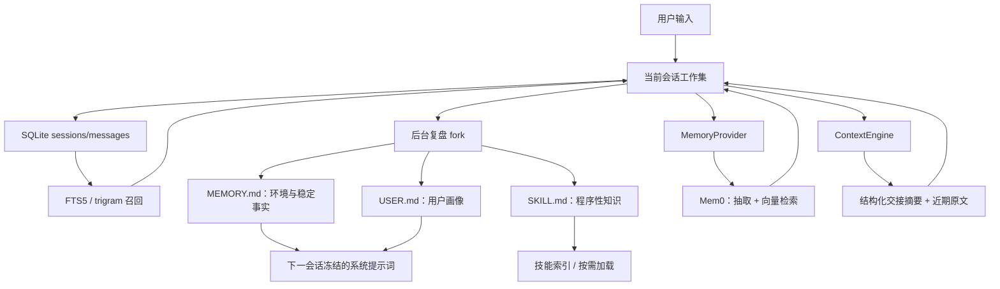

# Hermes Agent 记忆引擎与自我进化机制：阅读索引

## 这组文档回答什么

这组文档不按文件逐行解释，而是沿着四类状态的数据流来理解 Hermes：

1. **会话事实（episodic history）**：完整对话落入 SQLite，FTS5 负责低成本检索。
2. **声明式长期记忆（semantic/declarative memory）**：`MEMORY.md` 与 `USER.md` 保存经过筛选的稳定事实和用户画像。
3. **外部语义记忆（optional semantic backend）**：Mem0 等插件负责事实抽取、向量召回和去重。
4. **程序性记忆（procedural memory）**：`SKILL.md` 固化“这一类任务应该怎样做”。
5. **短期工作记忆（working set）**：上下文压缩器把旧轮次变成交接摘要，保留近期原文和不可压缩前缀。

这五类能力不是一个“大而全的记忆数据库”，而是多个存储介质、不同一致性模型和不同召回策略组成的分层系统。

## 必须先校正的三个前提

### 1. FTS5 不是 `MEMORY.md` 的索引

FTS5 虚表 `messages_fts` 与 `messages_fts_trigram` 索引的是 `messages` 表中的会话消息、工具名和工具调用参数。它支撑的是“我以前在哪次会话里谈过 X”，不是“用户最稳定的偏好是什么”。后者由 `USER.md` 或外部 MemoryProvider 负责。

### 2. 项目实现叫 Mem0，不是 memo0

代码目录是 `plugins/memory/mem0/`，类为 `Mem0MemoryProvider`。它是可选插件，并非 SQLite FTS5 的内部组件。

### 3. 技能不是 `.skill` 单文件

当前约定是一个技能目录，核心文件名为 `SKILL.md`，并可带 `references/`、`templates/`、`scripts/`、`assets/`。后台复盘通过 `skill_manage` 工具生成或修改这些文件。

## 文档目录

| 篇章 | 主题 | 重点问题 |
|---|---|---|
| [01](01-记忆分层与总体数据流.md) | 总体架构 | 为什么要分层，而不是统一塞进向量库 |
| [02](02-SQLite与FTS5会话记忆引擎.md) | SQLite / FTS5 | Schema、索引同步、CJK、召回排序 |
| [03](03-MEMORY与USER用户建模.md) | 本地长期记忆 | 冻结快照、容量治理、并发和注入防护 |
| [04](04-Mem0外部语义记忆插件.md) | Mem0 | ABC、三种后端、预取/同步、身份隔离 |
| [05](05-后台反思与技能提取闭环.md) | Reflection | 触发条件、review fork、底层 Prompt |
| [06](06-SKILL程序性记忆与生命周期治理.md) | 技能落盘 | Schema、原子写、来源、读后写、curator |
| [07](07-上下文压缩与注意力治理.md) | Context | 阈值、剪枝、摘要、交替约束、持久化 |
| [08](08-一致性安全失败恢复与架构演进.md) | 可靠性与演进 | 缓存、并发、失败隔离、设计必然性 |

## 一句话架构结论

Hermes 的核心思路是：**保留完整历史，但不把完整历史永久塞给模型；把稳定事实、用户画像、程序性知识和当前工作集分别存放，并用不同召回/更新协议连接它们。**

## 主要源码入口

- `hermes_state.py`：SQLite Schema、FTS5、压缩归档和会话检索。
- `tools/session_search_tool.py`：历史召回的 discovery / scroll / browse 三种读模型。
- `tools/memory_tool.py`：`MEMORY.md` / `USER.md` 的策展式存储。
- `agent/memory_provider.py`、`agent/memory_manager.py`：外部记忆插件的窄接口和编排器。
- `plugins/memory/mem0/`：Mem0 平台、自托管 HTTP 与 OSS 后端。
- `agent/background_review.py`：后台反思 Prompt 与隔离执行。
- `tools/skill_manager_tool.py`、`tools/skill_usage.py`：技能写入及生命周期元数据。
- `agent/context_engine.py`、`agent/context_compressor.py`、`agent/conversation_compression.py`：上下文换页机制。

