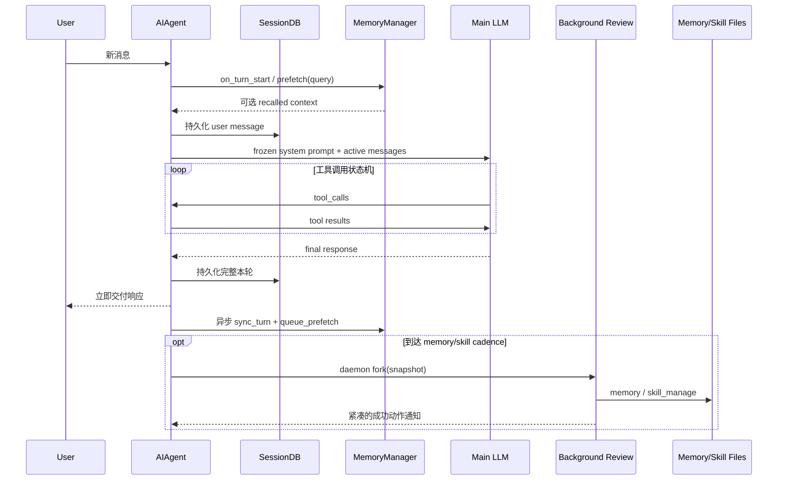

# 记忆分层与总体数据流

## 1. Hermes 真正解决的痛点

长期运行的 Agent 同时面对四个互相冲突的目标：

- **可追溯**：过去说过和做过什么，不能因压缩而永久消失。
- **低 Token**：不能每轮把全部历史重放给模型。
- **高信号**：用户偏好不能淹没在数万条聊天和工具日志中。
- **可迁移能力**：一次复杂任务形成的方法，下次应直接复用，而不是只召回一段故事。

若使用单一存储，会出现典型错配：全文历史注入导致 Token 爆炸；只存摘要失去证据；只用向量库难以表达确定的用户偏好；把操作步骤写入用户画像又会制造巨大的常驻 Prompt。

因此 Hermes 采用“按知识类型分治”的设计。

## 2. 五层状态及其一致性模型

| 层 | 介质 | 写入时机 | 读取时机 | 一致性/代价 |
|---|---|---|---|---|
| 会话事实 | SQLite `sessions/messages` | 每轮增量持久化 | `session_search` 按需 | 完整、可审计，不常驻 Prompt |
| 策展记忆 | `MEMORY.md` | 显式工具或后台复盘 | 会话启动冻结快照 | 小而权威，更新到下一会话可见 |
| 用户画像 | `USER.md` | 显式工具或后台复盘 | 会话启动冻结快照 | 与通用环境记忆隔离 |
| 外部语义记忆 | MemoryProvider（如 Mem0） | 每轮异步同步/显式工具 | 预取或模型主动搜索 | 语义召回强，但允许降级失败 |
| 程序性技能 | `<skill>/SKILL.md` | 后台复盘或用户操作 | 技能索引 + 按需加载 | 可执行知识，不应常驻全部正文 |
| 短期工作集 | `messages` + 压缩摘要 | 达到阈值时 | 每次模型调用 | 保近期原文，旧内容有损压缩 |

这不是重复存储，而是不同“读模型”：SQLite 回答“发生过什么”，`USER.md` 回答“这个人是谁”，`SKILL.md` 回答“该怎样做”，压缩摘要回答“当前工作进行到哪里”。

## 3. 一次正常对话的数据流

关键顺序是“先交付主回答，再做反思”。否则学习任务会与用户任务争夺延迟、迭代预算和注意力。

## 4. 声明式知识与程序性知识的边界

`tools/memory_tool.py` 的工具描述直接规定：

- `user`：姓名、角色、偏好、沟通风格，即“用户是谁”。
- `memory`：环境、约定、工具特性、稳定经验，即“当前世界中稳定成立什么”。
- `skill`：可复用过程，即“遇到这一类任务怎样做”。
- 临时 TODO、任务进度、完成日志不应写入长期记忆，应留在会话历史，通过 `session_search` 找回。

这个边界很重要。若把“今天修过某文件”永久注入 Prompt，它很快过期；若把一套复杂排障步骤仅存为一句记忆，又缺少触发条件、验证和陷阱。

## 5. 为什么核心只保留窄接口

外部记忆通过 `MemoryProvider` ABC 接入，`MemoryManager` 最多接受一个外部插件提供者。设计目标有三点：

1. 避免多个语义后端同时注入工具 Schema，扩大每次 API 调用的固定成本。
2. 统一 `initialize → prefetch → sync_turn → session boundary → shutdown` 生命周期。
3. 让 Mem0、Honcho、Hindsight 等变化留在边缘，主循环只认识统一协议。

这符合项目“核心是窄腰、能力在边缘”的总体约束。

## 6. 状态边界比存储格式更重要

真正的架构价值不是 Markdown 或 SQLite 本身，而是明确的可见性边界：

- 内置记忆在会话开始形成冻结快照；本轮写盘不改变当前系统 Prompt。
- 外部记忆可在当前问题前预取，但失败必须 fail-soft。
- 压缩可以改变 active working set，但不能删除原始可搜索历史。
- 后台复盘共享会话快照，但不能写入主会话的消息流或抢占压缩。
- 技能修改会清理技能 Prompt 缓存，但不应把全部技能正文常驻系统 Prompt。

这些边界共同保护了两条最高层不变量：**Prompt 前缀稳定**和**消息角色严格交替**。

## 7. 入口定位

- 初始化：`agent/agent_init.py:1353-1453`
- 系统 Prompt 注入：`agent/system_prompt.py:466-494`
- 外部记忆同步：`run_agent.py:3369-3429`
- 后台复盘触发：`agent/turn_context.py:307-314`、`agent/turn_finalizer.py:484-511`
- 压缩编排：`agent/conversation_compression.py`

