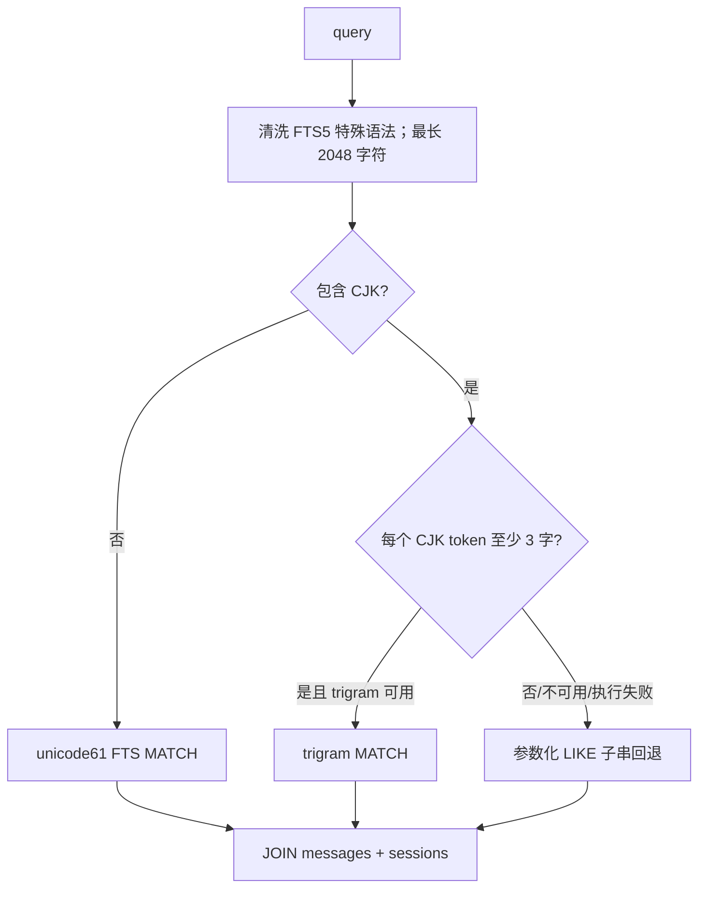
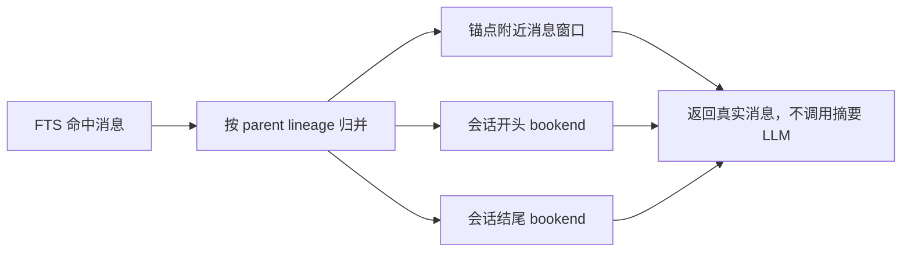

# SQLite 与 FTS5 会话记忆引擎

## 1. 定位：它是可搜索事件日志，不是画像数据库

`SessionDB` 的职责是保存会话、消息、用量和会话谱系，并提供零 LLM 成本的历史检索。它保留原始证据，因此是其他有损层（摘要、长期记忆抽取）的事实后盾。

数据库默认位于 profile 对应的 `state.db`。每个 profile 拥有独立状态，避免画像、会话和路由跨 profile 隐式继承。

## 2. 核心 Schema 的设计意图

源码：`hermes_state.py:704-911`，当前 `SCHEMA_VERSION = 20`（`hermes_state.py:143`）。下面省略计费细节，只保留与记忆设计相关的主干。

```sql
CREATE TABLE sessions (
  id TEXT PRIMARY KEY,
  source TEXT NOT NULL,
  user_id TEXT,
  session_key TEXT,
  chat_id TEXT,
  chat_type TEXT,
  thread_id TEXT,
  display_name TEXT,
  origin_json TEXT,
  model TEXT,
  model_config TEXT,
  system_prompt TEXT,
  parent_session_id TEXT,
  started_at REAL NOT NULL,
  ended_at REAL,
  end_reason TEXT,
  title TEXT,
  compression_failure_cooldown_until REAL,
  compression_failure_error TEXT,
  archived INTEGER NOT NULL DEFAULT 0,
  FOREIGN KEY(parent_session_id) REFERENCES sessions(id)
);

CREATE TABLE messages (
  id INTEGER PRIMARY KEY AUTOINCREMENT,
  session_id TEXT NOT NULL REFERENCES sessions(id),
  role TEXT NOT NULL,
  content TEXT,
  tool_call_id TEXT,
  tool_calls TEXT,
  tool_name TEXT,
  timestamp REAL NOT NULL,
  token_count INTEGER,
  finish_reason TEXT,
  reasoning TEXT,
  active INTEGER NOT NULL DEFAULT 1,
  compacted INTEGER NOT NULL DEFAULT 0
);

CREATE TABLE compression_locks (
  session_id TEXT PRIMARY KEY,
  holder TEXT NOT NULL,
  acquired_at REAL NOT NULL,
  expires_at REAL NOT NULL
);
```

设计解读：

- `sessions` 是会话聚合根；平台身份、线程身份和模型信息与消息分离，便于过滤和展示。
- `parent_session_id` 同时表达分支、子任务和传统“压缩后续会话”谱系；具体语义需结合父会话 `end_reason='compression'` 判断，不能仅凭 parent 字段猜测。
- `messages.active` 支持 rewind/undo 与原地压缩后的读模型切换。
- `messages.compacted` 区分“用户撤回的旧状态”和“因压缩退出活动窗口、但仍应被搜索的历史”。
- `compression_locks` 是带租约的每会话互斥锁，防止网关、手动压缩和自动压缩并发生成多个 continuation。

`session_model_usage`、`gateway_routing`、`state_meta` 则把计费聚合、平台路由和迁移元数据从消息主表解耦。

## 3. FTS5 为什么使用 content-only 虚表

```sql
CREATE VIRTUAL TABLE messages_fts USING fts5(content);

-- 插入时以 messages.id 作为 FTS rowid
INSERT INTO messages_fts(rowid, content)
VALUES (
  new.id,
  COALESCE(new.content, '') || ' ' ||
  COALESCE(new.tool_name, '') || ' ' ||
  COALESCE(new.tool_calls, '')
);
```

虚表只存一列拼接文本，关系属性仍从 `messages`、`sessions` JOIN 回来。这样有三个好处：

1. FTS 索引只承担倒排搜索，不复制角色、平台、模型等结构字段。
2. `rowid == messages.id` 形成稳定且便宜的连接键。
3. 工具名和参数同样可搜索，因此“以前在哪次任务里运行过 pytest/改过某路径”也能被召回。

三组 `AFTER INSERT/DELETE/UPDATE` trigger 保证索引与基表同步。启动时 `_ensure_fts_schema()` 会补建缺失触发器；迁移也能执行 FTS5 `rebuild` 从权威 `messages` 表恢复索引。因此 **messages 是事实源，FTS 是可再生派生数据**。

## 4. 为什么还有 trigram FTS

默认 `unicode61` 对 CJK 语句的分词不适合精确子串召回，所以项目增加：

```sql
CREATE VIRTUAL TABLE messages_fts_trigram USING fts5(
  content,
  tokenize='trigram'
);
```

查询路由为：



1-2 个 CJK 字符无法形成 trigram，因此退到 `LIKE`。这不是性能优雅路径，但保证短中文词仍可用。FTS5 模块整体不可用时，会话持久化仍继续，只关闭全文检索；trigram tokenizer 单独不可用时只降级 CJK 路径。

## 5. 查询安全与排名

`_sanitize_fts5_query()`（`hermes_state.py:4651`）不是 SQL 转义，而是 FTS 查询语言整形：

- 输入先截断到 2048 字符，避免病理输入。
- 保留成对引号短语。
- 移除 `+{}():"^` 等特殊含义字符。
- 清理悬空 `AND/OR/NOT`。
- 将点号、连字符、下划线组合词加引号，避免 `chat-send` 被拆成错误的 AND 查询。
- SQL 参数仍通过占位符绑定，不拼接用户内容。

默认排序使用 FTS5 的 `rank`（BM25，值越小越相关）；也可选择 newest/oldest 以时间为主、rank 为辅。

`tools/session_search_tool.py` 还做一次业务排序：cron 会话不删除，只降到交互会话之后。原因是高频自动任务词汇会淹没人的真实会话，形成“recall blindness”。

## 6. 从命中行到可理解上下文

只返回一条 snippet 对 Agent 不够。`session_search` 提供三个模式：

- **Discovery**：`query` → FTS 扫描 → 按会话谱系去重 → 命中附近窗口 + 会话首尾 bookends。
- **Scroll**：`session_id + around_message_id` → 围绕锚点前后翻页。
- **Browse**：无参数 → 最近会话元数据。

Discovery 先扫描最多 300 个 FTS 行，再按 lineage root 去重。否则同一个长会话的多个高分命中会占满 top-N。



## 7. 压缩后为何仍能搜索原文

原地压缩通过 `archive_and_compact()` 将旧 active 行软归档为 `active=0, compacted=1`，再插入新的活动摘要/尾部消息。默认搜索条件是：

```sql
(m.active = 1 OR m.compacted = 1)
```

因此：

- rewind 产生的 `active=0, compacted=0` 默认隐藏，因为用户已否定它们。
- compaction 产生的 `active=0, compacted=1` 仍可搜索，因为它们仍是历史事实。

这实现了非常关键的分离：**工作集可以有损，审计历史不可破坏。**

## 8. 并发与维护

数据库启用 foreign keys，并优先使用 WAL。多进程写竞争采用短 SQLite timeout + 应用层随机抖动重试，避免确定性 busy handler 造成 convoy。FTS 段会周期性 merge，WAL 在边界进行 best-effort TRUNCATE checkpoint，以控制长期驻留进程的文件膨胀。

## 9. 核心源码

- Schema/FTS：`hermes_state.py:704-911`
- FTS 可用性与重建：`hermes_state.py:1049-1191`
- 消息搜索：`hermes_state.py:4651-5000`
- 原地压缩持久化：`hermes_state.py:3942`
- Agent 召回工具：`tools/session_search_tool.py`

