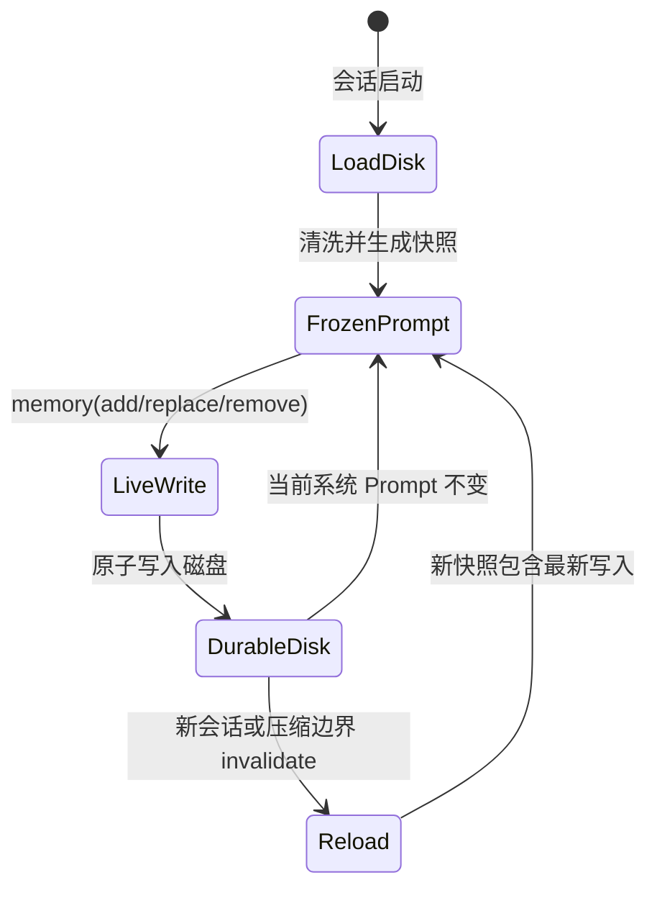
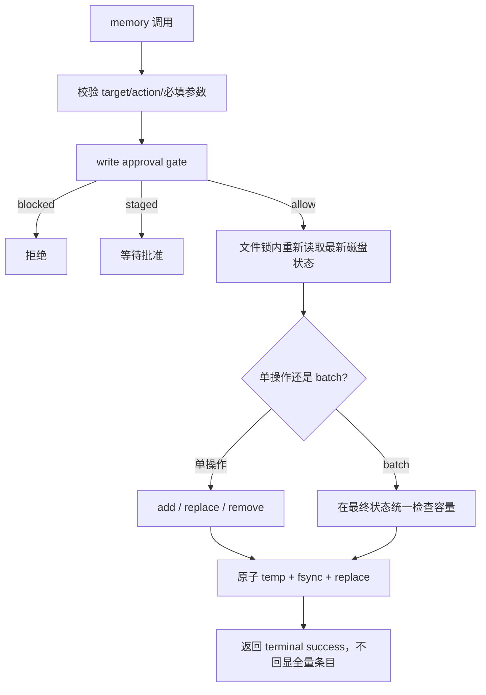

# MEMORY.md、USER.md 与用户建模

## 1. 两个文件不是简单拆分，而是两个认知命名空间

内置长期记忆由 `MemoryStore` 管理：

- `~/.hermes/memories/MEMORY.md`：Agent 的稳定笔记，如项目约定、环境事实、工具特性。
- `~/.hermes/memories/USER.md`：用户画像，如角色、偏好、沟通风格、工作习惯。

两者以 `§` 分隔独立条目。默认字符上限分别为 2200 和 1375。使用字符而非 Token，是为了不依赖当前模型 tokenizer，并强迫记忆保持策展式、小而高信号。

## 2. 为什么不存 SQLite

这里追求的不是搜索大量数据，而是每次新会话都应可靠看到一小段权威知识。Markdown 的优势是：

- 用户可读、可编辑、可备份。
- 无数据库迁移成本。
- 可直接组成系统 Prompt。
- 容量很小，不需要索引。

SQLite 会话历史和 Markdown 记忆是互补关系：前者是原始事实库，后者是人为/模型策展后的常驻摘要。

## 3. 冻结快照：Prompt Cache 优先于即时可见

`MemoryStore` 同时维护两套状态：

- `memory_entries/user_entries`：实时可变，工具写入后立即落盘。
- `_system_prompt_snapshot`：`load_from_disk()` 时捕获，此会话内不再改变。

这是一个刻意的“延迟可见性”选择：当前会话写入立即持久，但通常到下一会话才进入系统 Prompt。若每次 memory 工具调用后重建 Prompt，前缀字节会改变，缓存失效，长会话成本显著上升。

例外是上下文压缩边界：`invalidate_system_prompt()` 会重新从磁盘加载记忆，因为此时系统 Prompt 本来就要重建。

## 4. 写入状态机

工具只暴露一个 `memory` schema，通过 `action` 和 `target` 复用核心工具表面。

推荐 batch 是一个细致的容量设计：当存储已满时，“先 remove 再 add”若分两次调用，会多轮消耗 Token，且中间状态可见；batch 允许在一个事务式计算中先缩减旧项再加新项，只校验最终字符数。

`replace/remove` 使用短且唯一的 `old_text` 子串定位，不暴露额外 ID。匹配 0 条或多条都会失败并返回当前条目，要求模型缩小定位范围。

## 5. 容量治理为何是系统行为而不是提示建议

工具描述要求优先级为：用户偏好与纠正 > 环境事实 > 程序。达到容量上限时，add 会拒绝并要求合并旧项。

为避免模型在同一轮反复尝试 consolidation，连续失败超过 3 次后返回 terminal `done=True`，要求停止记忆调用并继续回答用户。这个保护体现了一个重要原则：**长期记忆副作用失败不能吞掉当前回答。**

成功响应也不回显完整条目，只报告占用和数量，并明确“不要重复”。这是在工具协议层防止模型看到全量状态后继续“优化”而产生写入抖动。

## 6. 并发与数据丢失防护

多会话可能同时写同一 profile。实现采用：

1. 独立 `.lock` 文件做互斥，不锁目标文件本身。
2. 在锁内重新读取，避免基于旧内存状态覆盖姊妹会话写入。
3. 同目录临时文件 + `fsync` + `os.replace`，读者永远看到完整旧版或完整新版。
4. `replace/remove` 前检查 external drift；若文件被 patch/shell/manual edit 写成无法 round-trip 的形状，先生成 `.bak.<timestamp>`，再拒绝覆盖。

add 是追加语义，因此允许跳过 drift 阻断，但仍重新读取并做去重；replace/remove 会重写整文件，必须更严格。

## 7. Prompt 注入安全

记忆进入 system Prompt，权限高于普通工具结果，所以采用 strict threat patterns：

- 写入时扫描提示注入/外泄模式。
- 加载快照时再次扫描，覆盖手工修改或供应链污染。
- 可疑条目不会从实时文件中静默删除，而是在 Prompt 快照中替换为 `[BLOCKED: ...]`，用户仍可检查和移除原始项。

这种“双状态”避免两个极端：既不让污染内容进入高权限 Prompt，也不隐瞒磁盘上发生过的污染。

## 8. 用户建模不是自动推断所有细节

后台 memory review 的目标只包括 persona、desires、preferences、personal details、行为期望和工作方式。它明确允许 `Nothing to save.`。这是一种稀疏画像策略：只保存未来能减少用户重复说明的稳定特征，不把每次话题、情绪或临时任务提升为身份事实。

## 9. 系统 Prompt 装配位置

`agent/system_prompt.py:466-494` 将内置 memory、user profile 和外部 provider block 放入 volatile tier，但整个系统 Prompt 每会话只构建一次并缓存。这里的“volatile”表示跨会话可变，不表示每轮重建。

## 10. 核心源码

- 存储和工具：`tools/memory_tool.py`
- 初始化：`agent/agent_init.py:1353-1376`
- Prompt 注入/重载：`agent/system_prompt.py:466-494, 541-544`
- 写批准：`tools/write_approval.py`
- 威胁模式：`tools/threat_patterns.py`

