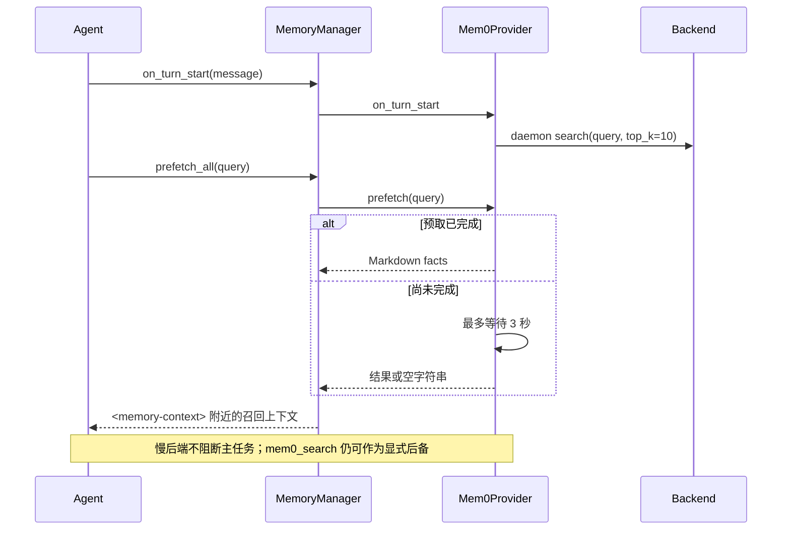
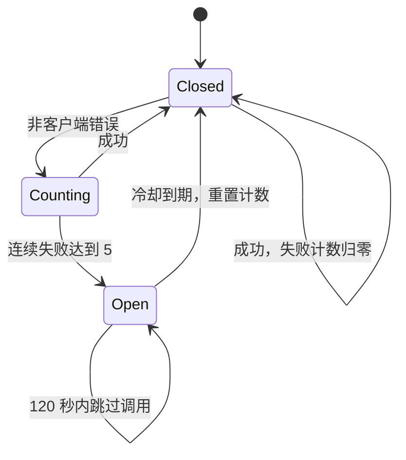

# Mem0 外部语义记忆插件

## 1. Mem0 在架构中的位置

Mem0 不是对 SQLite FTS5 的替换，也不是内置 `USER.md` 的实现。它通过 `MemoryProvider` 插件接口作为额外的语义记忆层：

- 完成每轮后，将 user/assistant 对话发送给 Mem0 做服务端事实抽取。
- 下轮开始前，按当前用户问题做语义预取。
- 模型也可主动调用 `mem0_search/add/update/delete`。

FTS5 擅长词法证据召回，Mem0 擅长同义语义和事实归并；本地 Markdown 则提供小型、确定、始终注入的权威画像。

## 2. MemoryProvider 窄接口

`agent/memory_provider.py` 定义的生命周期大致为：

```text
is_available
initialize(session_id, identity/context...)
system_prompt_block
prefetch / queue_prefetch
sync_turn
get_tool_schemas / handle_tool_call
on_pre_compress
on_session_end / on_session_switch
shutdown
```

`MemoryManager` 是主循环唯一集成点，并强制最多一个外部插件 provider，避免工具 Schema 膨胀与多个后端互相冲突。

## 3. 三种后端统一为同一协议

`plugins/memory/mem0/_backend.py` 定义 `Mem0Backend`：`search/add/update/delete/close`。其实现为：

| 后端 | 客户端 | 特点 |
|---|---|---|
| Platform | `mem0.MemoryClient` | 云 API，可 rerank，cloud add 可能异步 |
| SelfHosted | `httpx.Client` | 直接使用 `/memories`、`/search`，`X-API-Key` |
| OSS | `mem0.Memory.from_config` | 本地 LLM、embedder、vector_store 组合 |

必须单独写 SelfHostedBackend，是因为官方 cloud client 的认证头和 `/v1/ping/` 初始化契约与自托管 FastAPI server 不一致。通过 backend ABC 隔离这种供应商差异，Provider 上层不需要条件分支散落。

## 4. 用户身份解析

Mem0 的记忆隔离核心是 `user_id`。解析顺序：

1. 操作者在 `mem0.json` 或兼容 env 中配置的 canonical `user_id`。
2. gateway 传入的平台原生 ID（Telegram/Discord 等）。
3. CLI 无身份时回退 `hermes-user`。

读取过滤器默认仅为 `{"user_id": ...}`，因此同一个 canonical principal 可跨 channel/agent 召回。写入 metadata 额外记录 `channel`，为 UI 过滤保留能力，但不把 channel 与身份硬耦合。

这是用户建模中很容易忽略的一点：**身份合并策略是记忆准确性的前置条件**。过度合并会串用户，过度隔离会让同一个人在不同平台失忆。

## 5. 当前问题预取的数据流



`MemoryManager` 会先剥离 `/skill` 展开的完整技能正文，只把用户真实 instruction 发给 provider。否则技能模板会污染 embedding 和事实抽取。

## 6. 每轮同步：为什么是 infer=True

完成轮次调用：

```python
backend.add(
    [user_message, assistant_message],
    user_id=...,
    agent_id=...,
    infer=True,
    metadata={"channel": ...},
)
```

`infer=True` 让 Mem0 从对话中抽取事实并执行语义去重。显式 `mem0_add` 则使用 `infer=False`，表示工具调用者已经给出要原样保存的事实，避免再让抽取器改写。

外层 `MemoryManager.sync_all()` 使用单 worker daemon executor 串行提交，保证 turn N 先于 turn N+1；Mem0 内部还串行自己的 sync thread，若上一写入 5 秒后仍未结束则跳过新同步，避免重复 ingestion。

## 7. 为什么必须异步且 fail-soft

外部 provider 可能网络不通、daemon 配错或响应数分钟。同步若处在主 `run_conversation()` 返回路径上，用户已经看到回复，界面却一直显示 running，下一条消息还可能触发 interrupt。

因此：

- turn completion 只负责把任务排入 daemon worker。
- 单 provider 错误只记录日志，不阻断回答。
- shutdown 最多等待有限时间，不能让进程无限挂起。
- interrupted turn 完全不进入外部记忆，因为部分回答和中断工具链不是用户看到的稳定事实。

## 8. 熔断器状态机



404、无效 UUID 等客户端错误不触发 breaker，因为它们不代表服务器整体不可用。网络/服务错误才累计。OSS 模式错误还会提示检查 vector store。

## 9. OSS 的向量维度迁移

更换 embedding model 后，已有 Qdrant/pgvector collection 的维度可能不兼容。OSSBackend 会根据已知模型维度或显式 `embedding_dims` 检查 collection；维度不一致时重建 collection/table。这是语义记忆系统常见但容易遗漏的演进痛点：embedding schema 本质上也是数据库 Schema。

## 10. 配置设计

非秘密行为配置写入 `$HERMES_HOME/mem0.json`（mode、host、user_id、agent_id、rerank、OSS 组件）；API key 放 `.env`。旧 `MEM0_*` 环境变量仍作为兼容回退，但不再作为推荐配置面。

## 11. 核心源码

- ABC：`agent/memory_provider.py`
- 编排：`agent/memory_manager.py`
- Provider：`plugins/memory/mem0/__init__.py`
- 后端：`plugins/memory/mem0/_backend.py`
- OSS 设置：`plugins/memory/mem0/_setup.py`、`_oss_providers.py`

