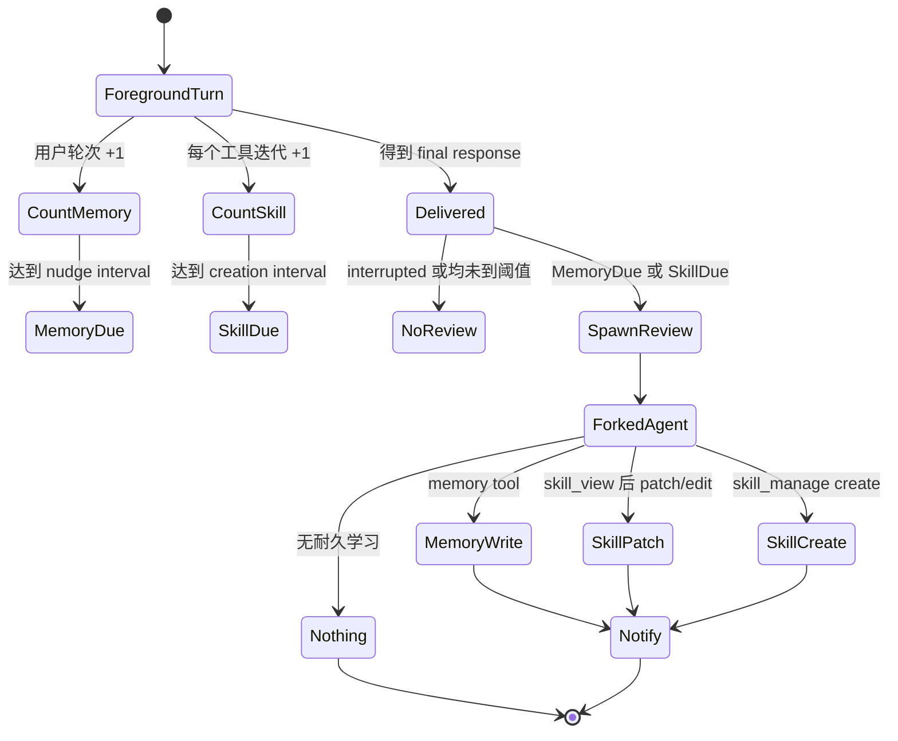
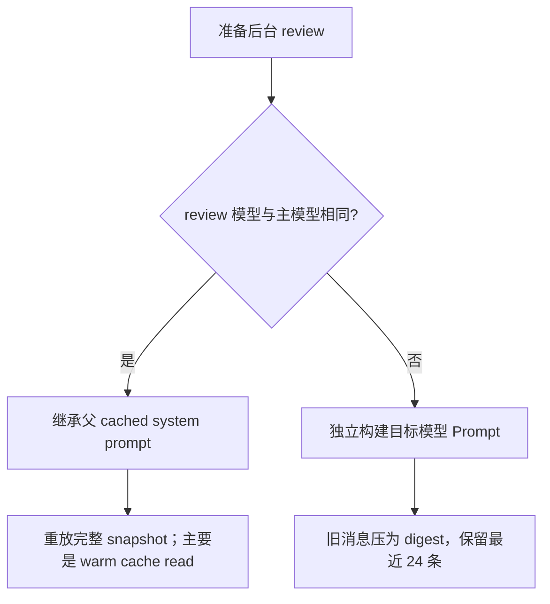

# 后台反思与技能提取闭环

## 1. 闭环不是“任务成功即同步生成文件”

真实实现是**按 cadence 触发的后台复盘**，而不是每个复杂任务结束时做一次阻塞式 Reflection：

- Memory review 默认按用户轮次计数，`memory.nudge_interval = 10`。
- Skill review 默认按工具迭代次数计数，`skills.creation_nudge_interval = 10`。
- 仅当相应工具存在、主轮有 final response 且未 interrupted 时触发。
- 工具执行中若已调用 `memory` 或 `skill_manage`，相关计数会被重置，避免重复复盘。

因此“复杂任务成功后固化”的近似机制是：复杂任务通常包含较多工具迭代，会更快越过 skill cadence；但触发条件不是一个明确的 `task_success && calls >= 5` if 语句。`skill_manage` 的 schema 提示“5+ calls”等信号，最终是否写入由复盘模型判断。

## 2. 触发状态机



入口：`agent/turn_context.py:307-314`、`agent/conversation_loop.py:692-694`、`agent/turn_finalizer.py:484-511`。

## 3. 为什么用 forked agent，而不是在主上下文里注入 Reflection

`agent/background_review.py` 会启动 daemon thread，创建一个独立 `AIAgent`，重放主会话快照并追加 review prompt。这样做解决四个问题：

1. **不污染角色序列**：主对话不会插入一条合成 user reflection 指令。
2. **不争夺前台注意力**：用户回答先返回，复盘稍后完成。
3. **限制能力**：线程级 whitelist 只允许 memory/skill 工具。
4. **保护会话所有权**：fork 不持久化自己的 session，不得结束父 session，也禁用压缩。

同模型默认复用父 Agent 的 `_cached_system_prompt`、session start 和 session id，以命中同一前缀缓存；若路由到不同辅助模型，缓存本来就冷，于是只重放旧消息 digest + 最近 24 条，降低 cold-write 成本。

## 4. Memory Review Prompt 的底层意图

核心文本位于 `agent/background_review.py:171-180`：

```text
Review the conversation above and consider saving to memory if appropriate.
Focus on:
1. Has the user revealed things about themselves — persona, desires,
   preferences, or personal details worth remembering?
2. Has the user expressed expectations about how you should behave,
   their work style, or ways they want you to operate?
If something stands out, save it using the memory tool.
If nothing is worth saving, say 'Nothing to save.' and stop.
```

为什么这么写：

- 问题集中在长期稳定的“who”，避免把任务流水写入画像。
- 使用“if appropriate / if something stands out”保持稀疏。
- 明确停止输出，防止为了完成副任务而强行编造记忆。
- 具体容量、batch、target 边界下沉到 memory 工具 schema，Prompt 不重复协议细节。

## 5. Skill Review Prompt 的核心结构

完整文本较长，位于 `agent/background_review.py:182-280`。它不是普通“总结经验”，而是在塑造技能库拓扑。

### 5.1 强制积极学习，但保留空操作

Prompt 先强调大多数 session 应有小更新，避免模型把“不行动”当默认；末尾又保留在无纠正、无新技术时 `Nothing to save.`。这种张力是刻意的：提高 recall，不允许凭空造规则。

### 5.2 信号定义

任何一种都应行动：

- 用户纠正风格、格式、可读性、冗长度或工作方式。
- 用户纠正执行顺序或方法。
- 产生可迁移的技术、修复、绕行、调试路径或工具模式。
- 本轮加载/查看的技能事实错误、漏步骤或过期。

用户对“怎么做”的抱怨既可进入用户记忆，也必须进入对应技能。理由是 memory 只能说明用户是谁，无法确保未来执行该类任务时遵循具体步骤。

### 5.3 更新优先级

Prompt 强制以下顺序：

1. 优先 patch 当前加载或查看过的技能。
2. 否则搜索并更新已有 class-level umbrella。
3. 细节放入 `references/`，可复制骨架放 `templates/`，确定性动作放 `scripts/`。
4. 只有无现有覆盖时才创建新的 class-level umbrella。

这解决“一次 session 一个 skill”的熵增问题。技能名不得是 PR 号、错误字符串、feature codename、单一库名或 `fix-X-today`。

### 5.4 反向知识污染防护

Prompt 明确禁止固化：

- 缺少二进制、未配置凭据等环境瞬态失败。
- “浏览器工具坏了”“X 永远不能用”等负面能力断言。
- 已通过重试恢复的暂态错误。
- 一次性任务故事。

原因是技能会跨月生效，临时故障若被写成规则，会变成 Agent 的永久自我限制。正确学习对象是恢复方法，而不是“工具不可用”。

## 6. Combined Prompt

当 memory 与 skill cadence 同时到达时，使用 `_COMBINED_REVIEW_PROMPT`，一次 fork 同时检查：

- Memory：who the user is / current durable situation。
- Skills：how to do this class of task。

合并不是为了混淆边界，而是为了只支付一次上下文重放和模型调用。

## 7. 复盘 fork 的安全围栏

- `_persist_disabled=True`、`_session_db=None`：不把复盘对话写入历史。
- `_end_session_on_close=False`：关闭 fork 不能结束父会话。
- `compression_enabled=False`：共享 session id 时禁止压缩，避免生成父会话的竞争子分支。
- memory/skill whitelist：即使模型尝试其他工具也在运行时拒绝。
- 当 profile 禁用 built-in memory 时，review whitelist 不包含 memory。
- 状态/警告输出静默，只把成功 memory/skill 动作汇总给用户。
- review 自己的 nudge interval 设为 0，阻止“复盘触发复盘”的递归。

## 8. Prompt Cache 决策



这体现 Hermes 的成本模型：相同模型时完整重放可能比重新摘要更便宜，因为前缀已缓存；换模型时旧缓存无效，digest 才有纯收益。

## 9. 核心源码

- Prompt 与 fork：`agent/background_review.py`
- 普通 transport 触发：`agent/turn_context.py`、`agent/conversation_loop.py`、`agent/turn_finalizer.py`
- Codex app-server 对齐路径：`agent/codex_runtime.py:477-527`
- 包装入口：`run_agent.py:1576-1628`

