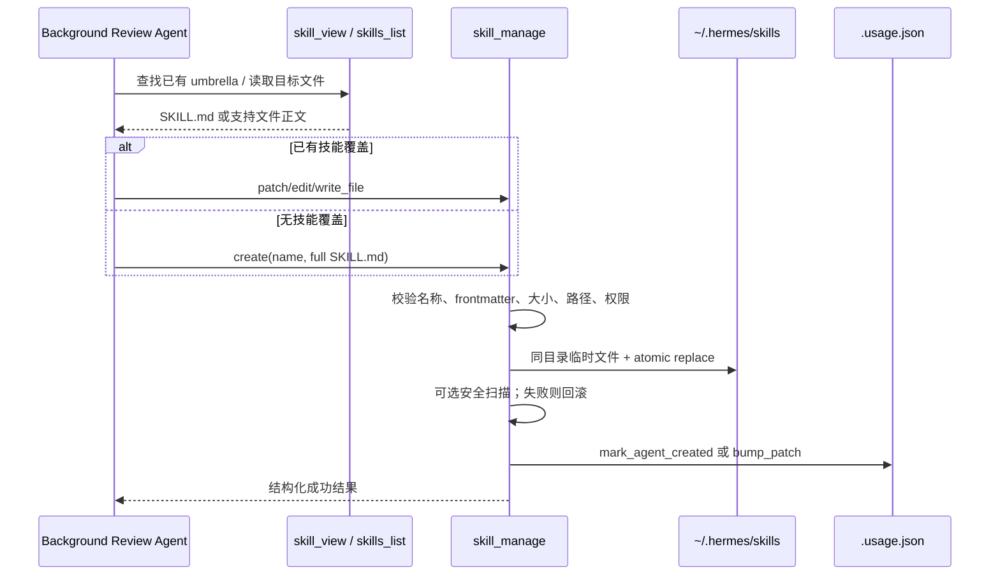
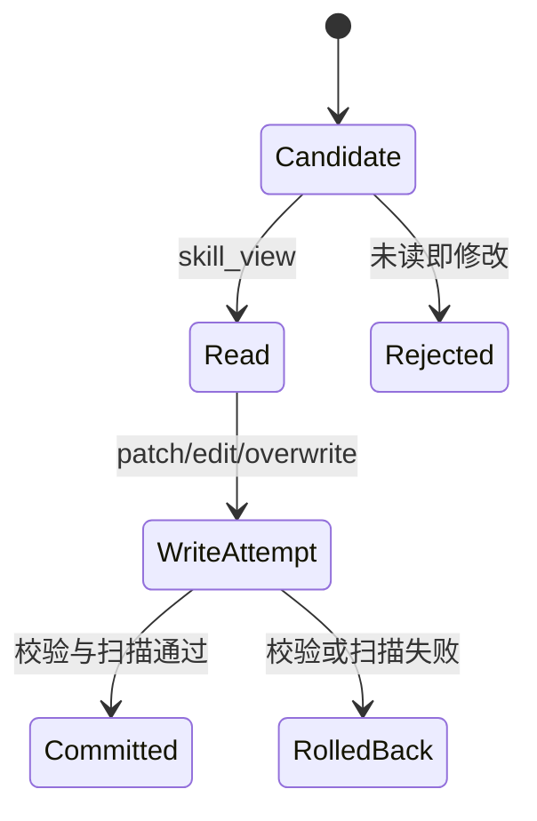
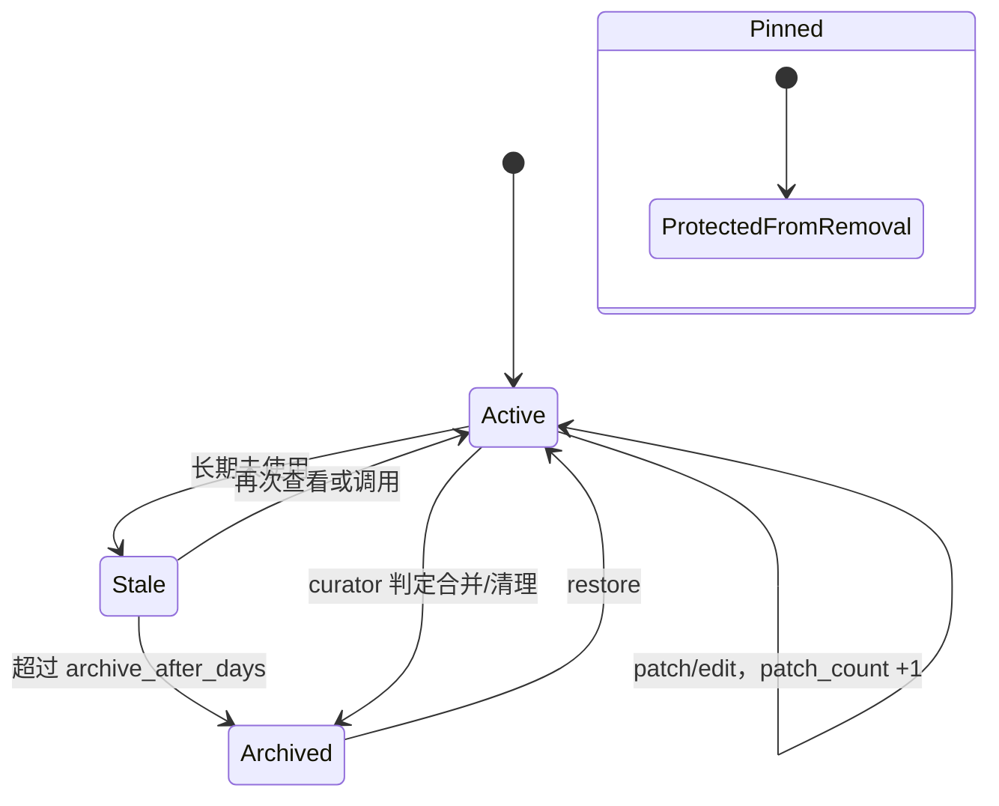

# SKILL 程序性记忆与生命周期治理

## 1. 文件模型

技能不是 `.skill` 文件，而是一个可打包目录：

```text
~/.hermes/skills/
└── [category/]<skill-name>/
    ├── SKILL.md
    ├── references/
    ├── templates/
    ├── scripts/
    └── assets/
```

`SKILL.md` 必须有 YAML frontmatter，至少包含 `name` 和 `description`，并且 frontmatter 之后必须有正文。

```markdown
---
name: release-triage
description: Diagnose and verify release pipeline failures.
---

# Release triage

## Triggers
...

## Procedure
1. ...

## Pitfalls
...

## Verification
...
```

技能的语义不是“记住一次任务”，而是给未来 Agent 一份带触发条件、步骤、陷阱和验证的执行策略。

## 2. Skill Extraction 到落盘的数据流



## 3. `skill_manage` 为什么是单工具多 action

动作包括 `create/patch/edit/delete/write_file/remove_file`。复用一个工具符合窄腰原则，避免每个文件操作都成为永久模型工具。

- `patch` 是小修优先路径，要求 `old_string` 唯一。
- `edit` 是完整重写，只用于大改。
- `write_file` 限制在允许的支持目录中。
- `delete` 可携带 `absorbed_into`，让 curator 区分合并与纯删除，并更新 cron 等下游引用。

工具 Schema 还写明“复杂任务成功、克服错误、用户纠正后方法生效、发现非平凡 workflow”等创建信号。这是模型决策提示，而真正的写入仍受后端校验约束。

## 4. 后台复盘的 read-before-write 约束

自主复盘可以演化技能，但不能凭对话里模糊提及的旧内容直接改文件。`skill_view` 读取时在 ContextVar 中记录目标路径；后台来源的 `edit/patch`，以及覆盖已有支持文件时，要求本轮已经读取该文件。

这相当于轻量 optimistic editing protocol：



它降低“模型基于旧印象覆盖新技能”的风险，也使修改证据可审计。

## 5. 来源与所有权

并非 `~/.hermes/skills` 下所有文件都能被自动 curator 管理：

- 后台 review 创建成功后，`mark_agent_created(name)` 在 `.usage.json` 标记 `created_by=agent`。
- 前台用户显式调用 `skill_manage(create)` 创建的技能属于用户，不自动视为 agent-created。
- bundled、hub-installed、external-dir 技能有不同保护策略；review Prompt 明确禁止修改 protected skills。
- pin 只阻止删除/归档/合并，不阻止改善内容。

“位置”不足以证明来源，必须使用显式 provenance。这避免手工技能因被浏览过就突然进入自动清理范围。

## 6. 为什么运营元数据不写进 frontmatter

`tools/skill_usage.py` 将 view/invoke/patch 时间、计数、生命周期状态、pin、created_by 存在 `.usage.json` sidecar，而非 `SKILL.md`：

- 用户正文不被运行时计数频繁改写。
- bundled/hub 文件减少冲突。
- 内容与运营状态可独立备份、比较和重建。
- 失败只影响 telemetry，不应让技能调用失败。

## 7. 生命周期状态机



curator 的目标不是不断增加技能，而是控制技能库的长期熵：识别重叠、创建 class-level umbrella、迁移引用、把旧技能移入 `.archive/`，并提供恢复能力。后台 curator 删除采用可恢复 archive，不直接 `rmtree`。

## 8. 原子性与安全

- 创建/编辑使用同目录临时文件 + `os.replace`。
- 名称和 category 仅允许有限字符，最大 64。
- 支持文件阻止 `..` traversal，并验证解析后仍位于技能目录。
- 删除前验证目标严格位于已知 skills root 内，且不是 root 本身、symlink 或 Windows junction。
- 可选 `skills.guard_agent_created` 会扫描 agent-created skill；阻断时创建删除目录，编辑则恢复原内容。
- write approval 可把后台/网关写入 staged pending，等待批准。

## 9. 技能正文为何按需加载

所有技能正文如果都塞进 system Prompt，会使固定前缀巨大，且每次新增技能都改变缓存键。Hermes 将轻量索引/命令发现与正文加载分开：触发技能时才把完整内容作为当前 user turn scaffolding 注入。MemoryManager 随后又会剥离 scaffolding，避免外部记忆把技能模板当成用户事实。

## 10. 核心源码

- 技能写入：`tools/skill_manager_tool.py`
- 使用与生命周期：`tools/skill_usage.py`
- 技能来源：`tools/skill_provenance.py`
- 技能读取与命令：`agent/skill_commands.py`、`tools/skills_tool.py`
- 大规模整理：`agent/curator.py`、`agent/curator_backup.py`

