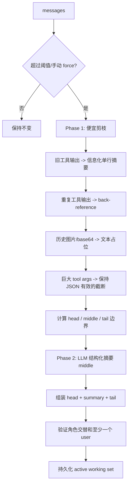
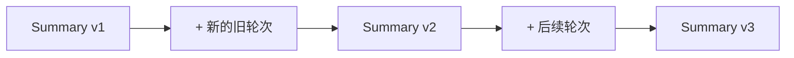

# 上下文压缩与注意力治理

## 1. 痛点不只是 Token 溢出

长对话有两类不同问题：

1. **硬限制**：请求超过模型 context window，API 直接拒绝。
2. **软退化**：虽未超窗，但大量旧工具输出、截图和已完成任务分散注意力，模型重复工作或把旧请求当成当前任务。

Hermes 的默认 `ContextCompressor` 不做简单“截掉最旧 N 条”，而是构造：

```text
[受保护的头部原文]
[旧工作结构化交接摘要]
[按 Token 预算保留的近期原文]
```

原始历史仍在 SQLite；active working set 才被替换。

## 2. ContextEngine 解耦

`agent/context_engine.py` 定义插件协议：

- `update_from_response(usage)`：跟踪真实 Token。
- `should_compress()` / `should_compress_preflight()`：决策。
- `compress(messages)`：生成新工作集。
- `on_session_start/end/reset()`：管理跨会话状态。
- 可选工具 Schema 和模型切换处理。

默认是 compressor，但插件可替换为 DAG/LCM 等引擎，主循环不需要知道压缩内部算法。这是典型 Strategy + lifecycle contract。

## 3. 触发阈值

默认构造参数 `threshold_percent=0.50`，但小于 512K 的模型会将阈值提高到至少 75%，避免小窗口模型过早压缩。阈值不是简单 `context_length * percent`：

```text
effective_input_window = context_length - reserved max_tokens
threshold = effective_input_window * effective_threshold_percent
```

并结合项目定义的最小 context floor。理由是 provider 常从总窗口预留输出 Token；若忽略预留，输入会在压缩触发前就被 413/context-length 拒绝。

触发依据优先使用 provider 返回的真实 `prompt_tokens`；preflight 粗估只在没有真实用量或紧急场景使用。压缩后会等待一次真实 usage 校验，避免粗估偏高导致每轮重复压缩。

## 4. 两阶段压缩算法



先做确定性剪枝能降低辅助摘要调用输入，并避免把 1MB 截图交给 summarizer。旧工具结果不是无脑删除，而尽量保留命令、目标、exit code、输出规模等有效信息。

## 5. Head 与 Tail 为什么都保护

- Head 通常包含系统消息以及最初的任务约束/关键定义。
- Tail 包含最新交互、尚未处理的用户请求和刚执行的工具结果。

`protect_first_n` 语义是“系统消息之外再保护 N 条非 system 消息”，默认 3；多次压缩后会衰减，避免最初若干普通对话永远占据预算。

Tail 不再只按固定消息数，而按 `tail_token_budget` 从末尾向前累计，同时保证最低消息数。因为一条截图或巨型工具调用可能等于数百条短文本，按 count 无法控制真实大小。

边界还要对齐 assistant tool_call 与 tool result，不能从一次工具协议中间切开，否则下一请求会违反 provider 消息契约。

## 6. 摘要 Prompt 的结构设计

`_generate_summary()` 的 preamble 要求：

- 把旧轮次视为 source material，而不是要回答的新指令。
- 只输出结构化摘要，不加问候。
- 跟随用户原语言。
- secrets 一律替换为 `[REDACTED]`。
- 已执行动作写成带日期的过去时事实，避免恢复后再次执行。

模板包括：

- Historical Task Snapshot（最重要字段，捕获最近未满足输入的原话）
- Goal / Constraints & Preferences
- Completed Actions（工具、目标、结果、路径、命令）
- Active State / Historical In-Progress State
- Blocked / Key Decisions / Resolved Questions
- Historical Pending User Asks
- Relevant Files / Historical Remaining Work / Critical Context

这里看似矛盾：既捕获 active task，又用 `Historical` 命名。原因是摘要本身在下一轮只能是参考，真正当前任务必须由摘要之后最新 user message决定。Prefix 和 end marker 反复强调“不要回答摘要里的旧问题”，用于对抗弱模型把摘要误读为新指令。

## 7. 迭代摘要而不是重头总结

第一次压缩产生 `_previous_summary`；后续压缩将旧摘要和新增 middle turns 一起交给 summarizer，要求保留仍相关信息、追加完成动作、迁移 resolved/pending 状态。

这是一种 checkpoint 增量更新：



若当前消息中找不到属于本会话的已有 summary，却内存里还有 `_previous_summary`，会清空它，防止 context engine 实例复用时跨会话污染。

## 8. 角色交替是组装阶段的一等约束

插入摘要时不能随意选 `user` 或 `assistant`：

- 若 head 末尾是 assistant/tool，摘要优先 user。
- 若 system 是唯一 head，Anthropic 要求首个可见消息为 user，因此强制 user。
- 如果压缩后没有任何真实 user 幸存，摘要也必须 user，兼容要求“至少有 user query”的后端。
- 若摘要无论选哪个角色都会与 head/tail 相撞，则合并进第一条 tail，并用明确分隔符区分旧内容、摘要和新消息。

这说明上下文压缩不是普通字符串摘要，而是**协议合法的消息序列变换**。

## 9. 摘要失败策略

失败不是统一吞掉：

- 配置 `abort_on_summary_failure=true`：原消息不变，不压缩。
- 认证失败或网络/连接失败：无论配置如何都 abort，避免在基础设施坏掉时丢弃 middle。
- 其他失败且允许 fallback：生成确定性 fallback summary，尽量保留最近用户 ask、文件、错误和最后丢弃轮次。
- 失败会进入 cooldown，防止每轮重试烧成本。
- 连续两次压缩未恢复足够 headroom，anti-thrashing 停止自动压缩，提示 `/new` 或聚焦 `/compress <topic>`。

## 10. 持久化：原地压缩与传统 rotation

`agent/conversation_compression.py` 负责压缩后的会话边界：

- **in-place**：session id 不变，旧行软归档，插入新的 active working set。路由、标题、cwd、goal 均不变。
- **rotation（兼容路径）**：父 session 以 `end_reason='compression'` 结束，新建带 `parent_session_id` 的 continuation。

压缩前会调用 memory provider `on_pre_compress` 和 `commit_memory_session(messages)`，让需要在完整上下文上抽取的 provider 有机会先提交。

## 11. 并发压缩锁

压缩可能由自动检查、手动 `/compress`、网关路径同时触发。锁以旧 session id 为 key，holder 带 TTL 并由 refresher 续租。抢锁失败的一方原样返回，不做 session rotation；否则两个 winner 会从同一父节点各建一个子会话。

锁子系统因代码版本错位不可用时选择 fail-open 并告警，理由是“少见的分叉风险”优于“每轮 AttributeError 导致完全无法前进”。这是明确记录过的可用性权衡。

## 12. 核心源码

- 抽象接口：`agent/context_engine.py`
- 算法与 Prompt：`agent/context_compressor.py`
- 锁、边界、持久化：`agent/conversation_compression.py`
- SQLite 归档：`hermes_state.py:3942`
- 手动压缩：`hermes_cli/partial_compress.py` 及相关 command handler

