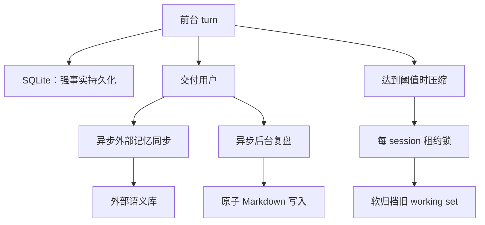
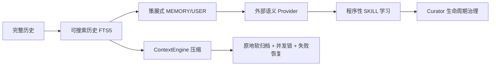

# 一致性、安全、失败恢复与架构演进

## 1. 全系统的关键不变量

从记忆和学习子系统可以提炼出七条真正“load-bearing”的不变量：

1. **同一会话的系统 Prompt 字节稳定**，除上下文压缩边界外不重建。
2. **消息角色序列合法**，压缩和中断不能留下孤立 tool result 或连续同角色。
3. **原始历史可恢复**，压缩改变工作集但不破坏证据。
4. **长期副作用不阻断主回答**，外部记忆和后台复盘失败均 best-effort。
5. **会话所有权唯一**，后台 fork 不能结束或压缩父会话。
6. **自主写入有来源和权限边界**，后台技能修改遵守 read-before-write、保护来源与审批。
7. **记忆身份显式解析**，跨平台合并必须由 canonical user_id 驱动。

## 2. 一致性并不是一个事务，而是多个边界协议



这不是跨 SQLite、文件、云 API 的分布式事务。Hermes 选择的是：主对话事实优先落盘；派生学习异步、幂等倾向、允许丢失单次机会；后续 cadence 和 session boundary 可再次补偿。

若强行做全局事务，任何 Mem0/磁盘/辅助 LLM 抖动都会阻断用户对话。

## 3. Prompt Cache 如何塑造架构

Prompt cache 不是局部优化，而是决定了状态流：

- `MEMORY.md/USER.md` 采取冻结快照，当前会话写入不热更新。
- 技能正文按需作为 user message 加载，不动态重建 system Prompt。
- 后台 review 同模型继承父 cached prompt；不同模型才压 digest。
- 时间只以日期粒度加入 Prompt，避免每分钟变动。
- 压缩是允许重建 Prompt 的少数边界，并顺便 reload 新记忆。

这解释了看似反直觉的行为：用户刚保存一条 memory，当前 system Prompt 可能仍看不到它。它是用弱实时性换取长期对话成本稳定和语义前缀一致。

## 4. Prompt Injection 的信任分区

不同输入按权限分层：

| 输入 | 进入位置 | 风险 | 主要防护 |
|---|---|---|---|
| `MEMORY.md/USER.md` | system Prompt | 最高 | 写入+加载 strict scan，冻结快照 |
| 外部 recalled context | 当前上下文 | 高 | `<memory-context>` fencing 与流式 scrubber |
| Skill body | user turn scaffolding | 中高 | 来源/安装扫描、按需加载 |
| FTS 会话结果 | tool result | 普通 | 参数化查询、真实消息返回 |
| 压缩摘要 | message history | 中高 | reference-only prefix、end marker、secret redaction |

`StreamingContextScrubber` 维护跨 delta 状态，处理 `<memory-context>` 标签被拆在不同流式 chunk 的情况。若结束时仍在未闭合 span 内，宁可丢弃剩余内容，也不把内部记忆上下文泄漏到 UI。

## 5. 失败矩阵

| 故障 | 系统行为 | 设计理由 |
|---|---|---|
| FTS5 不可用 | 基表继续写，搜索返回空；未来可重建 | 搜索是派生能力，不应拖垮会话 |
| trigram 不可用 | CJK 短词/失败路径退到 LIKE | 保正确性，接受性能下降 |
| Memory 文件外部漂移 | 备份并拒绝 destructive rewrite | 不静默丢用户手改内容 |
| 外部 MemoryProvider 超时 | daemon worker，主 turn 不等待 | 用户响应优先 |
| Mem0 连续服务失败 | breaker 120 秒 | 避免锤击故障服务 |
| 后台 review 失败 | 记录 auxiliary failure，不影响回答 | 学习是 best-effort 派生副作用 |
| summary 认证/网络失败 | abort，保留所有消息 | 基础设施故障不能导致有损降级 |
| summary 普通失败 | 配置决定 abort 或 deterministic fallback | 可用性与保真度可权衡 |
| 并发 compression | 租约锁只允许一个 winner | 防止 session 谱系分叉 |
| 压缩反复无收益 | anti-thrashing 熔断 | 防止每轮死循环烧 Token |

## 6. 为什么这是架构演进的必然结果

可以把 Hermes 的演进理解为四个阶段：

### 阶段 A：只有会话历史

优点是完整；问题是无法跨会话高效召回，且长对话不断增长。

### 阶段 B：加入本地记忆与摘要

用户偏好可跨会话，旧上下文可压缩。但动态注入会破坏缓存，粗糙摘要会让旧任务“复活”，截断会破坏工具协议。

### 阶段 C：明确生命周期与不变量

形成冻结 Prompt 快照、结构化 summary、角色交替修复、原地软归档、压缩锁、失败 cooldown。此时问题从“有功能”升级为“长时间运行仍正确”。

### 阶段 D：能力边缘化与自我治理

MemoryProvider/ContextEngine ABC 将供应商能力插件化；后台 review 与 curator 让技能库产生、合并、归档；provenance 和 approval 抑制自主写入风险。



所谓“必然性”来自负载增长：当 session 数、工具调用数、平台数和插件数增加后，单体状态、同步副作用、粗粒度截断和隐式身份都不可持续。

## 7. 仍值得关注的架构问题

### 7.1 多存储最终一致性

SQLite、Markdown、Mem0 和 skill sidecar 之间没有统一事务。当前通过“事实历史不丢 + 派生层 best-effort”控制风险。未来若需要严格审计，可考虑为 memory/skill write 建统一事件日志，再由 materializer 写各后端，但这会增加核心复杂度，必须有真实消费者才值得。

### 7.2 用户可解释性

`journey` / learning graph 将 learned skills 与 memories 可视化，是对自主学习黑盒的补偿。自动学习若没有可查看、编辑、删除、pin、restore 的 UX，很快会失去用户信任。

### 7.3 检索融合

目前 FTS、Mem0、内置 Prompt snapshot 各有入口。融合排名若放在核心会增加耦合；更合适的演进方式是继续由 Context/Memory provider 在边缘组合，并保持工具 Schema 有界。

### 7.4 摘要的信息衰减

迭代摘要不可避免会累积误差，所以设计必须持续依赖三条补偿路径：近期原文、SQLite 原始历史和可验证的当前文件/系统状态。摘要只能是 handoff，不应成为最终事实源。

## 8. 建议的源码阅读顺序

1. `agent/turn_context.py` → 看一轮开始时哪些计数和状态被更新。
2. `agent/turn_finalizer.py` → 看回答交付后的持久化、同步与 review 触发顺序。
3. `hermes_state.py` → 看事实日志和 active/compacted 读模型。
4. `tools/memory_tool.py` → 看冻结画像和写入安全。
5. `agent/memory_manager.py` + Mem0 plugin → 看边缘能力接入。
6. `agent/background_review.py` → 看学习决策 Prompt 与 fork 隔离。
7. `tools/skill_manager_tool.py` + `tools/skill_usage.py` → 看程序性记忆的物理落盘和治理。
8. `agent/context_compressor.py` + `agent/conversation_compression.py` → 看 working-set 换页和协议不变量。

## 9. 最终结论

Hermes 的“自我进化”不是让模型任意修改自身代码，而是一个有边界的知识编译管线：

```text
原始经历（SQLite）
  → 反思筛选（background review）
  → 声明式知识（MEMORY/USER）或程序性知识（SKILL）
  → 来源、审批、安全、生命周期治理
  → 未来会话按不同成本模型召回
```

它最成熟的地方并非使用了 FTS5、Mem0 或 Markdown，而是清楚地区分“证据、画像、方法和当前状态”，并为每类知识选择了不同的写入时机、可见性和失败策略。

