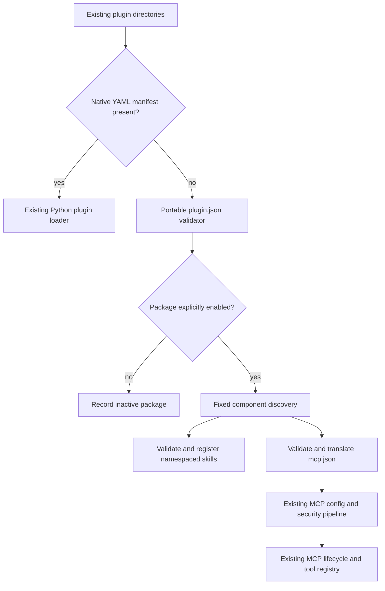
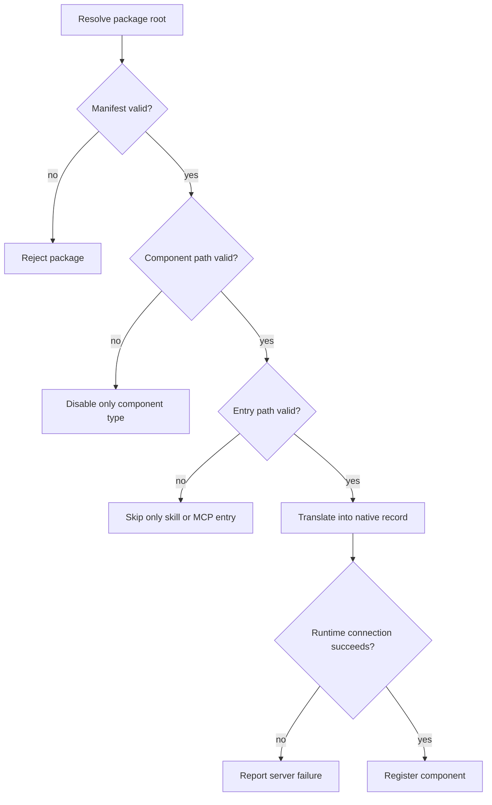

# Agent Plugins v1 Compatibility - Plan

## Goal Capsule

- **Objective:** Let Hermes install, discover, validate, explicitly enable, and load portable Agent Plugins v1.0.0 directory packages that contain Agent Skills and MCP servers.
- **Authority:** Preserve Hermes native `plugin.yaml` plus `register(ctx)` behavior and the Agent Plugins v1.0.0 normative text. When machine schemas and specification prose differ, the specification prose governs.
- **Execution profile:** Add a compatibility adapter that translates portable components into Hermes' existing namespaced plugin-skill registry and MCP client. Do not add a model-visible core tool or a parallel runtime.
- **Stop conditions:** The supported subset, security boundaries, failure isolation, native regressions, documentation, and focused integration tests are complete. Full Agent Plugins conformance must not be claimed unless every applicable normative requirement is proved.
- **Tail ownership:** This change ships as one focused PR linked to #64182 and explicitly complementary to #69446 and #64181.

---

## Product Contract

### Summary

Hermes will recognize root `plugin.json` packages alongside native plugins, but only enabled packages can contribute components. A local compatibility adapter will validate the v1.0.0 format and feed valid skills and MCP entries into existing Hermes machinery.

### Problem Frame

Hermes already owns the two portable component runtimes standardized by Agent Plugins v1: Agent Skills and MCP servers. Its native plugin system uses a different package contract based on `plugin.yaml` and Python `register(ctx)`, so standard portable packages are currently invisible even when their components are otherwise compatible.

The compatibility boundary is security-sensitive. A portable package can expose instructions, supporting files, local executables, process environment, and remote MCP endpoints. Discovery must therefore remain opt-in, path-contained, locally validated, and isolated at the narrowest component boundary.

The official rendered specification page labels v1.0.0 a Working Draft, while the specification repository changed the same version to Published on 2026-07-24. The implementation targets the normative v1.0.0 content and documentation must record this status discrepancy without treating either label as a runtime rule.

### Requirements

#### Package discovery and activation

- R1. Hermes recognizes a root `plugin.json` as an Agent Plugins v1 package without changing native `plugin.yaml`, `plugin.yml`, Python module, or entry-point plugin behavior.
- R2. User and project portable packages use the existing `plugins.enabled` allow-list and `plugins.disabled` deny-list, with explicit disable taking precedence and no automatic trust or activation.
- R3. `hermes plugins install`, `list`, `enable`, `disable`, `update`, and `remove` accept portable packages through the existing plugin workflow and retain the install-disabled default.
- R4. Portable package identity and component names are deterministic and namespaced so they cannot silently replace native skills or MCP servers.

#### Local validation and containment

- R5. Root `plugin.json` is parsed and validated locally for the canonical v1.0.0 `$schema`, closed field set, field types, and plugin-name constraints without retrieving schemas at load time.
- R6. Unknown root manifest fields and a non-object `extensions` field are reported and ignored as the specification's non-fatal exceptions; every other manifest violation rejects the package before component discovery.
- R7. Fixed component locations are exactly immediate `skills/*/SKILL.md` directories and root `mcp.json`; missing locations are valid, while a wrong filesystem kind invalidates only that component type.
- R8. Every package file path is checked against the filesystem-resolved package root, including symlink and junction targets, with the specification's narrow failure boundaries for the manifest, component type, skill, and MCP server entry.

#### Skills compatibility

- R9. Each immediate skill is validated against the complete Agent Skills frontmatter contract: required matching `name` and non-empty `description`, plus every optional field's type and limit when present. Invalid skills are reported and skipped without blocking valid siblings or MCP.
- R10. Valid portable skills use Hermes' read-only namespaced plugin-skill registry and existing `skill_view` safeguards, preprocessing, linked-file containment, platform checks, and prompt-injection warnings.
- R11. Portable skill discovery does not mutate the system prompt or past messages during a conversation; any inventory change takes effect only through existing startup or turn-boundary behavior.

#### MCP compatibility

- R12. Root `mcp.json` is locally validated for the canonical v1.0.0 schema identifier, a version matching `plugin.json`, the closed top-level shape, and independently closed server variants.
- R13. Invalid top-level MCP configuration disables MCP only for that package, while invalid or unsupported server entries are skipped independently and valid skills and sibling servers continue.
- R14. Stdio commands remain one opaque executable token with arguments passed separately; Hermes never invokes a shell or splits a command string for portable packages.
- R15. The initial portable subset supports stdio MCP only. Package files and plugin-relative commands resolve within `PLUGIN_ROOT`; explicit `cwd` resolves within its selected `PLUGIN_ROOT` or `PLUGIN_DATA` root, and omitted `cwd` becomes `PLUGIN_ROOT`. Streamable HTTP and legacy SSE entries are reported and skipped until Hermes can enforce the v1 cross-origin configured-header rules throughout the native remote client.
- R16. Hermes creates a dedicated persistent writable `PLUGIN_DATA` directory per installed package instance, sets filesystem-resolved `PLUGIN_ROOT` and `PLUGIN_DATA` after configured environment overlays, and prevents packages from overriding either reserved key.
- R17. Placeholder expansion is a single non-recursive replacement of exact `${PLUGIN_ROOT}` and `${PLUGIN_DATA}` occurrences only in `args`, environment values, and `cwd`; no other environment, command, URL, header, key, or path expansion is performed.
- R18. Portable MCP entries pass through existing suspicious-entry filtering, safe subprocess environment construction, async discovery, tool registration, approval middleware, reconnect handling, and per-server connection failure isolation.

#### Scope and claims

- R19. Documentation identifies the exact implemented Agent Plugins v1.0.0 subset and does not claim full conformance unless the applicable normative checklist and runtime behavior are fully tested.
- R20. The change adds no catalog, registry admission, portable export format, manifest-v2 policy, capability-consent model, new transactional update mechanism, lifecycle ledger, gateway injection, Desktop UI, or model-visible core tool. R3 only adapts the existing non-transactional update workflow.

### Acceptance Examples

- AE1. **Covers R1, R2, R9, R10.** Given an enabled portable package with one valid skill and a native Python plugin in a separate directory beneath the same plugin search root, when discovery runs, then `skill_view` resolves the qualified portable skill and the native plugin still registers normally.
- AE2. **Covers R2, R3.** Given a valid installed package absent from `plugins.enabled`, when Hermes starts, then the package is listed as not enabled and contributes no skills, MCP servers, or subprocesses.
- AE3. **Covers R5, R6.** Given a manifest with one unknown top-level field but otherwise valid content, when discovery runs, then Hermes reports and ignores the field and continues; an unsupported `$schema` rejects the package.
- AE4. **Covers R7, R8.** Given an in-root skills directory and an `mcp.json` symlink escaping the package, when discovery runs, then valid skills remain available and MCP is disabled only for that package.
- AE5. **Covers R9, R13.** Given one valid skill, one invalid skill, one valid MCP server, and one invalid server entry, when the enabled package loads, then only the valid skill and server are registered.
- AE6. **Covers R14, R15, R16, R17.** Given a stdio entry with an opaque command, separate args, plugin placeholders, and omitted `cwd`, when translated, then the command is unchanged, placeholders expand exactly once, reserved environment values are host-owned, and the native process receives the resolved plugin root as `cwd`.
- AE7. **Covers R8, R15.** Given a plugin-relative command or `cwd` whose lexical or symlink resolution escapes the permitted root, when validation runs, then that server entry is skipped before any process starts.
- AE8. **Covers R13, R18.** Given two valid portable MCP entries where one fails to connect, when native MCP discovery runs, then the other server and its tools remain available and the failed entry is reported.

### Success Criteria

- Every scenario named in the task brief has focused automated coverage using isolated `HOME` and `HERMES_HOME` fixtures.
- Native plugin discovery, activation, skill registration, and MCP configuration remain backward compatible.
- Portable packages are useful through existing CLI, skill, and MCP surfaces without changing prompt caching or the core tool schema.
- Public documentation and PR wording distinguish the supported subset from catalog, pack, lifecycle, consent, and gateway roadmap work.

### Scope Boundaries

#### Deferred to Follow-Up Work

- Catalog metadata, pinned-source admission, search, and discovery remain owned by #64181 and #69446.
- Hermes-native manifest v2 and plugin pack export or install semantics remain owned by #64165 and #64166.
- Capability declaration, consent, staged updates, and ownership lifecycle remain owned by #64228, #37977, #64229, and #76490.
- Full-profile distribution packaging remains separate from the portable plugin adapter.

#### Outside This Change

- Automatic trust, sandbox guarantees, archive formats, registries, signatures, provenance verification, hot reload watchers, Desktop management UI, new component types, and gateway-session injection are not part of Agent Plugins v1 compatibility.

---

## Planning Contract

### Assumptions

- The portable package root is an installed plugin directory already visible to the native plugin scanner; this change does not search arbitrary ancestor directories or reinterpret workspace-root files as packages.
- Portable components use a deterministic package namespace when exposed to Hermes. Native user config retains precedence because portable MCP server names cannot collide with unqualified native server keys.
- Hermes supports Agent Plugins stdio through its existing client. Portable Streamable HTTP and legacy SSE remain unsupported in this first subset because the current redirect path cannot prove the v1 configured-header boundary end to end.
- Package state lives below profile-specific `HERMES_HOME` in a dedicated data subtree keyed by canonical package identity. Removal may leave data intact unless existing uninstall policy explicitly owns cleanup.

### Key Technical Decisions

- KTD1. **Add a compatibility adapter, not a runtime.** A focused module owns v1 manifest, skill, MCP, path, and placeholder validation, then returns native Hermes records to the existing plugin manager and MCP registry.
- KTD2. **Preserve native discovery contracts.** The plugin scanner recognizes `plugin.json` only when no native manifest owns the directory, records a portable marker on the manifest, and routes enabled portable packages to component registration without importing `__init__.py`.
- KTD3. **Use namespaced read-only skills with collision refusal.** Portable skills use the canonical discovered plugin key as their namespace and enter the same registry as `ctx.register_skill` output. Registration reports and skips a duplicate qualified name rather than overwriting a native or portable skill, and progressive disclosure does not join the editable flat skill tree or force a system-prompt rebuild.
- KTD4. **Merge MCP after native interpolation.** Native `config.yaml` servers keep their current secret interpolation. Portable entries are independently translated and merged afterward so the portable contract can leave unknown placeholders literal and restrict expansion to the two standardized variables.
- KTD5. **Namespace portable MCP servers before registration.** The internal server key combines package and declared server identity, preventing silent collision while leaving the portable manifest unchanged.
- KTD6. **Extend stdio runtime only where the portable contract requires it.** The existing MCP client receives an explicit `cwd` and already executes `command` plus `args` without a shell; no separate process launcher is introduced.
- KTD7. **Report partial failure through existing logging and loader state.** Fatal manifest errors reject a package, while skill, MCP-type, server-entry, and connection failures are logged at their normative narrow boundary and do not roll back independent components.
- KTD8. **Document subset support, not blanket conformance.** The guide binds behavior to the v1.0.0 normative specification, records the current Working Draft/Published source mismatch, identifies stdio as the only portable MCP transport, and lists client-owned trust policy.

### High-Level Technical Design

### System-Wide Impact

- **Prompt caching:** Package discovery and MCP registration finish before agent tool snapshots. Portable skills use existing progressive disclosure. No system prompt or past message is mutated mid-conversation.
- **Trust:** Agent Plugins v1 does not define enablement, permissions, provenance, or sandboxing. Hermes' existing explicit activation and full-trust plugin warning remain the client-owned boundary.
- **Profiles:** Package data and activation are profile-scoped through `get_hermes_home()`. Tests must isolate both `HOME` and `HERMES_HOME` to prevent cross-profile leakage.
- **MCP security:** Portable configuration receives stricter format validation before existing IOC, suspicious-shell, safe-environment, malware preflight, and connection controls.
- **Startup parity:** Background CLI, TUI, dashboard, and slash-worker gates treat enabled portable MCP entries as configured so a portable-only package reaches discovery before tool snapshots.
- **Compatibility:** Native Python plugins, model providers, memory providers, platform plugins, and entry points remain on their existing loading paths.

### Risks and Dependencies

- The official website and repository disagree on v1.0.0 publication status. Runtime behavior must key on canonical schema identifiers, not a mutable status label.
- Agent Plugins delegates `SKILL.md` validity to the Agent Skills specification, which is stricter than Hermes' permissive frontmatter parser. The adapter needs a narrow explicit validator rather than weakening local skill behavior globally.
- Existing MCP config performs broad `${VAR}` secret interpolation, which is incompatible with the portable expansion rules. Merge ordering must keep native and portable interpolation paths separate.
- Existing stdio startup currently omits `cwd` from its SDK parameters. Adding it must be regression-tested for native servers with and without `cwd`.
- Filesystem containment must consider symlinks and platform path forms without pretending to sandbox the launched process.

### Sources and Research

- Agent Plugins v1.0.0 normative specification: <https://github.com/agentplugins/agent-plugins-spec/blob/main/spec/1.0.0.md>
- Rendered specification with Working Draft label: <https://agent-plugins.org/specification>
- Agent Skills format specification: <https://agentskills.io/specification>
- Hermes roadmap tracking issue: <https://github.com/NousResearch/hermes-agent/issues/64182>
- Community index issue and catalog PR: <https://github.com/NousResearch/hermes-agent/issues/64181> and <https://github.com/NousResearch/hermes-agent/pull/69446>
- Existing gateway plugin PR, outside this adapter: <https://github.com/NousResearch/hermes-agent/pull/64436>

---

## Implementation Units

### U1. Portable package validation and translation model

- **Goal:** Add the local v1.0.0 validator and immutable translation records for portable manifests, skills, MCP entries, package paths, and plugin data.
- **Requirements:** R5-R9, R12-R17.
- **Dependencies:** None.
- **Files:** `hermes_cli/agent_plugins.py`, `tests/hermes_cli/test_agent_plugins.py`.
- **Approach:**
  1. Define canonical schema identifiers and explicit closed-field validators in Python so load never needs network access or a new dependency.
  2. Resolve package, fixed component, skill, command, and working-directory paths through one containment helper with narrow typed diagnostics.
  3. Validate Agent Skills frontmatter without changing Hermes' permissive local-skill parser.
  4. Translate valid stdio and supported remote entries into native MCP configuration, including dedicated data directories and exact single-pass placeholders.
- **Patterns to follow:** `hermes_cli/plugins_cmd.py` safe install-path resolution, `tools/path_security.py` containment, `agent/skill_utils.py` frontmatter parsing, and `hermes_cli/mcp_security.py` fail-closed entry checks.
- **Test scenarios:**
  - Minimal and full valid v1 manifests produce portable package metadata without network access.
  - Malformed JSON, non-object roots, missing required fields, invalid field types, invalid names, and unsupported schema identifiers reject the package.
  - Unknown manifest fields and non-object `extensions` report non-fatal diagnostics and preserve otherwise valid loading.
  - Missing fixed locations are accepted; wrong kinds and symlink escapes invalidate only the owning boundary.
  - Valid and invalid Agent Skills are distinguished by required frontmatter, name constraints, directory match, and description constraints.
  - MCP top-level errors, schema mismatch, unknown server fields, invalid stdio variants, reserved environment keys, and path escapes stop only the applicable MCP boundary; valid remote variants are reported as unsupported and skipped.
  - Placeholder replacement is exact, single-pass, non-recursive, field-limited, and leaves unknown forms literal.
  - A command string containing shell syntax remains one unchanged executable token and is never split.
- **Verification:** Unit results demonstrate every validation and containment rule with deterministic diagnostics and no external schema fetch.

### U2. Plugin discovery, activation, CLI, and skills bridge

- **Goal:** Recognize portable packages through existing plugin roots and CLI workflows, then register valid skills only after explicit activation.
- **Requirements:** R1-R4, R7-R11.
- **Dependencies:** U1.
- **Files:** `hermes_cli/plugins.py`, `hermes_cli/plugins_cmd.py`, `hermes_cli/subcommands/plugins.py`, `tools/skills_tool.py`, `tests/hermes_cli/test_plugins.py`, `tests/hermes_cli/test_plugins_cmd.py`, `tests/test_plugin_skills.py`, `tests/hermes_cli/test_agent_plugins.py`.
- **Approach:**
  1. Extend directory discovery with a portable-manifest branch that does not alter native YAML precedence, kind routing, source precedence, or Python import behavior.
  2. Route enabled portable packages through a component bridge that records loaded state and registers namespaced read-only skills, refusing duplicate qualified names instead of silently replacing an existing entry.
  3. Include portable packages in install validation, list metadata, enable/disable key resolution, and help text while preserving the disabled-by-default installation flow.
  4. Surface portable skills and their supporting files through existing progressive-disclosure APIs without adding them to the editable flat skill tree or rebuilding the system prompt mid-session. Extend qualified skill file reads with resolved-root and symlink containment because the current plugin branch serves only the main `SKILL.md`.
- **Patterns to follow:** `PluginManager._scan_directory_level`, `PluginContext.register_skill`, `_discover_all_plugins`, and the existing allow-list/deny-list migration semantics.
- **Test scenarios:**
  - An enabled portable package registers valid qualified skills and an unenabled or explicitly disabled package registers nothing.
  - `plugins.disabled` wins when a package is present in both activation lists.
  - CLI install accepts a valid `plugin.json` repository but does not enable it unless requested; invalid portable manifests fail without moving an active target.
  - CLI list, JSON, plain, enable, disable, update, and remove resolve portable identity through the same canonical key.
  - One invalid skill does not hide a valid sibling; a valid supporting file can be read, while traversal and symlink escapes are blocked.
  - Native and portable packages that would produce the same qualified skill name do not overwrite one another and emit a deterministic diagnostic.
  - A native `plugin.yaml` plus `register(ctx)` plugin and a portable package load in the same isolated process with unchanged native registration.
  - Source collision and rescan behavior remain deterministic and do not leave stale portable skill entries.
- **Verification:** Loader-level integration under temporary `HOME` and `HERMES_HOME` proves activation, CLI visibility, namespaced skill access, and native regression behavior.

### U3. Portable MCP merge and native runtime support

- **Goal:** Feed validated portable MCP servers into the existing MCP registration and lifecycle path with correct environment, `cwd`, namespacing, and isolation.
- **Requirements:** R4, R12-R18.
- **Dependencies:** U1, U2.
- **Files:** `hermes_cli/agent_plugins.py`, `hermes_cli/plugins.py`, `hermes_cli/mcp_startup.py`, background startup owners that gate MCP discovery, `tools/mcp_tool.py`, `tests/tools/test_mcp_tool.py`, `tests/tools/test_agent_plugins_mcp.py`, `tests/hermes_cli/test_agent_plugins.py`, and focused startup-path tests located during implementation.
- **Approach:**
  1. Expose enabled packages' translated MCP entries from the plugin manager as an in-memory source.
  2. Merge that source after native config interpolation, assign collision-proof internal server names, and make all existing background startup gates recognize a portable-only MCP source after plugin discovery.
  3. Pass validated `cwd` into `StdioServerParameters` while retaining the no-shell command and separate-arguments path.
  4. Run portable stdio entries through existing suspicious-entry filtering, safe environment construction, parallel connection discovery, tool registry, and error reporting. Report and skip remote portable transports before they reach the native client.
- **Patterns to follow:** `_load_mcp_config`, `_filter_suspicious_mcp_servers`, `register_mcp_servers`, `_discover_and_register_server`, and MCP startup before `AIAgent` tool snapshots.
- **Test scenarios:**
  - Valid stdio portable entries convert into expected native records without rewriting `config.yaml`; Streamable HTTP and legacy SSE entries are reported as unsupported and absent from the registered map.
  - Native config interpolation still resolves secrets, while portable unknown placeholders remain literal and reserved variables are host-owned.
  - Portable server names cannot overwrite a native server or another package's server.
  - Omitted and explicit valid `cwd` values reach the SDK; lexical and symlink escapes are absent from the registered server map.
  - Existing suspicious MCP filtering can reject a translated entry before spawn.
  - Mixed valid and invalid entries preserve valid siblings; a real fixture where one connection fails leaves another connected.
  - Portable-only MCP configuration starts through background CLI, TUI, dashboard, and slash-worker gates after plugin discovery.
  - Safe mode suppresses native and portable MCP discovery.
  - Existing native MCP configs with and without `cwd` retain their prior behavior.
- **Verification:** Focused unit tests and a loader-to-native-registry integration exercise prove translation, subprocess parameters, collision handling, and per-server failure isolation.

### U4. User and developer documentation

- **Goal:** Document installation, activation, supported subset, security posture, status discrepancy, and roadmap boundaries in the current plugin guide and CLI help.
- **Requirements:** R3, R19, R20.
- **Dependencies:** U1-U3.
- **Files:** `website/docs/developer-guide/plugins/index.md`, `website/docs/user-guide/cli.md`, `hermes_cli/subcommands/plugins.py`.
- **Approach:**
  1. Add a concise portable-package section showing the fixed v1 layout and existing `hermes plugins` workflow.
  2. State supported component types, stdio-only portable MCP transport support, explicit activation, full-trust process posture, profile-scoped data, failure isolation, and unsupported v1/client-owned features.
  3. Record that the rendered site says Working Draft while the repository says Published, and link directly to the normative versioned specification.
  4. Explain that the adapter complements the catalog and roadmap work rather than replacing it.
- **Patterns to follow:** Existing developer plugin guide terminology, CLI command tables, and public artifact style rules.
- **Test scenarios:** Test expectation: none - this unit documents behavior already enforced and tested by U1-U3.
- **Verification:** Docs build or targeted Docusaurus validation passes, command help renders the portable-package capability accurately, and no full-conformance claim exceeds tested behavior.

---

## Verification Contract

| Gate | Scope | Evidence |
|---|---|---|
| Focused validator tests | U1 | Manifest, version, fields, skills, MCP variants, placeholders, and containment cases pass. |
| Plugin loader and CLI tests | U2 | Isolated `HOME` and `HERMES_HOME` integration proves disabled/untrusted packages, valid loading, partial failures, CLI behavior, and native plugin regression. |
| MCP unit and integration tests | U3 | Native config plus portable translation, SDK `cwd`, safe environment, collision isolation, mixed entries, and connection failure isolation pass. |
| Existing regression suites | U2, U3 | Relevant plugin-skill, plugin-manager, plugin CLI, MCP startup, and MCP tool suites pass unchanged. |
| Static quality | U1-U4 | Repository lint or compile checks cover every changed Python file. |
| Documentation | U4 | Website docs build or the repository's targeted docs validation completes successfully. |
| Full repository confidence | All | `scripts/run_tests.sh` passes, or any infrastructure-only failure is isolated with exact evidence and the focused required suites remain green. |
| Public artifact audit | All | Diff, commit, and PR contain no secrets, assistant attribution, model/provider provenance, badges, or em/en dashes. |
| PR and CI | All | PR links #64182, explains non-conflict with #69446/#64181 and independence from #64436, and all actionable CI/review failures are resolved or precisely handed to a maintainer-only gate. |

---

## Definition of Done

- R1-R20 are implemented or explicitly evidenced as outside the supported subset.
- AE1-AE8 pass through automated tests matched to their full integration scope.
- Portable packages remain disabled until explicitly enabled, and disabled packages cannot register skills, servers, tools, or subprocesses.
- Manifest and component validation performs no schema network requests at load time.
- Filesystem and symlink escapes are rejected at the narrowest required failure boundary.
- PLUGIN variables, command token handling, `cwd`, and MCP failure isolation match the documented subset.
- Native Hermes plugins and MCP configuration retain existing behavior.
- Prompt and tool snapshots remain stable for the life of an active conversation except existing cache-safe turn-boundary mechanisms.
- Documentation states exact support and source-status discrepancy without an unproved conformance claim.
- No catalog, pack, manifest-v2, consent, lifecycle, gateway, Desktop, or core-tool scope appears in the diff.
- Focused verification, relevant regressions, docs checks, and CI are green or have a maintainer-only block documented exactly once.
- Abandoned experiments, debug output, temporary fixtures, and unrelated formatting changes are absent from the final diff.
